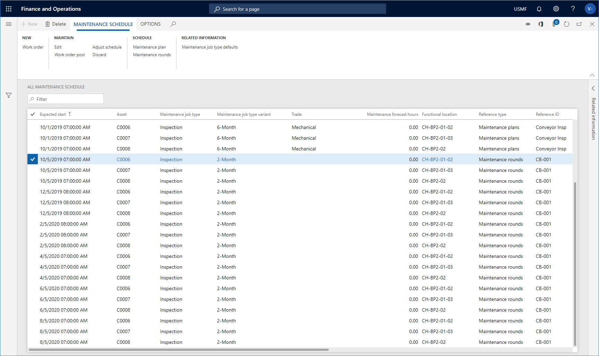

---
# required metadata

title: Object calendar
description: This topic explains the object calendar in Enterprise Asset Management.
author: josaw1
manager: AnnBe
ms.date: 06/28/2019
ms.topic: article
ms.prod: 
ms.service: dynamics-ax-applications
ms.technology: 

# optional metadata

ms.search.form: CatProcureCatalogEdit, CatProcureCatalogListPage
# ROBOTS: 
audience: Application User
# ms.devlang: 
ms.reviewer: josaw
ms.search.scope: Core, Operations
# ms.tgt_pltfrm: 
ms.custom: 2214
ms.assetid: 2f3e0441-414d-402b-b28b-7ab0d650d658
ms.search.region: Global
# ms.search.industry: 
ms.author: mkirknel
ms.search.validFrom: 2016-02-28
ms.dyn365.ops.version: AX 7.0.0

---

# Object calendar

This topic explains the object calendar in Enterprise Asset Management. The object calendar contains a list of all the expected preventive maintenance sequences, requests, and rounds to be carried out. Some calendar entries may have been converted to work orders.

There are four object calendar views that are slightly different, depending on which calendar posts you want to see.

| All object calendars       | All calendar entries are shown in this calendar.                                                                                                                                             |
|----------------------------|----------------------------------------------------------------------------------------------------------------------------------------------------------------------------------------------|
| My object calendars        | All calendar entries containing objects installed on functional locations to which you are related as a worker (set up in [Workers and worker groups](../setup-for-objects/workers-and-worker-groups.md)) are shown in this calendar. |
| Open object calendar lines | Calendar entries with status "Created" - meaning that they have not yet been converted to a work order or discarded - are shown in this calendar.                                            |
| Open object calendar pools | Calendar entries connected to a work order pool are shown in this calendar.                                                                                                                  |

>[!NOTE]
>If an object calendar entry is included in several work order pools (refer to [Work order pools](../work-orders/work-order-pools.md)), one record is shown for each pool in **Open object calendar pools**. This is done to optimize the filtering options on work order pools.

To open an object calendar:

1. Click **Enterprise asset management** > **Common** > **Object calendar** > **All object calendars** or **Open object calendars** or **Open object calendar pools**.

2. To update the object calendar, click **Preventive maintenance** or **Rounds**. Refer to [Schedule preventive maintenance](../preventive-and-reactive-maintenance/schedule-maintenance-sequences.md).

3. You can edit a calendar entry by selecting it and clicking **Edit**. For example, you can easily update the priority of the job or the worker responsible for the job. You can only edit calendar entries that have not yet been connected to a work order.

4. You can delete a calendar entry by selecting it and clicking **Delete**.

5. You can discard a calendar entry by selecting it in the list page and clicking **Discard**. This function is useful if, for example, an object has a 2,000 km maintenance sequence and a 10,000 km maintenance sequence. Then, you may want to discard the 2,000 km maintenance sequence when it coincides with 10,000 km, 20,000 km, 30,000 km, and so on. If you discard a calendar entry related to a maintenance sequence, that calendar line will never again appear when that maintenance sequence is scheduled.

6. You can select a number of entries in **All object calendars** and click **Work order pool**, if you want all selected calendar entries to be included in the same work order pool.

7. You can select a number of entries in **All object calendars** or **Open object calendars** or **Open object calendar pools** and click **Adjust** if you want to make the same adjustments to several entries. You can change expected start and end dates, priority, and the responsible group or responsible worker related to the selected object calendar entries.

- When a calendar entry has been related to a work order, the work order ID will be displayed in the **Work order** field.  
- In **All objects** > **Preventive maintenance** FastTab, you can set up maintenance sequence lines for the selected object. Later, if you delete a maintenance sequence line related to an object in **All objects** , you also automatically delete all object calendar lines with status "Created" that have been created based on that maintenance sequence. See also [Create an
object](../objects/create-an-object.md).

The figure below shows a screenshot of the interface.

