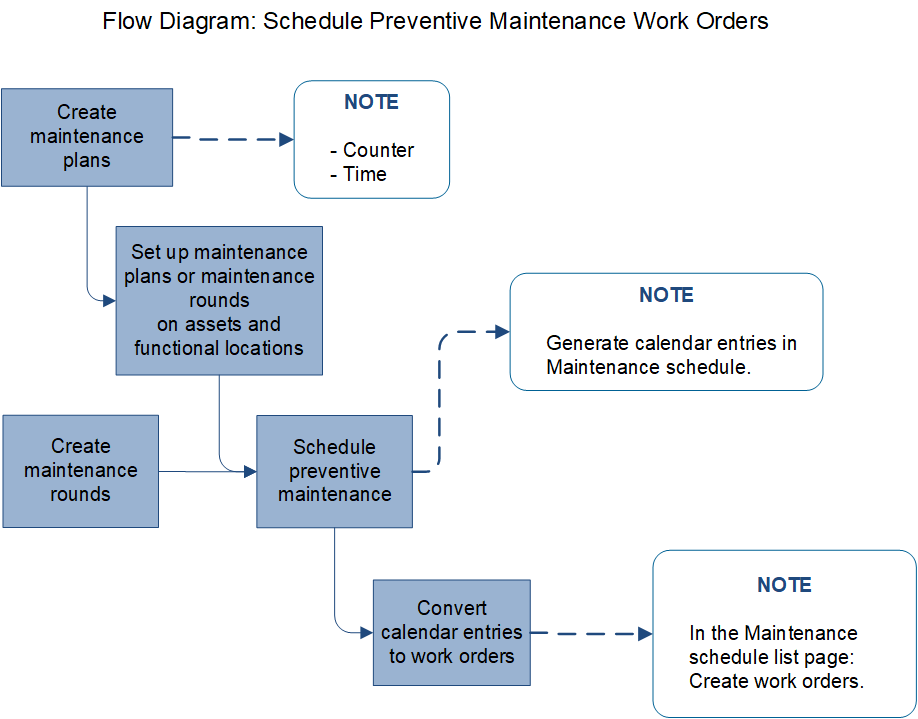

---
# required metadata

title: Preventive maintenance overview
description: This topic explains preventive maintenance in Asset Management.
author: josaw1
manager: AnnBe
ms.date: 06/28/2019
ms.topic: article
ms.prod: 
ms.service: dynamics-ax-applications
ms.technology: 

# optional metadata

ms.search.form: CatProcureCatalogEdit, CatProcureCatalogListPage
# ROBOTS: 
audience: Application User
# ms.devlang: 
ms.reviewer: josaw
ms.search.scope: Core, Operations
# ms.tgt_pltfrm: 
ms.custom: 2214
ms.assetid: 2f3e0441-414d-402b-b28b-7ab0d650d658
ms.search.region: Global
# ms.search.industry: 
ms.author: mkirknel
ms.search.validFrom: 2016-02-28
ms.dyn365.ops.version: AX 7.0.0

---

# Preventive maintenance overview

This topic explains preventive maintenance in Enterprise Asset Management. Preventive maintenance is a discipline involving planned maintenance jobs, for example, regular service, calibration, and inspections. In **Enterprise Asset Management**, you can create maintenance sequences and set them up on objects or functional locations. You can also set up rounds on functional locations. Maintenance sequences on objects are active regardless of where the object is installed. Maintenance sequences and rounds on functional location are active for the objects currently installed at the location. Instead of setting up maintenance sequences on objects, or setting up rounds on functional locations, you can create rounds that include multiple objects on which you need to perform related types of maintenance jobs in the same work routine. Rounds created from objects - instead of created on functional locations - means that you can select a number of objects for one round that are not depending on being installed on the same functional location.

Maintenance sequences are used for preventive and reactive maintenance on individual objects. Rounds are used for preventive maintenance on a group or a set of objects. Maintenance sequences and rounds are used for generating work order proposals. The work order proposals are saved as object calendar lines, which can be bundled and converted into work orders.

The figure below provides an overview of the work flow from creating maintenance sequences and rounds to creating work orders for objects, based on those sequences and rounds.

