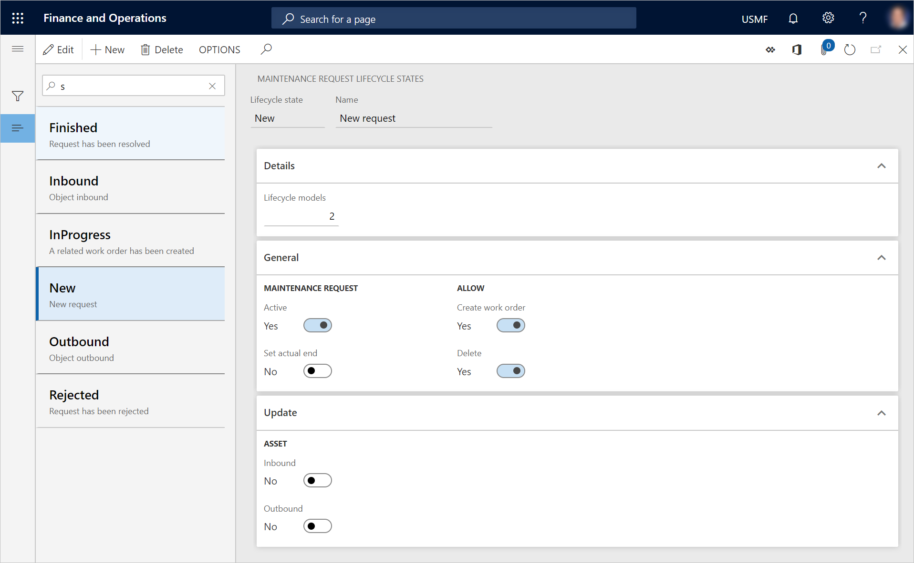

---
# required metadata

title: Maintenance request lifecycle stages
description: This topic describes how to set up maintenance request stages in Asset Management.
author: josaw1
manager: AnnBe
ms.date: 07/25/2019
ms.topic: article
ms.prod: 
ms.service: dynamics-ax-applications
ms.technology: 

# optional metadata

ms.search.form: 
# ROBOTS: 
audience: Application User
# ms.devlang: 
ms.reviewer: josaw
ms.search.scope: Core, Operations
# ms.tgt_pltfrm: 
ms.custom: 
ms.assetid: 
ms.search.region: Global
# ms.search.industry: 
ms.author: mkirknel
ms.search.validFrom: 2016-02-28
ms.dyn365.ops.version: AX 7.0.0

---

# Maintenance request stages

Maintenance request lifecycle states define the stages that a request can go through, for example, "Created", "Active", and "Ended". When a request is converted into a work order, the request stage should be updated to "Ended" or "Closed" to indicate that the request is no longer active. You are able to view all requests, regardless of their stage, in the **All requests** list.

## Set up maintenance request lifecycle stages

1. Click **Asset management** > **Setup** > **Maintenance equests** > **Lifecycle states**.
2. Click **New** to create a new request stage.
3.	Insert the Lifecycle state in the **Lifecycle State** field and a name for the request stage in the **Name** field. In the **Lifecycle models** field, you can see the number of lifecycle models that uses the request lifecycle states.
4. On the **General** FastTab, select if a maintenance request should be active in this stage.
5. Select "Yes" on the **Set actual end** toggle button if actual end date and time should automatically be inserted on the maintenance request at this state.
6. Select "Yes" on the **Create work order** toggle button if it should be possible to create a work order from the maintenance request at this state.
7. Select "Yes" on the **Delete** toggle button if it should be possible to delete maintenance requests at this stage.
8. On the **Update** FastTab, the **Inbound** and **Outbound** toggle buttons are relevant if you use depot repair (refer to [Manage requests](../manage-requests/requests.md) for more information). Select "Yes" if you want to automatically update the object stage to **Inbound** or **Outbound** at this stage.

>[!NOTE]
>If the **Inbound** toggle button or the **Outbound** toggle button is set to "Yes" on the **Update** FastTab on a request stage, it means that when the stage is set to "Inbound" or "Outbound" on a request, the object stage for the object selected on the request is updated accordingly.

>[!NOTE]
>Request stages, stage groups, and types are related and used in the same way as work order stages, work order stage groups, and work order types. Refer to [Work order stages](../setup-for-work-orders/work-order-stages.md) for a general explanation regarding stage group, type, and stage relations.

## Set up maintenance request lifecycle models

When you have created the lifecycle states required for your maintenance requests, they can be divided into lifecycle models. This is done to create the flow that may be used for different types of maintenance requests. As a minimum, one standard maintenance request lifecycle models should be created.

1. Click **Asset management** > **Setup** > **Maintenance requests** > **Lifecycle models**.
2. Click **New** to create a new stage group.
3. Insert the stage Lifecycle model in the **Lifecycle model** field and a name in the **Name** field. In the **Lifecycle states** and **Maintenance request types** fields, you can see the number of lifecycle models selected that uses the lifecycle model.
4. On the **Lifecycle states** FastTab, select the lifecycle states that should be included in the group. This is done by clicking a stage in the **Lifecycle states remaining** section and clicking the  button.
5. If you want to select all the available lifecycle states for a group, click the  button. All lifecycle states are transferred to the **Lifecycle states selected** section.
6. If you want to remove a selected lifecycle state from the group, select the lifecycle state in the **Lifecycle states selected** section and click the  button.
7. On the **General** FastTab, you can select stages related to depot repair. This means that the lifecycle states is automatically updated to the stage you select when assets selected on the maintenance request are received for depot repair in the **Inbound Assets** list, or returned after repair, which is registered in the **Outbound assets** list.

The following figure shows a screenshot of the interface.

