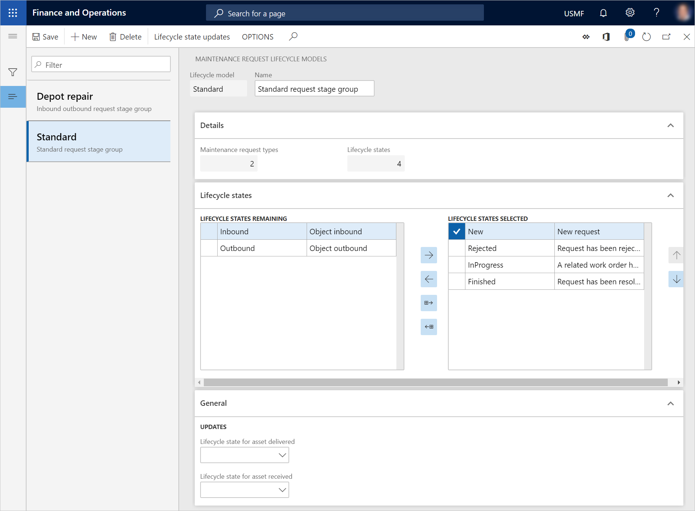

---
# required metadata

title: Request stages
description: This topic describes how to set up request stages in Enterprise Asset Management.
author: josaw1
manager: AnnBe
ms.date: 06/26/2019
ms.topic: article
ms.prod: 
ms.service: dynamics-ax-applications
ms.technology: 

# optional metadata

ms.search.form: CatProcureCatalogEdit, CatProcureCatalogListPage
# ROBOTS: 
audience: Application User
# ms.devlang: 
ms.reviewer: josaw
ms.search.scope: Core, Operations
# ms.tgt_pltfrm: 
ms.custom: 2214
ms.assetid: 2f3e0441-414d-402b-b28b-7ab0d650d658
ms.search.region: Global
# ms.search.industry: 
ms.author: mkirknel
ms.search.validFrom: 2016-02-28
ms.dyn365.ops.version: AX 7.0.0

---

# Request stages

This topic describes how to set up request stages in Enterprise Asset Management. Request stages define the stages that a request can go through, for example, "Created", "Active", and "Ended". When a request is converted into a work order, the request stage should be updated to "Ended" or "Closed" to indicate that the request is no longer active. You are able to view all requests, regardless of their stage, in the **All requests** list.

## Set up request stages

1. Click **Enterprise asset management** > **Setup** > **Requests** > **Stage** > **Stages**.
2. Click **New** to create a new request stage.
3. Insert the stage ID in the **Stage** field and a name for the request stage in the **Name** field. In the **Stage groups** field, you can see the number of request stage groups that uses the request stage.
4. On the **General** FastTab, select if the request should be active in this stage.
5. Select "Yes" on the **Set actual end** toggle button if actual end date and time should automatically be inserted on the request at this stage.
6. Select "Yes" on the **Create work order** toggle button if it should be possible to create a work order from the request at this stage.
7. Select "Yes" on the **Delete** toggle button if it should be possible to delete requests at this stage.
8. On the **Update** FastTab, the **Inbound** and **Outbound** toggle buttons are relevant if you use depot repair (refer to [Manage requests](../manage-requests/requests.md) for more information). Select "Yes" if you want to automatically update the object stage to **Inbound** or **Outbound** at this stage.

>[!NOTE]
>Whether you are able to work with inbound and outbound objects depends on the setup of Enterprise Asset Management. The functionality can only be used if the **Inbound/outbound** check box is selected in the **License configuration** form (**System administration** > **Setup** > **Licensing** > **License configuration**).

If the **Inbound** toggle button or the **Outbound** toggle button is set to "Yes" on the **Update** FastTab on a request stage, it means that when the stage is set to "Inbound" or "Outbound" on a request, the object stage for the object selected on the request is updated accordingly. The figure below shows a screenshot of the interface.

>[!NOTE]
>Request stages, stage groups, and types are related and used in the same way as work order stages, work order stage groups, and work order types. Refer to [Work order stages](../setup-for-work-orders/work-order-stages.md) for a general explanation regarding stage group, type, and stage relations.

## Set up request stage groups

When you have created the stages required for your requests, they can be divided into groups. This is done to create the stage group flow that may be used for different types of requests. As a minimum, one standard request stage group should be created.

1. Click **Enterprise asset management** > **Setup** > **Requests** > **Stage** > **Stage groups**.
2. Click **New** to create a new stage group.
3. Insert the stage group ID in the **Stage group** field and a name for the stage group in the **Name** field. In the **Stages** and **Request types** fields, you can see the number of stages selected in the stage group, and the number of request types that uses the stage group.
4. On the **Stages** FastTab, select the stages that should be included in the group. This is done by clicking on a stage in the **Stages remaining** section and clicking the  button.
5. If you want to select all the available stages for a group, click the  button. All stages are transferred to the **Stages selected** section.
6. If you want to remove a selected stage from the group, select the stage in the **Stages selected** section and click the  button.
7. Click **Stage updates** to define which stages can follow a selected stage.
8. On the **General** FastTab, you can select stages related to depot repair. This means that the request stage is automatically updated to the stage you select when objects selected on the request are received for depot repair in the **Inbound objects** list, or returned after repair, which is registered in the **Outbound objects** list.

The following figure shows a screenshot of the interface.

