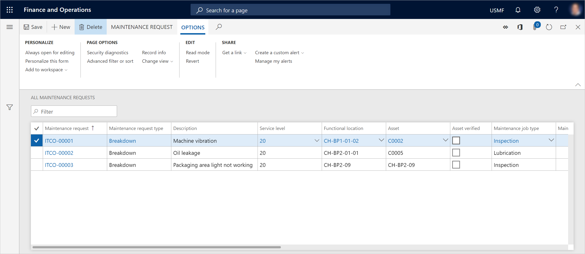

---
# required metadata

title: Maintenance requests
description: This topic provides an overview of maintenance requests in Asset Management.
author: josaw1
manager: AnnBe
ms.date: 07/26/2019
ms.topic: article
ms.prod: 
ms.service: dynamics-ax-applications
ms.technology: 

# optional metadata

ms.search.form: 
# ROBOTS: 
audience: Application User
# ms.devlang: 
ms.reviewer: josaw
ms.search.scope: Core, Operations
# ms.tgt_pltfrm: 
ms.custom: 
ms.assetid: 
ms.search.region: Global
# ms.search.industry: 
ms.author: mkirknel
ms.search.validFrom: 2019-07-30
ms.dyn365.ops.version: AX 7.0.0

---

# Maintenance requests

[!include [banner](../../includes/banner.md)]

[!include [banner](../../includes/preview-banner.md)]

You can set up various types of requests to use in your company. Maintenance requests are one type. Maintenance requests are used to request that a work order be required for a specific job. A maintenance request can be created by any user who has access to Asset Management functionality. A planner or manager can then decide whether a maintenance request should be converted to a work order, or whether it should complete its own lifecycle.

## View maintenance requests

- Select **Asset management** \> **Common** \> **Maintenance requests** \> **All maintenance requests** or **Active maintenance requests**.

    The **All maintenance requests** list page shows all maintenance requests, regardless of their lifecycle state. The **Active maintenance requests** lists page shows only maintenance requests that are in an active state.

The following illustration shows an example of the **All maintenance requests** list page.

