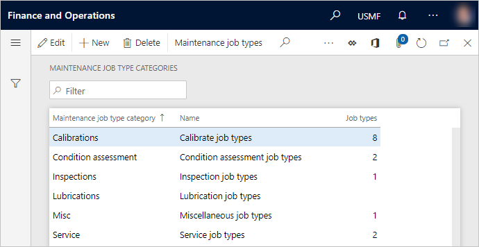
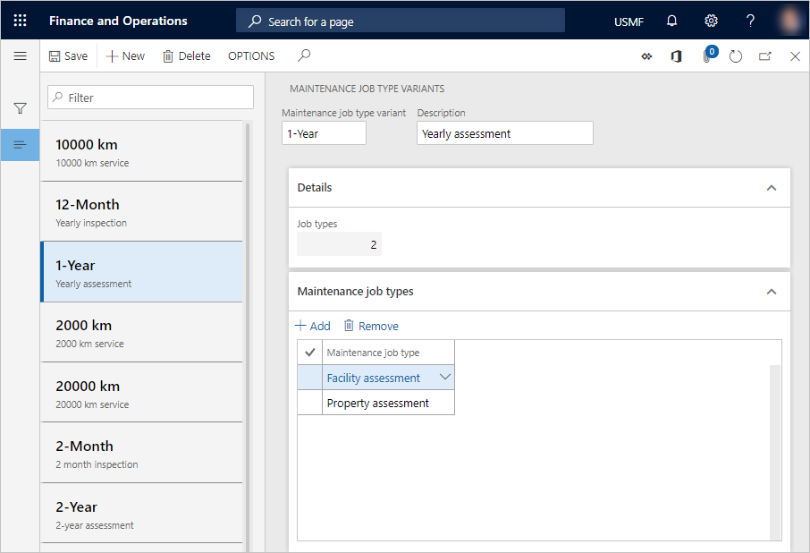
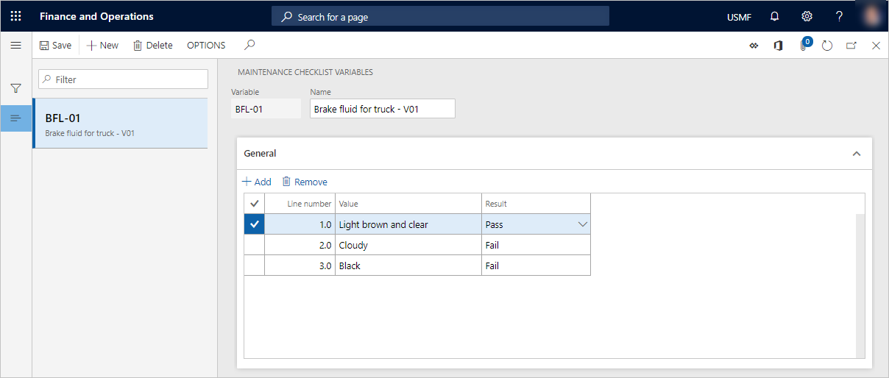
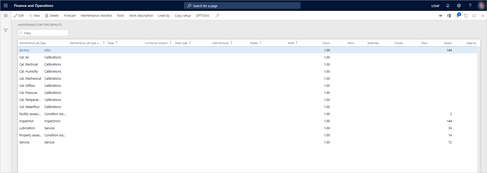
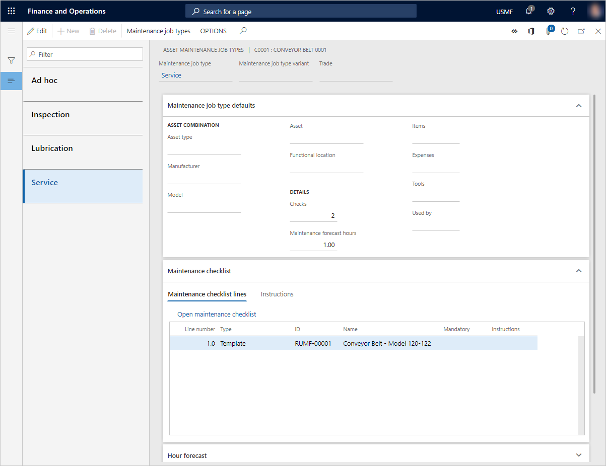
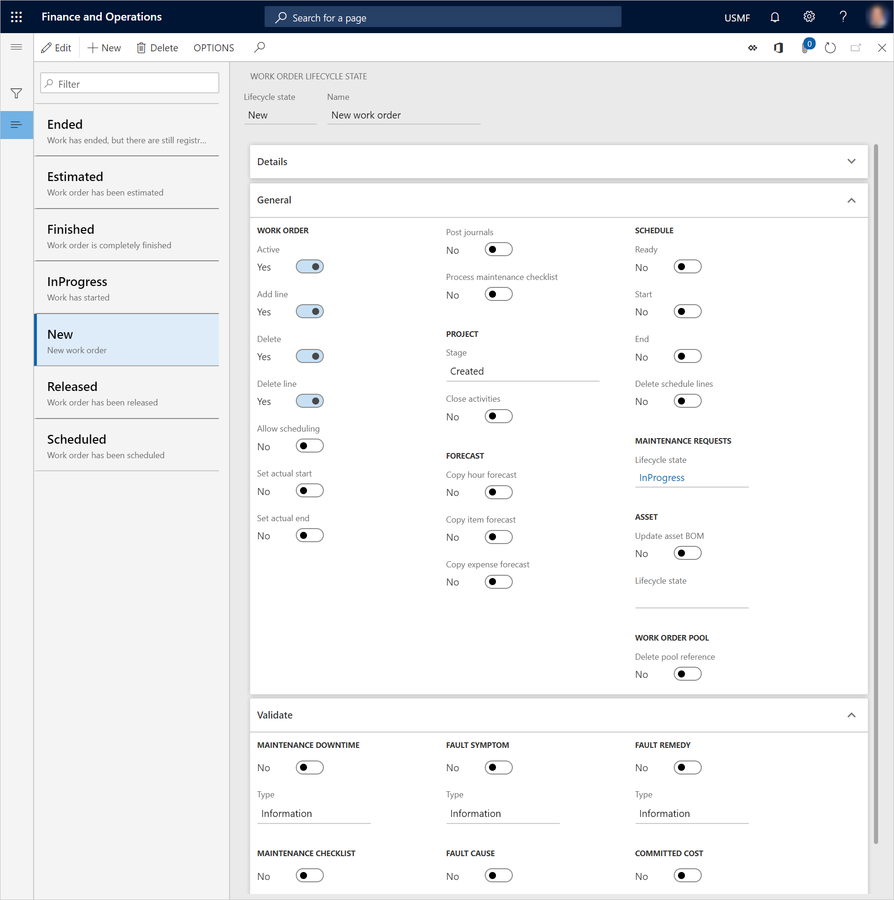

---
# required metadata

title: Maintenance job type categories and maintenance job types, maintenance job type variants, maintenance job trades, and maintenance checklists
description: This topic describes maintenance job type categories and maintenance job types, maintenance job type variants, maintenance job trades, and maintenance checklists in Asset Management.
author: josaw1
manager: AnnBe
ms.date: 06/27/2019
ms.topic: article
ms.prod: 
ms.service: dynamics-ax-applications
ms.technology: 

# optional metadata

ms.search.form: CatProcureCatalogEdit, CatProcureCatalogListPage
# ROBOTS: 
audience: Application User
# ms.devlang: 
ms.reviewer: josaw
ms.search.scope: Core, Operations
# ms.tgt_pltfrm: 
ms.custom: 2214
ms.assetid: 2f3e0441-414d-402b-b28b-7ab0d650d658
ms.search.region: Global
# ms.search.industry: 
ms.author: mkirknel
ms.search.validFrom: 2016-02-28
ms.dyn365.ops.version: AX 7.0.0

---

# Maintenance job type categories and maintenance job types, maintenance job type variants, maintenance job trades, and maintenance checklists

An asset has an asset type attached to it. The asset type defines which maintenance job types, meaning which maintenance jobs, can be carried out on an asset. When you create a work order, selecting a maintenance job type is mandatory. It is only possible to select the maintenance job types that are related to the asset type setup used on the object.

Refer to [Assets and work orders](../overview/functional-locations-and-objects.md) for a graphic outline of assets and maintenance job types, and their connection to a work order.

Maintenance job type variants can be set up on a maintenance job type. Maintenance job type variants define variations of a job type, for example, size (small, medium, large), periods (weekly, bi-weekly, 1 month, 3 months), and configurations (low standard, flexible, high performance).

Maintenance job trades are information regarding professional trade, for example, mechanical, electrical, and hydraulic. Competency requirements can be set up on a maintenance job trade. All maintenance job trades can be used in relation to all maintenance job types. Selecting maintenance job type variant and/or maintenance job trade on work a order is optional.

For each maintenance job type, variations of maintenance job type setup can be created. Example: If you have a maintenance job type called "Service", you can create variations for that maintenance job type relating to "Trucks 30,000 km", "Cars 30,000 km", and "Vans 30,000 km".

Maintenance job type categories are used to collect a group of maintenance job types for overview purposes. Examples could be "Calibration", "Inspection", "Overhaul", and "Instrumentation".

Maintenance checklist templates and maintenance checklist variables are used for setup of maintenance checklists. Maintenance checklists are set up on maintenance job types and used on work orders.

First, you set up the required maintenance job type categories, maintenance job type variants, and maintenance job trades. Next you create maintenance job types. Then, you create all the variations of maintenance job types that are required for your equipment in **Maintenance job type defaults**. Forecasts, maintenance checklists, and tools can be set up for a combination of maintenance job type in **Maintenance job type defaults**.

**Note:** A job type can only be related to one job group.

## Create a job group

1. Click **Enterprise asset management** > **Setup** > **Work orders** > **Jobs** > **Job groups**.
2. Click **New**.
3. Insert a job group ID in the **Job group** field.
4. Insert a name for the group in the **Name** field.

When you have related job groups to job types, you will see how many job types are related to the job group in the **Job types** field.

The following figure shows a screenshot of the interface.

## Create a job variant

1. Click **Enterprise asset management** > **Setup** > **Work orders** > **Jobs** > **Job variants**.
2. Click **New**.
3. Insert the job variant ID in the **Variant** field and a description of the job variant in the **Description** field.
4. On the **Job types** FastTab, click **Add** to add a job type.
5. Select the job type in the **Job type** field.
6. Repeat steps 4-5 to add more job types to the variant. In the **Job types** field you can see the number of job types added to the selected job variant.

The following figure shows a screenshot of the interface.

## Create a job trade

1. Click **Enterprise asset management** > **Setup** > **Work orders** > **Jobs** > **Job trades**.
2. Click **New**.
3. Insert the job trade ID in the **Trade** field and a description of the job trade in the **Description** field.
4. On the **Competencies** FastTab > **Skills** tab, click **Add** to add a new skill to be related to the job trade.
5. Select the skill in the **Skill** field.
6. Select the skill level in the **Level** field.
7. Repeat steps 4-6 to add more skills to the job trade. In the **Skills** field you can see the number of skills added to the selected job trade.
8. Click the **Certificates** tab if you want to add certificates to the job trade.
9. Click **Add** to add a new certificate.
10. Select the certificate in the **Certificate type** field.
11. Repeat steps 9-10 to add more certificates to the job trade. In the **Certificates** field you can see the number of certificates added to the selected job trade.

The following figure shows a screenshot of the interface.

## Create a checklist variable

When you create checklist lines in the job type setup, you must select a checklist type. "Variable" is a checklist type. It is used to define a possible result in a range on a checklist line, which is related to a work order line. A variable is a way to create a set of predefined outcomes without having to make an exact measurement.

*Example 1:* You can measure oil level by defining 'Level too high', 'Level too low', and 'Level within range'. For each of the three values, you define if the value result is "Pass", "Fail", or "None".

*Example 2:* Make a visual inspection or assessment of a piece of equipment regarding wear and tear.

1. Click **Enterprise asset management** > **Setup** > **Work orders** > **Checklists** > **Checklist variables**.
2. Press CTRL+N, or click the **New** button.
3. Insert an ID in the **Variable** field and a name in the **Name** field.
4. Click **Add** to add a line for a variable.
5. A sequential line number is automatically inserted in the **Line number** field. You can change the line numbers when you have added all the lines, if required. When a line is selected, and you press the arrow-down button on your keyboard, the next number in the sequence is automatically inserted below.
6. Insert a value description in the **Value** field.
7. Select a status for the line in the **Status** field.

## Create a checklist template

Checklist templates can be used as a common set of tasks that a worker must perform in order to complete a work order correctly. The templates are referenced from checklist lines on the job type setup. Templates can be referenced across multiple job type setup lines, making it easy to reuse a set of common checklist tasks. Examples include general safety instructions, or a list of items and conditions to be checked on a specific pump or similar models of a conveyor belt.

1. Click **Enterprise asset management** > **Setup** > **Work orders** > **Checklists** > **Checklist templates**.
2. Press CTRL+N, or click the **New** button. A template ID is automatically inserted in the **Checklist template** field.
3. Insert a template name in the **Name** field.
4. Click **Add** to add a template line.
5. A sequential line number is automatically inserted in the **Line number** field. You can change the line numbers when you have added all the lines, if required. When a line is selected, and you press the arrow-down button on your keyboard, the next number in the sequence is automatically inserted below.
6. In the **Type** field, select a type for the checklist line. For each checklist type, the related fields are shown on the **Properties** FastTab.

  a. "Text" is used to add a checklist line with a text description of what to do. This checklist type can be used if you want a worker to check or inspect something, without expecting a specific (measurable) result. Insert a name/heading in the **Name** field, and insert a description of what to do in the Instructions field. If this step is mandatory for the checklist, select "Yes" on the **Mandatory** toggle button.
  b. "Header" is used as a heading to group the checklist lines shown below the header. This is useful if you have several checklist lines that can be divided into specific areas. In that case, the use of headers provides an overview for the worker who is going to complete a checklist with many checklist lines. Insert a descriptive name in the **Name** field.
  c. "Template" is used if you want to make a reference to an existing template. Insert a name for the template in the **Name** field, and select the template in the **Template** field.
  d. "Variable" is used to define a possible result in a range on a checklist line. The setup of checklist variables is described in the sub section above. Insert a name to describe the variable in the **Name** field. Select the variable in the **Variable** field. Insert a description of what to do in the Instructions field. If this step is mandatory for the checklist, select "Yes" on the **Mandatory** toggle button.
  e. "Measurement" is used to record a specific measurement. You can set up the measurement to be related to a predefined counter. Insert a name for the template in the **Name** field. If this step is mandatory for the checklist, select "Yes" on the **Mandatory** toggle button. If you want to use the measurement line as a counter registration, select the counter in the **Counter** field; the related **Unit** field is automatically updated. If you have selected a counter, select the update method in the **Value** field. Insert the allowed value range in the **Min. value** and **Max. value** fields. Insert a description of what to do in the **Instructions** field.

>[!NOTE]
>The "Measurement" type without a counter setup is treated as an independent measurement registration for which there is no automatic follow-up in Enterprise Asset Management. Likewise, if the selected counter type is not present on the object related to the work order, the checklist task is handled as an independent measurement. The counter value can be changed multiple times; it will not be posted until the [work order stage](../setup-for-work-orders/work-order-stages.md) is changed to a stage in which the **Process checklist** toggle button is set to "Yes".

7. The **Checks** field at the top of the form shows the total number of checklist lines in your template, including the nested lines in an existing template, which you may have referenced in your template.

The following figure shows a screenshot of the interface.

## Create a Job Type

1. Click **Enterprise asset management** > **Setup** > **Work orders** > **Jobs** > **Job types**.
2. Click **New**.
3. Insert a job type ID in the **Job type** field.
4. Insert a name for the job type in the **Name** field. In the **Details** group, you can see an overview of the number of job variants, skills, certificates, succeeding jobs, and object types created on the job type. In the **Setup lines** field, you see the number of job type setup lines set up on the job type. In the **Objects** field, you see the number of active objects that are currently using the job type.
5. On the **General** FastTab, select a job group in the **Job group** field.
6. Select "Yes" on the **Maintenance stop** toggle button if this job type requires a maintenance stop of the equipment before the job can be carried out.
7. On the **Description** FastTab, insert a description of the job type.
8. On the **Variants** FastTab, you can add job variants to the job type.
9. On the **Competencies** FastTab, you can add skills and certificate requirements to the job type.
10. If a specific job type is required as the next job type to be carried out, add it on the **Succeeding jobs** FastTab. You can also set up **Variant** and **Trade** related to the job type. In the **Displacement** field, you can add number of days that the succeeding job should start before or after the job using this job type has started. If you insert a positive number, for example "5", it means that the succeeding job starts five days after the start of the job that is related to the job type. If you insert a negative number, for example "-3", it means that the succeeding job will start three days before the scheduled start of the job that is related to the job type.  
>[!NOTE]
>If you add more than one job type line, the sequence of the lines indicate the order in which they should be carried out, starting from the top of the list.  
11. On the **Object types** FastTab, you can add object types to the job type, as shown in the figure below.

## Create job type setup lines and related forecasts, checklists, tools, description, and attachments

1. Click **Enterprise asset management** > **Setup** > **Work orders** > **Jobs** > **Job type setup** or **Enterprise asset management** > **Setup** > **Work orders** > **Jobs** > **Job types** > select a job type > **Job type setup** button.
2. Click **New**.
3. Depending on how specific the job type setup should be, make selections in the **Functional location**, **Object type**, **Product**, **Model**, and/or **Object** fields.
4. If a job type has not automatically been inserted, select a job type in the **Job type** field.
5. If required, select a job variant and a job trade in the **Variant** and **Trade** fields.
6. Click the **Forecast** button. In **Job type setup forecast**, you can make forecasts on hours, items, and expenses.
7. Click **Add** on the relevant tabs and make your selections to create the required forecasts for the job type.
8. On the **Items** tab, you can select inventory dimensions to be shown on the item line. Select **Inventory** > **Dimensions**, select the dimensions you want to display, select "Yes" on the **Save setup** toggle button, and click **OK**.
9. On the **Items** tab, click **Item where used** if you want to get an overview of where the item on the selected line is used in Enterprise Asset Management in relation to objects, job type setup, spare parts, and work orders. Read more about this overview in [Items where used](../controlling-and-reporting/items-where-used.md).
10. On the **Forecast totals** FastTab, you see an overview of forecast totals showing total number of hours and forecast lines created.

>[!NOTE]
>If you want to copy a forecast setup from another job type, select the **Copy forecast** button and select the job type from which to copy the setup.

11. Click **Save** to save your updates.
12. Close **Job type setup forecast**.
13. In **Job type setup**, click the **Checklist** button.
14. In **Job type setup checklist**, you can add checklist lines to the selected job type setup. Click **New** to add a checklist line. Line numbers are inserted automatically in the **Line number** field to indicate the sequence of the checklist lines. You can edit line numbers, if required. When you have created the first checklist line, select the line and press the arrow-down button on your keyboard to add a line below. You can also select a checklist line and click the **New** button, then the new line is inserted above the selected checklist line.
15. In the **Type** field, select the line type, then add information related to the
checklist type. See a description of available types and related fields in the
"Create a Checklist Template" sub section above.

- If you want to copy checklist setup from another job type, click the **Copy checklist** button and select the job type from which to copy the setup.  
- You can easily create a template from an existing checklist, which can be reused across multiple checklists. The new template will be an exact copy of the active checklists. Click the **Create templat**e button and insert a **Name** for the template. You can set the **Replace** toggle button to "Yes" to replace the existing checklist with a single line referencing the new template. You can see the contents of the template in the **Checklist templates** detail view.  

16. Click **Save** to save your updates.
17. Close **Job type setup checklist**.
18. In **Job type setup**, click the **Tools** button.
19. In **Job type setup tools**, you can add the tools (resources) to be used for the job type. Select the tool in the **Resource** field.

- If you want to copy a tool setup from another job type, select the **Copy tools** button and select the job type from which to copy the setup.

20. Click **Save** to save your updates.
21. Close **Job type setup tools**.
22. In **Job type setup**, click the **Description** button > **Edit**, and add a description related to the selected job type setup, if required.
23. Click **Save** to save the description.

- If a description is added, that description overrules a description set up on the job type. If no description is added in this form, the description, if any, in **Job types** is used. Descriptions are automatically transferred to work orders using the job type or job type setup.

24. Close **Description**.
25. If you want to set up attachments on a selected job type setup line, click **Attach documents**. Attachments set up on a job type setup line will automatically be included on a work order line that uses that particular job type setup line.
26. Click the **New** button and select a document type.
27. Upload the document or file.
28. Fill out the **Attachments** form. This attachment setup uses standard Dynamics 365 for Finance and Operations document setup functionality.
29. Click **Save** to save the attachment.

- Attachments on a job type setup line are only printed with a work order report if the document types of the attachments are selected in **Enterprise asset management** > **Setup** > **Enterprise asset management parameters** > **Document types**.  
- Examples of attachments could be a guideline explaining how to complete a specific job, or a predefined checklist (if you do not use the checklist functionality for job type setup lines).  

30. In **Job type setup**, you can see the number of forecasted hours as well as the number of setup lines created for items, expenses, checklists, measuring points, and tools on each line. In the **Objects** field, you see the number of active objects related to the job type setup.
31. If you want to copy a job type setup to another job type setup, select the setup line to which you want to copy another setup, click **Copy setup**, and select a job type setup to copy.
32. If you want to see a list of the objects, maintenance sequences, or rounds that currently use a job type setup line, select the line and click **Used by**.

The figure below shows a screenshot of the interface.

When the system selects the available job type setup to be used on a work order line, the selection is based on the object and the related object type setup. Enterprise Asset Management goes through all job type setup records related to the job type, which is related to the object type, to check for a possible match, always checking the most specific combination first. This means that, first, a possible match regarding **Trade** is checked. If no match is found, **Variant** is checked. If no match is found, **Job type** is checked, and so on. As you can see in the layout of **Job type setup**, this means that Enterprise Asset Management checks each record from right to left for a match (**Trade**, then **Variant**, then **Job type**, **Object**, **Model**, **Product**, and **Object type** to find the most specific combination. If no match is found, the "default" record is used in which only the job type is selected.

- For each job type setup line you create, a project activity ID is automatically related to the line. The project activity is created on the forecast project selected in **Enterprise asset management parameters** > **Objects** link > **Forecast project** field. The purpose of the project activity is to manage forecasts on hours, items, and expenses in relation to work orders. Job type forecasts are automatically transferred to the work order line, and they are copied from the forecast project to the work order project created for the work order line. The purpose of the project activity is to manage forecasts in relation to work orders.  
- A batch job can be set up to update job type setup references to run manually or at regular intervals. Click **Enterprise asset management** > **Periodic** > **Preventive maintenance** > **Update job type setup references** to create a batch job or run a manual update.

## Overview of job types related to objects

When you have created the required job type setup combinations, it is possible
to get an overview of the current job type setup related to a specific object in
**All Objects**. The overview shows a combination of all job type setup
combinations that can be used on the object type selected on the object,
including combinations with variations of job variants and job trades.

1. Click **Enterprise asset management** > **Common** > **Objects** > **All Objects** or **Active objects**.
2. In the list, select the object for which you want to see an overview of job type combinations.
3. On the **General** tab, click the **Job types** button.
4. In the left side of **Object job types**, you will see a list of all the job type combinations related to the selected object.
5. Select a job type combination to see the related setup for checklists, forecasts, and tools. At the top of the form, in the **Details** group, you will see number of related checklists, measurements, hours, and so on, that are related to the selected job type combination.
6. If you want to see details for the selected job type, click the **Job types** button.

The figure below shows a screenshot of the interface.

## Automatic update of job type forecasts

In Enterprise Asset Management, you can automatically update any changes in job type forecasts regarding hour costs, item costs, and expenses, which have been updated in other modules in Dynamics 365 for Finance and Operations. This is done to ensure that the latest cost prices are always used in your job type forecasts. It is also possible to make similar updates for [work order forecasts](../work-orders/forecasts.md).

1. Click **Enterprise asset management** > **Periodic** > **Forecast** > **Update job type forecast**.
2. In the **Update job type forecast** dialog, you can add selections regarding specific job types, if required.
3. Click **Filter**, then click **Select** to make those selections.
4. If required, you can set up automatic update as a batch job by filling out the fields on the **Run in the background** FastTab.
5. Click **OK** to start the forecast update.

The figure below shows a screenshot of the interface.

