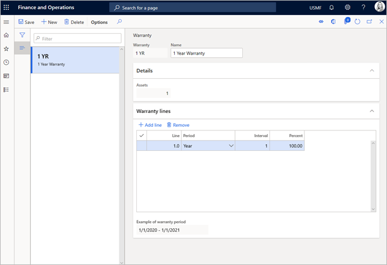

---
# required metadata

title: Warranty agreements
description: This topic explains warranty agreements in Asset Management.
author: josaw1
manager: tfehr
ms.date: 08/24/2020
ms.topic: article
ms.prod: 
ms.service: dynamics-ax-applications
ms.technology: 

# optional metadata

ms.search.form: 
# ROBOTS: 
audience: Application User
# ms.devlang: 
ms.reviewer: kamaybac
ms.search.scope: Core, Operations
# ms.tgt_pltfrm: 
ms.custom: 
ms.assetid: 
ms.search.region: Global
# ms.search.industry: 
ms.author: mkirknel
ms.search.validFrom: 2019-08-30
ms.dyn365.ops.version: 10.0.5

---

# Warranty agreements

[!include [banner](../../includes/banner.md)]

 

In Asset Management, you can set up warranty terms that can be connected to an asset or an asset type. Warranty terms are created for a specific period. Warranty can be set up to provide full coverage or partial coverage, and you can set up terms that are related to hours, expenses, and items.

The first step is to create any vendor warranty agreements that you have for your equipment. You then attach warranty agreements to assets or asset types. Vendor warranty agreements are used only for informational purposes. If vendor warranty is set up on an asset, you can see the warranty coverage period on the asset.

## Create a warranty agreement

A warranty agreement can include several agreement lines to cover the warranty for work hours, expenses, and items.

1. Select **Asset management** \> **Setup** \> **Assets** \> **Warranty**.
2. Select **New** to create a product.
3. In the **Warranty** field, enter a warranty ID.
4. In the **Name** field, enter a description.

    On the **Details** FastTab, the **Assets** field shows the number of active assets that use the warranty agreement.

5. On the **Hour warranty** and **Item warranty** FastTabs, follow these steps to add lines that should be included in a warranty agreement that pertains to hours or items:

    1. Select **Add line** to add a new condition to the warranty. A sequential line number is automatically entered in the **Line** field.
    2. In the **Period** field, select the type of warranty period.
    3. In the **Interval** field, enter a number. This field defines the number of periods that the warranty should be valid for.
    4. In the **Percent** field, enter the coverage percentage for the warranty line. The percentage indicates how much is covered by your company.

