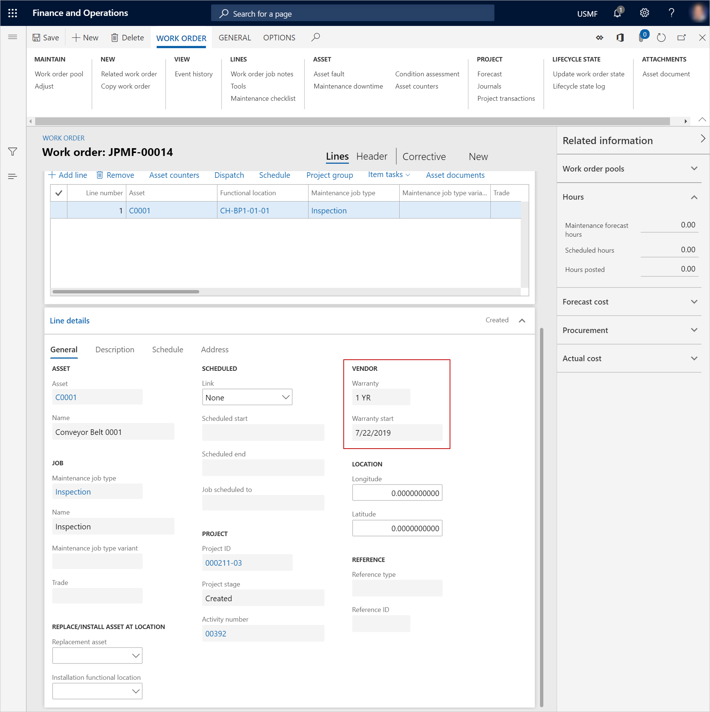

---
# required metadata

title: Warranty on objects and object types
description: This topic explains how to set up warranty on objects and object types in Enterprise Asset Management.
author: josaw1
manager: AnnBe
ms.date: 07/01/2019
ms.topic: article
ms.prod: 
ms.service: dynamics-ax-applications
ms.technology: 

# optional metadata

ms.search.form: CatProcureCatalogEdit, CatProcureCatalogListPage
# ROBOTS: 
audience: Application User
# ms.devlang: 
ms.reviewer: josaw
ms.search.scope: Core, Operations
# ms.tgt_pltfrm: 
ms.custom: 2214
ms.assetid: 2f3e0441-414d-402b-b28b-7ab0d650d658
ms.search.region: Global
# ms.search.industry: 
ms.author: mkirknel
ms.search.validFrom: 2016-02-28
ms.dyn365.ops.version: AX 7.0.0

---

# Warranty on objects and object types

This topic explains how to set up warranty on objects and object types in Enterprise Asset Management.

## Set up warranty on object type

1. Click **Enterprise asset management** > **Setup** > **Object** > **Types**.

2. Select the object type to which you want to attach a warranty agreement.

3. On the **General** FastTab, select the agreement in the **Vendor warranty** field.

## Set up warranty on object

1. Click **Enterprise asset management** > **Common** > **Objects** > **All Objects**.

2. Select the object and click **Edit**.

3. On the **Vendor** FastTab, select the warranty agreement in the **Vendor warranty** section.

4. Select the start and end dates in the **Warranty start** and **Warranty end** fields.

**Caution:** If a date is selected in the Contract / warranty **Date** field on a work order, that is the date from which the warranty or contract is valid for the work order. When you create a work order, the date of creation is automatically inserted in this field. You can change the date in this field to, for example, correspond with the start date in a warranty agreement.

>[!NOTE]
>If an object is covered by a vendor warranty, and a work order is created for that object with expected start date in the warranty period, you will see a notification regarding the warranty agreement when you create the work order. It is then possible to cancel the work order, if required.
