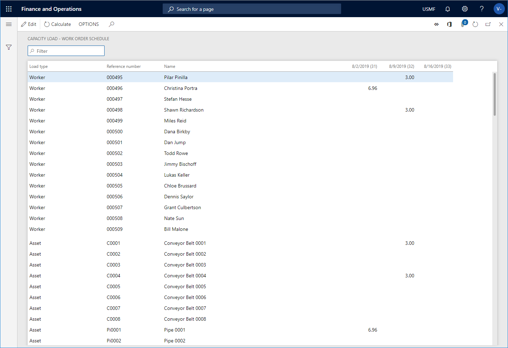

---
# required metadata

title: Calculate capacity load on scheduled work orders
description: This topic explains how to calculate capacity load on scheduled work orders in Asset Management.
author: josaw1
manager: AnnBe
ms.date: 06/28/2019
ms.topic: article
ms.prod: 
ms.service: dynamics-ax-applications
ms.technology: 

# optional metadata

ms.search.form: CatProcureCatalogEdit, CatProcureCatalogListPage
# ROBOTS: 
audience: Application User
# ms.devlang: 
ms.reviewer: josaw
ms.search.scope: Core, Operations
# ms.tgt_pltfrm: 
ms.custom: 2214
ms.assetid: 2f3e0441-414d-402b-b28b-7ab0d650d658
ms.search.region: Global
# ms.search.industry: 
ms.author: mkirknel
ms.search.validFrom: 2016-02-28
ms.dyn365.ops.version: AX 7.0.0

---

# Calculate capacity load on scheduled work orders

You can calculate capacity load on scheduled work orders to get an overview of the work load on resources for a specific period. Calculations can be made for the following resources: Maintenance workers, worker groups, tools, and assets.

1. Click **Asset management** > **Inquiries** > **Schedule** > **Capacity load**.

2. In the **Calculate capacity load** dialog > **Show** field, select which load type you want to calculate: "Capacity", "Reserved", or "Remainder".

3. Select "Yes" on the **Skip zero** toggle button if you do not want to show results containing zero.

4. Select the resource types for which you want to calculate capacity load by selecting "Yes" on the relevant toggle buttons: **Worker**, **Maintenance worker group**, **Tool**, and **Asset**.

5. Select the start date for the calculation in the **From date** field.

6. In the **Interval type** field, select the interval for the calculation: "Day", "Week", "Month", or "Quarter".

7. In the **Period frequency** field, insert the number of intervals you want to calculate. For example, if you have selected "Day" as the interval type, and you insert the number "5" in this field, a calculation of five days from the start date will be made.

8. Click **OK** to start the calculation.

The figure below shows the result of a calculation covering three weeks for the load type "Reserved".

>[!NOTE]
>If you select the load types "Capacity" or "Remainder" for your calculation, the same result will be displayed if no reservations have been made for the resources in the selected period.

Refer to [Calculate capacity load](../capacity-planning/calculate-capacity-load.md) for information on how to calculate capacity load on maintenance schedule lines and not scheduled work orders.
