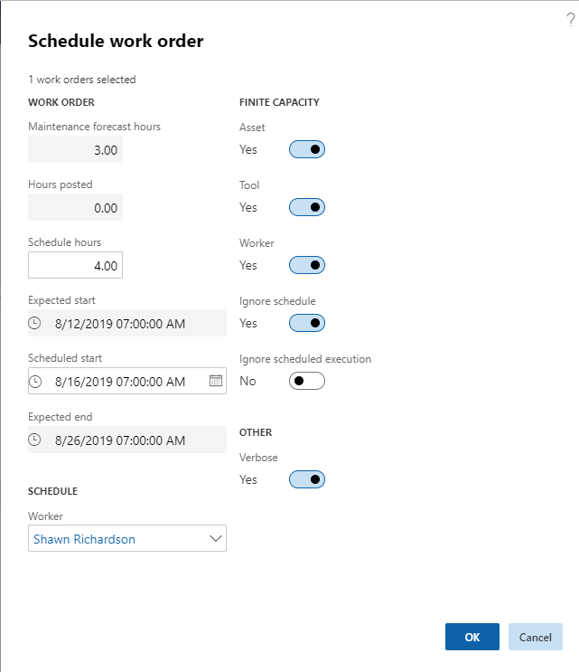

---
# required metadata

title: Schedule exclusively
description: This topic explains how to schedule exlusively in Enterprise Asset Management.
author: josaw1
manager: AnnBe
ms.date: 06/28/2019
ms.topic: article
ms.prod: 
ms.service: dynamics-ax-applications
ms.technology: 

# optional metadata

ms.search.form: CatProcureCatalogEdit, CatProcureCatalogListPage
# ROBOTS: 
audience: Application User
# ms.devlang: 
ms.reviewer: josaw
ms.search.scope: Core, Operations
# ms.tgt_pltfrm: 
ms.custom: 2214
ms.assetid: 2f3e0441-414d-402b-b28b-7ab0d650d658
ms.search.region: Global
# ms.search.industry: 
ms.author: mkirknel
ms.search.validFrom: 2016-02-28
ms.dyn365.ops.version: AX 7.0.0

---

# Schedule exclusively

This topic explains how to schedule exlusively in Enterprise Asset Management. You can schedule one work order or work order lines to one worker using the **Schedule exclusively** functionality.

1. Click **Enterprise asset management** > **Common** > **Work orders** > **All Work orders** or **Active work orders**.

2. Select the work order in the list.

3. On the **General** tab, click **Schedule exclusively**.

4. Select the worker in the **Worker** field.

5. In the **Schedule hours** field, you can insert expected work hours, in case expected work hours differ from forecast hours.

6. In the **Scheduled start** field, you can insert another start date and time if you do not want to use expected start date and time.

7. If the scheduling process should observe capacity limitations regarding resources already scheduled on other jobs, make sure that the **Object**, **Tool**, and **Worker** toggle buttons are set to "Yes". If you want to see detailed information about the scheduling process, select "Yes" on the **Verbose** toggle button. This means detailed information about the calculated scores on the work order is shown in the Infolog.

8. Select "Yes" on the **Ignore calendar** toggle button to ignore closed days in the calendar (applies to object, worker, and tools). Select "Yes" on the **Ignore scheduled execution** toggle button to ignore limitations that may have been selected on the work order regarding scheduling. Refer to the [Scheduled execution](../setup-for-work-orders/scheduled-execution.md) section for information on the setup of scheduled execution.

9. Click **OK**. The work order stage is automatically updated to the "Scheduled" stage specified in the work order stage group.

The figure below shows a screenshot of the interface.

>[!NOTE]
>If you want to delete the schedule on a work order, this is done by selecting the work order in the **All work orders** list, and clicking **Delete schedule** on the **General** tab. Remember to manually update the work order stage if you delete the schedule.
