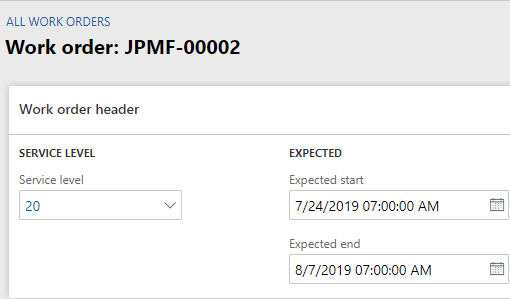
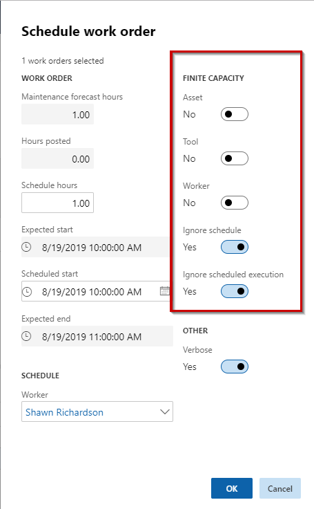

---
# required metadata

title: Schedule work order on specific date and time
description: This topic explains how to schedule a work order on a specific date and time in Asset Management.
author: josaw1
manager: AnnBe
ms.date: 06/28/2019
ms.topic: article
ms.prod: 
ms.service: dynamics-ax-applications
ms.technology: 

# optional metadata

ms.search.form: CatProcureCatalogEdit, CatProcureCatalogListPage
# ROBOTS: 
audience: Application User
# ms.devlang: 
ms.reviewer: josaw
ms.search.scope: Core, Operations
# ms.tgt_pltfrm: 
ms.custom: 2214
ms.assetid: 2f3e0441-414d-402b-b28b-7ab0d650d658
ms.search.region: Global
# ms.search.industry: 
ms.author: mkirknel
ms.search.validFrom: 2016-02-28
ms.dyn365.ops.version: AX 7.0.0

---

# Schedule work order on specific date and time

If a work order must be scheduled on a specific date *and* time, for example, you can override the standard scheduling process in Asset Management and create a specific schedule for a work order.

1. Click **Asset management** > **Common** > **Work orders** > **All Work orders** or **Active work orders**.

2. In the work order list, click on the Work order ID in the **Work order** column.

3. Click **Edit**.

4. On the **Work order header** FastTab, insert start and end dates and times in the **Expected start** and **Expected end** fields.

5. On the **General** tab, click **Schedule** to use the standard scheduling process, or click **Dispatch** if you want to schedule the work order to a specific worker.

6. In order to override any existing capacity reservations to ensure that the work order is scheduled in the expected period, select "No" on the **Object**, **Tool**, and **Worker** toggle buttons on the **Parameters** FastTab > **Finite capacity** section. This means that the scheduling process will ignore existing capacity reservations because the work order must start on the expected start time.

The figure below shows the **Schedule work orders** dialog with the selections for ensuring work order schedule on your selected date and time.

7. Click **OK** to start scheduling.

8. If the scheduling process results in double bookings, you will see a message on the screen, and you can adjust the related work orders.

<NOTE
>In order to schedule a maintenance worker for the work order, that maintenance worker must be available at the expected start date and time. Worker availability is set up in the worker calendar. 

