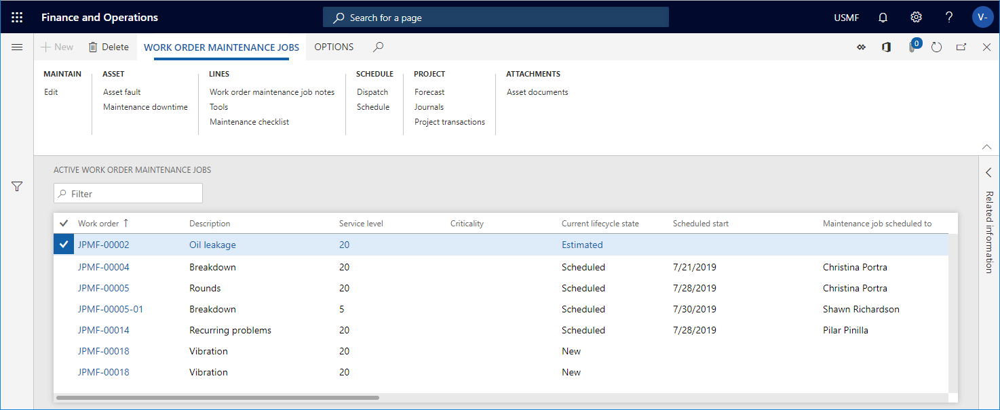

---
# required metadata

title: Active work order maintenance jobs overview
description: This topic explains active work order maintenance jobs overview in Asset Management.
author: josaw1
manager: AnnBe
ms.date: 08/15/2019
ms.topic: article
ms.prod: 
ms.service: dynamics-ax-applications
ms.technology: 

# optional metadata

ms.search.form: 
# ROBOTS: 
audience: Application User
# ms.devlang: 
ms.reviewer: josaw
ms.search.scope: Core, Operations
# ms.tgt_pltfrm: 
ms.custom: 
ms.assetid: 
ms.search.region: Global
# ms.search.industry: 
ms.author: mkirknel
ms.search.validFrom: 2019-08-31
ms.dyn365.ops.version: 10.0.5

---

# Active work order maintenance jobs overview

[!include [banner](../../includes/banner.md)]

[!include [banner](../../includes/preview-banner.md)]

In **Active work order maintenance jobs**, you can get an overview of work orders in relation to how many work orders have been created on specific assets, asset types, manufacturers, models, maintenance job types, and so on. If you select a work order job and click **Edit**, you open the related work order. If you select a job and click one of the buttons on the **Work order maintenance jobs** tab, you see data for the work order to which the work order job is related.

Click **Asset management** > **Common** > **Work orders** > **Active work order maintenance jobs** to open the list. The list contains all active work order jobs and displays some of the information related to the work order or work order job.

In the **%** column, a number indicates completion of the work order in percent. Completion is based on two calculations: Posted hours compared to forecasted hours, and number of maintenance checklists completed.

For a short description of the buttons in **Active work order maintenance jobs**, refer to [Introduction to work orders](../work-orders/introduction-to-work-orders.md) in which identical buttons are described.
