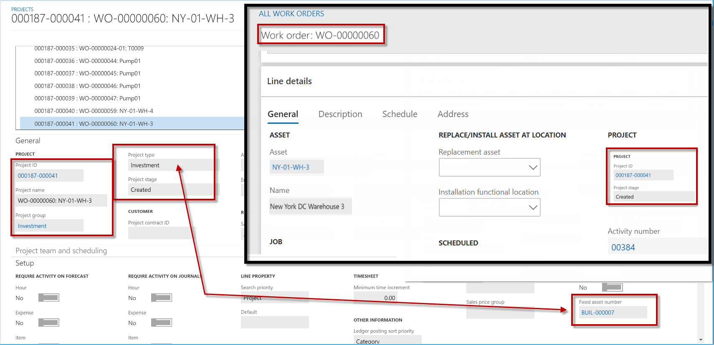

---
# required metadata

title: Working on work orders
description: This topic describes working on work orders in Enterprise Asset Management.
author: josaw1
manager: AnnBe
ms.date: 06/27/2019
ms.topic: article
ms.prod: 
ms.service: dynamics-ax-applications
ms.technology: 

# optional metadata

ms.search.form: CatProcureCatalogEdit, CatProcureCatalogListPage
# ROBOTS: 
audience: Application User
# ms.devlang: 
ms.reviewer: josaw
ms.search.scope: Core, Operations
# ms.tgt_pltfrm: 
ms.custom: 2214
ms.assetid: 2f3e0441-414d-402b-b28b-7ab0d650d658
ms.search.region: Global
# ms.search.industry: 
ms.author: mkirknel
ms.search.validFrom: 2016-02-28
ms.dyn365.ops.version: AX 7.0.0

---

# Add fault to work order

You can add faults set up in the fault designer to a work order. The object selected in the work order must contain object types that have one or more fault records connected to it. Read more about setup in the [Fault management](../setup-for-work-orders/fault-management.md) section.

1. Click **Enterprise asset management** > **Common** > **Work orders** > **All Work orders** or **Active work orders**.

2. In the list, select the work order on which you want to make a fault registration and click **Object fault**.

3. On the **Symptoms** FastTab, click **Add line**. A sequential fault number is automatically inserted in the **Fault** field.

4. Select the relevant symptom in the **Fault symptom** field.

5. Select **Fault area** and **Fault type** in the relevant fields.

6. In the **Fault date** field, the current date is automatically inserted. You can select another date, if necessary.

7. On the **Cause** FastTab, add a line describing the cause of the problem.

8. On the **Remedy** FastTab, add a line describing a possible solution to the problem.

9. Click **Save**.

## View object faults

In the **Object faults** list, you can get an overview of all faults registered on objects.

Click **Enterprise asset management** > **Inquiries** > **Object fault** > **Object faults** to open the list.

## Print object fault report

From the **All objects** list page, you can print an object fault report displaying all fault registrations as well as a graphic overview of fault statistics.

1. Click **Enterprise asset management** > **Common** > **Objects** > **All objects**.

2. In the **Objects** list, select the object for which you want to print a fault report.

3. On the **General** tab, click **Object fault**.

4. If required, insert a specific period or select a fault type.

5. Click **OK** to print the report.

>[!NOTE]
>You can also print a fault report for several objects or object types by clicking **Enterprise asset management** > **Reports** > **Objects** > **Object fault**.
