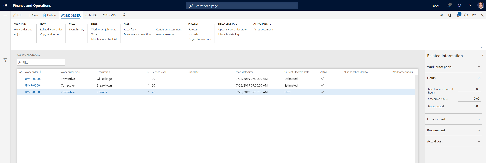
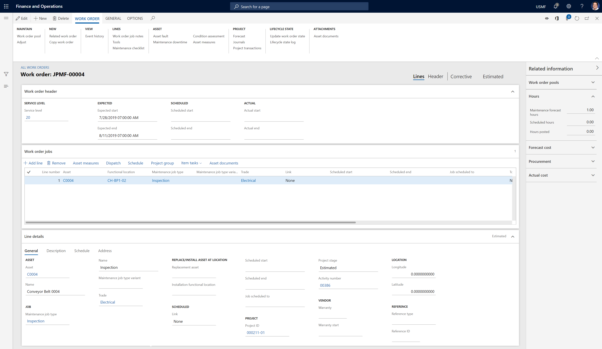

---
# required metadata

title: Introduction to work orders
description: This topic provides an overview of work orders in Asset Management.
author: josaw1
manager: AnnBe
ms.date: 08/15/2019
ms.topic: article
ms.prod: 
ms.service: dynamics-ax-applications
ms.technology: 

# optional metadata

ms.search.form: 
# ROBOTS: 
audience: Application User
# ms.devlang: 
ms.reviewer: josaw
ms.search.scope: Core, Operations
# ms.tgt_pltfrm: 
ms.custom: 
ms.assetid: 
ms.search.region: Global
# ms.search.industry: 
ms.author: mkirknel
ms.search.validFrom: 2019-08-15
ms.dyn365.ops.version: 10.0.5

---

# Introduction to work orders

[!include [banner](../../includes/banner.md)]

[!include [banner](../../includes/preview-banner.md)]

Work orders are used to manage, provide required information for, and register consumption on maintenance jobs. A work order may contain one or more work order jobs, and one or more assets can be connected to a work order. Each work order line defines a maintenance job scheduled on the asset.

Work orders can be created automatically or manually:

- Automatically using the **Schedule maintenance plans** form, for calendar-based maintenance plans set to "Auto create" (refer to [Preventive and reactive maintenance](../preventive-and-reactive-maintenance/preventive-maintenance-overview.md)).  

- Automatically using the **Schedule maintenance rounds** form, for maintenance rounds set to "Auto create" (refer to [Preventive and reactive maintenance](../preventive-and-reactive-maintenance/preventive-maintenance-overview.md)).  

- Create from maintenance schedule, which can be preventive maintenance jobs or maintenance requests.  

- Create a work order manually.  

- Create a work order from the **All maintenance requests** or **Active maintenance requests** or **My functional location maintenance requests**.

>[!NOTE]
>Work order jobs related to the same asset are related to the same project ID.

## All work orders

Click **Asset management** > **Common** > **Work orders** > **All Work orders** to open the list. **All work orders** contain a list of all work orders and displays some of the information related to a work order.

- Click **Asset management** > **Common** > **Work orders** > **Active work orders** to see a list of active work orders.

- Click **Asset management** > **Common** > **Work orders** > **My functional location work order maintenance jobs** to see a list of work order jobs containing assets installed on functional locations, you are related to as a worker (set up in [Maintenance workers and worker groups](../setup-for-objects/workers-and-worker-groups.md)).

- In the **All Work orders** list (grid view), click on a link in the **Work order** column to show the Details view of the selected record. Click the **Edit** button to open for editing.  

- In the Details view, you see detailed information related to the work order.  

- In the Details view, select the **Lines** link to see work order job details, or select the **Header** link to see work order details.  

- The vertical **Related information** pane to the right of the screen contains additional work order-related information. Expand the pane to see related information for the selected work order.  

The action pane buttons are organized in tabs on the action pane. Here is a brief description of the buttons relating to Enterprise Asset Management:

| Button name                     | Description                                                                                                                                                                                                                                                             |
|---------------------------------|-------------------------------------------------------------------------------------------------------------------------------------------------------------------------------------------------------------------------------------------------------------------------|
| Edit                            | Edit the selected work order.                                                                                                                                                                                                                                           |
| New                             | Create new work order.                                                                                                                                                                                                                                                  |
| Delete                          | Delete the selected work order.                                                                                                                                                                                                                                         |
| Work order pool                 | Add selected work order to a work order pool, or remove from work order pool.                                                                                                                                                                                           |
| Adjust                          | Adjust information about expected start and end, service level, responsible maintenance worker, or responsible maintenance worker group on selected work orders.                                                                                                                                     |
| Related work order              | Create a new work order related to the selected work order job. This is useful if you want to register primary and secondary work orders.                                                                                                                              |
| Copy work order                 | Create a new work order based on an existing work order.                                                                                                                                                                                                                |
| Event history                   | See registration history on the work order.                                                                                                                                                                                                                |
| Work order maintenance job notes                           | Create a description, or insert notes or remarks, on a work order. Start by clicking the **Add timestamp** button to add your user name and a timestamp to the note. Notes are displayed in the **Work order** form > **Line details** FastTab > **Description** tab. |
| Tools                           | Create a list of required tools on a work order. Tools are set up as resources in **Organization administration** > **Common** > **Resources** > **Resources**.                                                                                                      |
| Maintenance checklist           | View checklist for the asset connected to the work order.                                                                                                                                                                                                              |
| Asset fault                     | View or register fault information on an asset to be used for fault management.                                                                                                                                                                                        |
| Maintenance downtime            | Specify maintenance downtime for a work order.                                                                                                                                                                                                                               |
| Condition assessment            | Register condition assessment measurements on a work order.                                                                                                                                                                                                             |
| Asset counters                 | Create or view counter registrations on the asset.                                                                                                                                                                                                                     |
| Forecast                        | View or create forecasts on a work order.                                                                                                                                                                                                                               |
| Journals                        | View or create work order journals. Journal lines can be copied from forecasts.                                                                                                                                                                                         |
| Project transactions            | View all posted transactions related to work orders created for the asset.                                                                                                                                                                                             |
| Update Work order state                | Update work order lifecycle state.                                                                                                                                                                                                                                                |
| Lifecycle state log                       | Log displaying the lifecycle states of the selected work order.                                                                                                                                                                                                                   |
| Asset documents                | View list of documents attached to assets related to a work order. These documents are set up in **Asset management** > **Setup** > **Asset documents**.                                                                                                 |
| Schedule                        | Schedule the selected work orders.                                                                                                                                                                                                                                      |
| Dispatch            | Schedule the selected work order for one worker.                                                                                                                                                                                                                        |
| Delete schedule                 | Delete scheduling for the selected work order.                                                                                                                                                                                                                          |
| Scheduled work order maintenance jobs             | Open the **Scheduled work order maintenance jobs** list page.                                                                                                                                                                                                                             |
| Work order purchase requisition | Open the **Work order purchase requisition** list page.                                                                                                                                                                                                                 |
| Work order purchase             | Open the **Work order purchase** list page.                                                                                                                                                                                                                             |
| Cost control                    | Compare budget costs and actual costs on the work order.                                                                                                                                                                                                                |
| Hour control                    | Compare forecasted hours and actual hours on the work order.                                                                                                                                                                                                                |
| Work order report               | Print work order report.                                                                                                                                                                                                                                                |
| Work order consumption          | Print consumption report.                                                                                                                                                                                                                                               |

The buttons on the **Work order** tab > **Project** group relate to functionality in the **Project management and accounting** module regarding forecasts, journals, and invoicing.

>[!NOTE]
>Forecasts created on a work order can be included when running master scheduling by using the forecast model selected in the **Asset management parameters** form.

