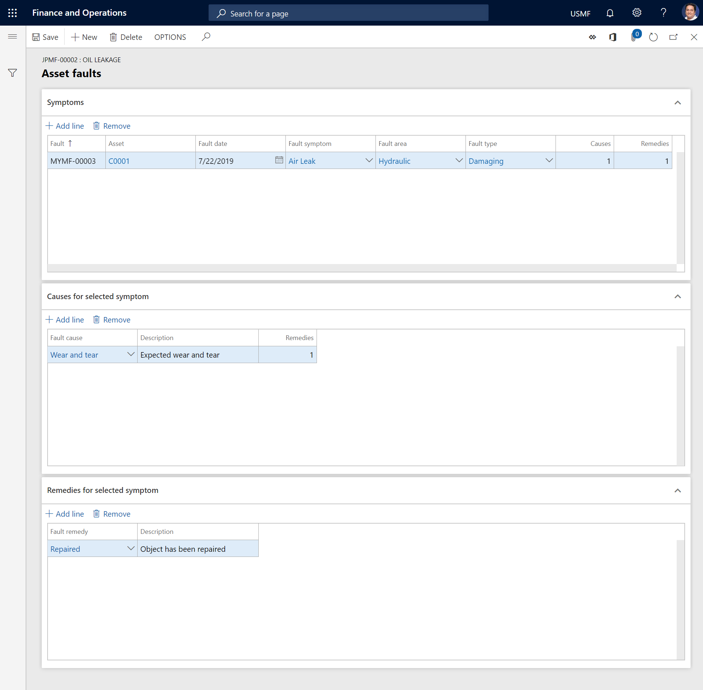

---
# required metadata

title: Working on work orders
description: This topic describes working on work orders in Enterprise Asset Management.
author: josaw1
manager: AnnBe
ms.date: 06/27/2019
ms.topic: article
ms.prod: 
ms.service: dynamics-ax-applications
ms.technology: 

# optional metadata

ms.search.form: CatProcureCatalogEdit, CatProcureCatalogListPage
# ROBOTS: 
audience: Application User
# ms.devlang: 
ms.reviewer: josaw
ms.search.scope: Core, Operations
# ms.tgt_pltfrm: 
ms.custom: 2214
ms.assetid: 2f3e0441-414d-402b-b28b-7ab0d650d658
ms.search.region: Global
# ms.search.industry: 
ms.author: mkirknel
ms.search.validFrom: 2016-02-28
ms.dyn365.ops.version: AX 7.0.0

---

# Checklists

Checklists are set up on job types and used when you work on a work order. Filling out checklists is part of completing a work order. See the [Job groups and job types, variants,trades, and checklists](../setup-for-work-orders/job-groups-and-job-types-variants-trades-and-checklists.md) section for more information on how to set up checklists on job types in the **Job type setup** detail view.

When you work with checklists on a work order, you can fill out the predefined checklists that are related to job types. It is also possible to add additional checklists.

## Fill out a checklist

1. Click **Enterprise asset management** > **Common** > **Work orders** > **All work orders** or **Active work orders**.

2. Select the work order and click **Checklist**.

3. In **Checklists**, you see checklists for all work order lines. If the work order lines have different job types, the checklists may be different on each work order line. Click on the work order line that you want to work with. The related checklist is shown on the **Checklist** FastTab. The properties of the selected checklist line are shown on the **Properties** FastTab.

4. Complete all the checklist lines, one at a time, in the sequential order they are shown. A checklist line of type "Header" is used as a heading to group the checklist lines below. You are not required to fill out a header, but as for all checklist line types, it is possible to add a **Note** to the header.

5. If instructions are related to a checklist line, the **Instructions** check box is selected. Read instructions for the selected checklist line on the **Instructions** tab.

6. The information required to complete a checklist line may vary, depending on the related checklist type. You complete a checklist line by filling out the fields on the **Properties** FastTab. For example, on a line of type "Text", you add a **Note** explaining what was the result of that checklist line. On a line of type "Measurement", you add the **Measured value** you read on the equipment, and you can also add a **Note**, if required.

- When you have completed a checklist line, select the **Checked** check box to mark the line as completed. If you want to discard a checklist line because it is not relevant for the work order line, select the **N/A** check box on the line. If a checklist line is marked **Mandatory**, you must mark it as either "Checked" or "N/A".  
- You can only update checklist registrations if the work order is in an [Active](../setup-for-work-orders/work-order-stages.md) stage.  
- In the left side of the view, on the work order line, the **Checks** field informs you of the number of checklist lines to be completed. Note that a checklist line of type "Header" is not included in the count because "Header" is used to divide a checklist into different sections. A header line is not a check that you need to complete.  

## Add a checklist line

Checklists are created from the definition on the job type setup and transferred to a work order line. If required, you can add checklist lines to a work order line. Manually added checklist lines get the reference "Manual".

1. In **Checklists**, select the work order line number for which you want to add a checklist.

2. On the **Checklist** FastTab, select a checklist line and press the arrow-down button on your keyboard if you want to insert a new line after the selected checklist line. The next number in the sequence is automatically inserted in the **Line number** field. You can also select a checklist line and click the **Add line** button if you want to insert a new line above the selected checklist line.

3. Insert a name for the checklist in the **Name** field.

4. In the **Type** field, select a type for the checklist line. For each checklist type, the related fields are shown on the **Properties** FastTab.  
  a. "Text" is used to add a checklist line with a text description of what to do. This checklist type can be used if you want a worker to check or inspect something, without expecting a specific (measurable) result. Insert a description of what to do on the **Instructions** tab.  
  b. "Header" is used as a heading to group the checklist lines shown below the header. This is useful if you have several checklist lines that can be divided into specific areas. Insert a descriptive name in the **Name** field.  
  c. "Template" is not applicable when you add a checklist line manually on a work order line.  
  d. "Variable" is used to define a possible result in a range on a checklist line. The setup of checklist variables is described in [Job groups and job types, variants, trades, and checklists](../setup-for-work-orders/job-groups-and-job-types-variants-trades-and-checklists.md). Insert a name to describe the variable in the **Name** field. Select the variable in the **Variable** field. Insert a description of what to do on the **Instructions** tab.  
  e. "Measurement" is used to record a specific measurement. Insert a name for the measurement in the **Name** field. Select the unit for the measure in the **Unit** field. Insert a description of what to do on the **Instructions** tab.  

5. When you are done adding checklist lines manually, fill out the lines as described in the section above.

>[!NOTE]
>In the **Checklists**, you cannot delete checklist lines with the reference "Job type". You can only delete checklist lines with the reference "Manual", which you or other workers have created manually.

The figure below shows a screenshot of the interface.

