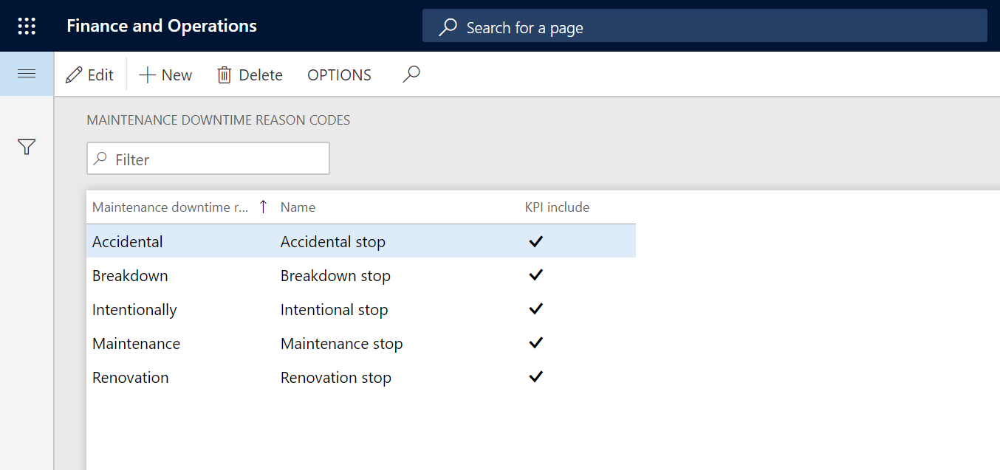
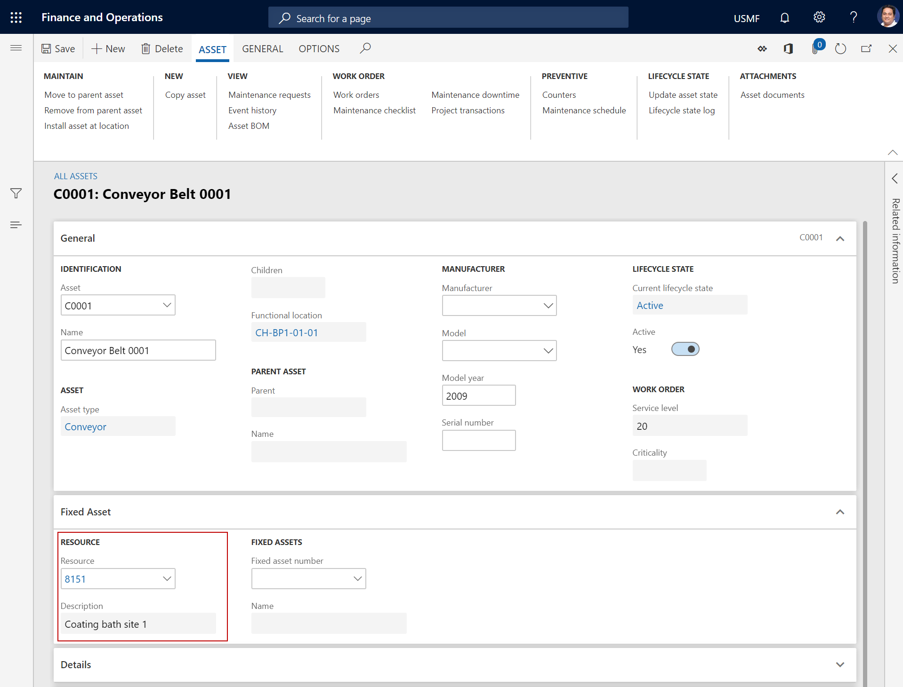
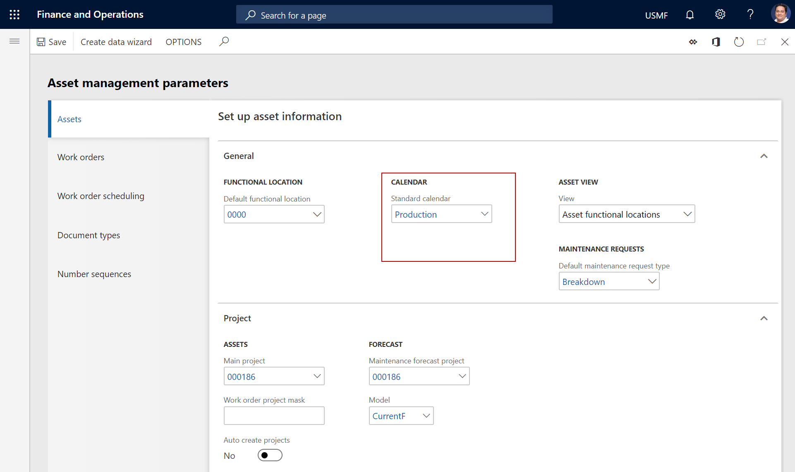

---
# required metadata

title: Maintenance downtime
description: This topic describes maintenance downtime in Asset Management.
author: josaw1
manager: AnnBe
ms.date: 08/23/2019
ms.topic: article
ms.prod: 
ms.service: dynamics-ax-applications
ms.technology: 

# optional metadata

ms.search.form: 
# ROBOTS: 
audience: Application User
# ms.devlang: 
ms.reviewer: josaw
ms.search.scope: Core, Operations
# ms.tgt_pltfrm: 
ms.custom: 
ms.assetid: 
ms.search.region: Global
# ms.search.industry: 
ms.author: mkirknel
ms.search.validFrom: 2019-08-31
ms.dyn365.ops.version: 10.0.5

---

# Maintenance downtime

[!include [banner](../../includes/banner.md)]

[!include [banner](../../includes/preview-banner.md)]

You can create maintenance downtime registrations on the asset selected on a work order. This is useful if you want to register maintenance downtime on one or more machines in the production area. First, you create the maintenance downtime reason codes that you want to use, for example, breakdown and planned stop. This is done in **Maintenance downtime reason codes**. Next, you can create maintenance downtime registrations in **Maintenance downtime** and add the relevant reason codes.

## Create maintenance downtime reason codes

1. Click **Asset management** > **Setup** > **Work orders** > **Maintenance downtime reason codes**.

2. Click **New**.

3. Insert an ID in the **Maintenance downtime reason code** field.

4. Insert a name for the reason code in the **Name** field.

5. Select the **KPI include** check box if the reason code should be included in asset KPI calculations. Generally, planned production stops should not be included in KPI calculations as they do not impact expected performance.

6. Click **Save**.

When you have created the maintenance downtime reason codes you want to use, you can create maintenance downtime registrations for work orders and assets.

## Create maintenance downtime registrations

1. Click **Asset management** > **Common** > **Work orders** > **All work orders** or **Active work orders**.

2. Select the work order and click **Maintenance downtime**.

3. Click **New**.

4. Insert date and time interval for the maintenance downtime registration in the **From** and **To** fields.

5. When you leave the **To** field, the duration in hours is automatically inserted in the **Duration** field.

6. Select a reason code in the **maintenance downtime reason code** field.

7. Repeat steps 3-6 if you want to add more registrations.

8. Click **Save**.

The calendar used to calculate a maintenance downtime registration depends on your selection in the setup of assets and parameters. If a resource is selected on an asset in **All assets** > **Fixed asset** FastTab > **Resource** field, the calendar set up for the associated resource group is used, as shown in the following figure.

If no resource is selected on the asset, the standard calendar selected in **Asset management parameters** is used, as shown in the following figure.

Click **Enterprise asset management** > **Inquiries** > **Maintenance downtime** to see an overview of all maintenance downtime registrations.

>[!NOTE]
>All calendars used in the **Asset Management** module are set up in **Organization administration** > **Setup** > **Calendars** > **Calendars**.

