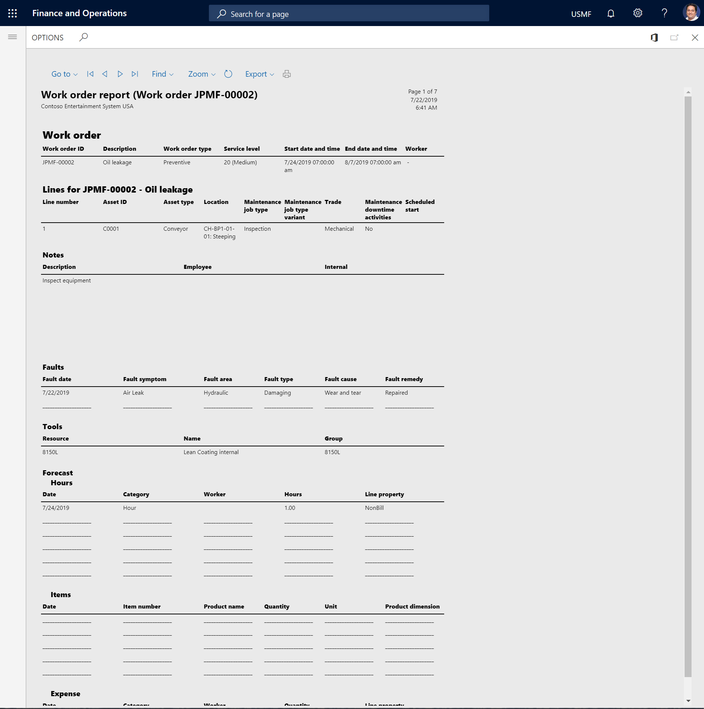
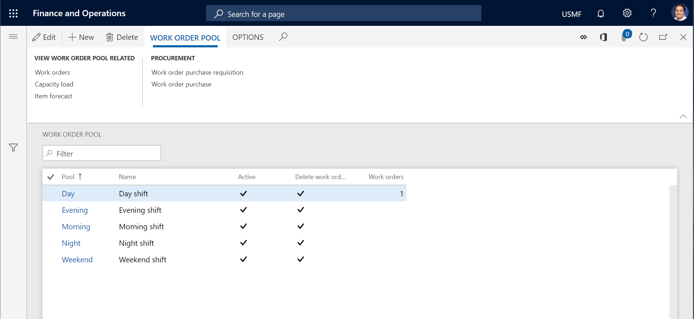

---
# required metadata

title: Working on work orders
description: This topic describes working on work orders in Enterprise Asset Management.
author: josaw1
manager: AnnBe
ms.date: 06/27/2019
ms.topic: article
ms.prod: 
ms.service: dynamics-ax-applications
ms.technology: 

# optional metadata

ms.search.form: CatProcureCatalogEdit, CatProcureCatalogListPage
# ROBOTS: 
audience: Application User
# ms.devlang: 
ms.reviewer: josaw
ms.search.scope: Core, Operations
# ms.tgt_pltfrm: 
ms.custom: 2214
ms.assetid: 2f3e0441-414d-402b-b28b-7ab0d650d658
ms.search.region: Global
# ms.search.industry: 
ms.author: mkirknel
ms.search.validFrom: 2016-02-28
ms.dyn365.ops.version: AX 7.0.0

---

# Production stop

You can create production stops on the object selected on a work order. This is useful if you want to register production stop on one or more machines in the production area. First, you create the production stop types that you want to use, for example, breakdown and planned stop. This is done in **Production stop types**. Next, you can create production stop lines in **Production stop** and add the relevant production stop types.

## Create production stop types

1. Click **Enterprise asset management** > **Setup** > **Work orders** > **Production stop types**.

2. Click **New**.

3. Insert an ID for the production stop type in the **Production stop type** field.

4. Insert a name in the **Name** field.

5. Select the **KPI include** check box if the stop type should be included in object KPI calculations. Generally, planned production stops should not be included in KPI calculations as they do not impact expected performance.

6. Click **Save**.

The figure below shows a screenshot of the interface.

When you have created the production stop types you want to use, you can create production stop lines for work orders and objects.

## Create production stops

1. Click **Enterprise asset management** > **Common** > **Work orders** > **All work orders** or **Active work orders**.

2. Select the work order and click **Production stop**.

3. Click **New**.

4. Insert date and time interval for the production stop in the **From** and **To** fields.

5. When you leave the **To** field, the duration in hours is automatically inserted in the **Duration** field.

6. Select a stop type in the **Production stop type** field.

7. Repeat steps 3-6 if you want to add more production stop lines.

8. Click **Save**.

The following figure shows a screenshot of the interface.

The calendar used to calculate a production stop depends on your selection in the setup of objects and parameters. If a resource is selected on an object in **All Objects** > **Asset** FastTab > **Resource** field, the calendar set up for the associated resource group is used, as shown in the following figure.

If no resource is selected on the object, the standard calendar selected in the **Enterprise asset management parameters** form is used, as shown in the following figure, as shon in the following figure.

Click **Enterprise asset management** > **Inquiries** > **Production stop** to see an overview of all production stops.

**Note:** All calendars used in the **Enterprise Asset Management** module are set up in **Organization administration** > **Setup** > **Calendars** > **Calendars**.

