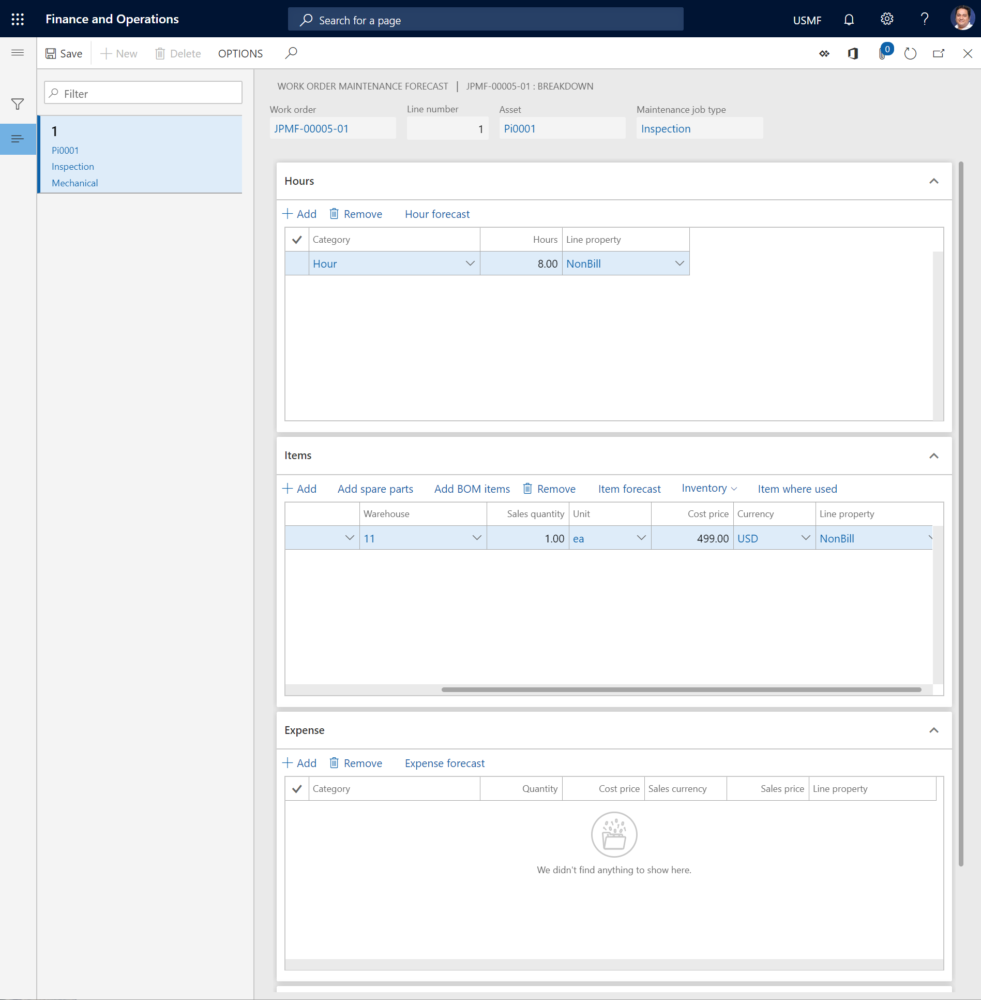

---
# required metadata

title: Forecasts
description: This topic explains forecasts in Enterprise Asset Management.
author: josaw1
manager: AnnBe
ms.date: 06/27/2019
ms.topic: article
ms.prod: 
ms.service: dynamics-ax-applications
ms.technology: 

# optional metadata

ms.search.form: CatProcureCatalogEdit, CatProcureCatalogListPage
# ROBOTS: 
audience: Application User
# ms.devlang: 
ms.reviewer: josaw
ms.search.scope: Core, Operations
# ms.tgt_pltfrm: 
ms.custom: 2214
ms.assetid: 2f3e0441-414d-402b-b28b-7ab0d650d658
ms.search.region: Global
# ms.search.industry: 
ms.author: mkirknel
ms.search.validFrom: 2016-02-28
ms.dyn365.ops.version: AX 7.0.0

---

# Forecasts

This topic explains forecasts in Enterprise Asset Management. When you create a work order, you create work order lines with related objects and job types. When you select a job type containing forecasts, the forecasts are automatically copied to the work order.

You may be able to add or delete forecast lines on a work order. The setup of a work order stage, the related project type, and the stage rules related to the project type determines if you are able to add or edit forecast lines. Read more about work order stages and related project stages in [Integration to project management and accounting](../integration-to-project-management-and-accounting/forecasts-work-orders-and-projects.md).

1. Click **Enterprise asset management** > **Common** > **Work orders** > **All work orders** or **Active work orders**.

2. Select the work order in the list, and click **Forecast**. In **Work order forecast**, forecast lines from the job type selected on the work order line are displayed.

## Add hours forecast to a work order

1. Select the work order line to which you want to add a forecast.

2. On the **Forecast** FastTab, click the **Hours** tab.

3. Click **Add** to create a new line.

4. Select a category in the **Category** field.

5. Insert number of forecasted hours in the **Hours** field.

6. In the **Line property** field, select the charge type to be used on the line.

## Add items forecast to a work order

There are three ways to add items to a work order forecast: You can create lines for items (spare parts) that are not included in the spare parts list or object BOM, you can select spare parts from the approved spare parts list, and you can select items from the object BOM.

1. Select the work order line to which you want to add a forecast.

2. On the **Forecast** FastTab, click the **Items** tab.

3. Click **Add** to create a new line for a spare part that is not on the spare parts list or the object BOM list.

4. Select the item in the **Item number** field.

5. Insert quantity in the **Quantity** field, and select a quantity unit in the **Unit** field.

6. Insert cost price and currency in the relevant fields.

7. If you want to change the list of dimensions displayed on the **Inventory dimensions** tab, click **Inventory** > **Dimensions display**, select the dimensions, and select "Yes" on the **Save setup** toggle button.

8. If you want to add an approved spare part to the forecast, click **Add spare parts**, select the spare part, edit related information if required, and click **OK**.

9. If you want to add object BOM items to the forecast, click **Add BOM items**, select the item, edit related information if required, and click **OK**.

10. Click the **Item where used** if you want to get an overview of where the item on the selected line is used in Enterprise Asset Management in relation to objects, job type setup, spare parts, and work orders. Read more about this overview in [Items where used](../controlling-and-reporting/items-where-used.md).

## Add expense forecast to a work order

1. This topic explains how to add an expense forecast to a work order. In the left-hand side of the form, select the work order line to which you want to add a forecast.

2. On the **Forecast** FastTab, click the **Expense** tab.

3. Click **Add** to create a new line.

4. Select a category in the **Category** field.

5. Insert quantity in the **Quantity** field.

6. Insert cost price, sales currency, and sales price in the relevant fields.

7. In the **Line property** field, select the charge type to be used on the line.

>[!NOTE]
>On the **Forecast totals** FastTab, you can see an overview of the number of lines created on each tab, for the selected work order line and for the work order. Also, you can see a sum of forecasted work hours for the work order line and for the work order.

## Automatic update of work order forecasts

In Enterprise Asset Management, you can automatically update any changes in work order forecasts regarding hour costs, item costs, and expenses, which have been updated in other modules in Dynamics 365 for Finance and Operations. This is done to ensure that the latest cost prices are always used in your work order forecasts. It is also possible to make similar updates for [job type forecasts](../setup-for-work-orders/job-groups-and-job-types-variants-trades-and-checklists.md).

1. Click **Enterprise asset management** > **Periodic** > **Forecast** > **Update work order forecast**.

2. In the **Update work order forecast** drop-down, you can add selections regarding specific work orders or work order lines, if required. Click **Filter** to make those selections.

3. If required, you can set up the automatic update as a batch job on the **Run in
the background** FastTab.

4. Click **OK** to start the forecast update.

The following figure shows a screenshot of the interface.

