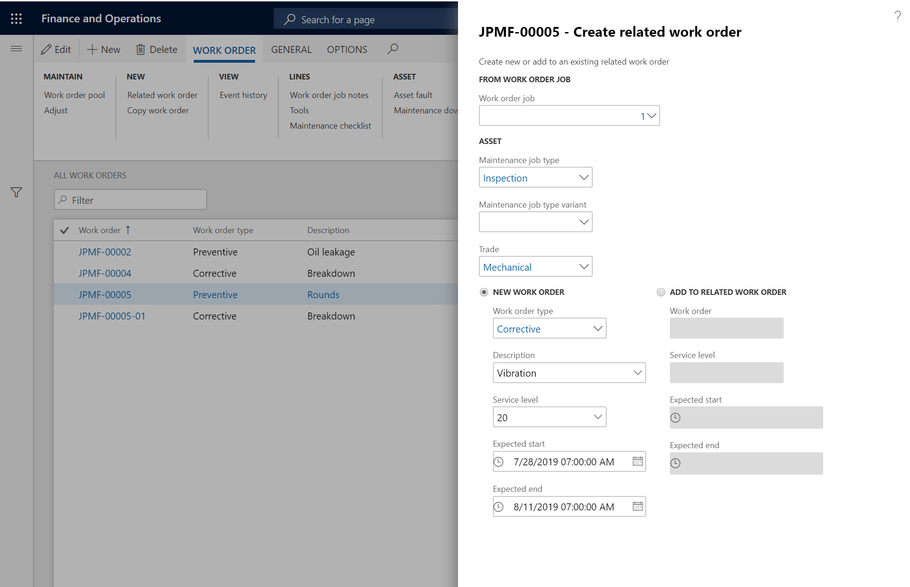
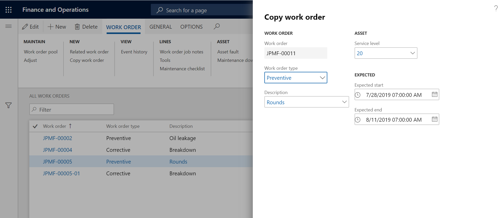
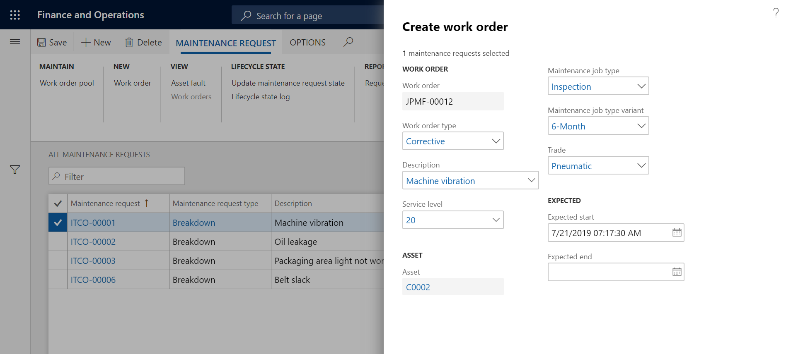

---
# required metadata

title: Manually created work orders
description: This topic explains how to create work orders manually in Asset Management.
author: josaw1
manager: AnnBe
ms.date: 06/27/2019
ms.topic: article
ms.prod: 
ms.service: dynamics-ax-applications
ms.technology: 

# optional metadata

ms.search.form: CatProcureCatalogEdit, CatProcureCatalogListPage
# ROBOTS: 
audience: Application User
# ms.devlang: 
ms.reviewer: josaw
ms.search.scope: Core, Operations
# ms.tgt_pltfrm: 
ms.custom: 2214
ms.assetid: 2f3e0441-414d-402b-b28b-7ab0d650d658
ms.search.region: Global
# ms.search.industry: 
ms.author: mkirknel
ms.search.validFrom: 2016-02-28
ms.dyn365.ops.version: AX 7.0.0

---

# Manually created work orders

You can create work orders manually in two ways:

- in **All work orders** or **Active work orders**  
- in **All maintenance requests** or **Active maintenance requests** or **My functional location maintenance requests**  

## Create work order

1. Click **Asset management** > **Common** > **Work orders** > **All work orders** or **Active work orders**.

2. Click the **New** button.

3. In the **Create work order** drop-down, select a work order type.

4. If required, select a description.

5. Select the asset for the work order as well as a maintenance job type.

>[!NOTE]
>When you select an asset, three tabs may be available: The **My assets** tab contains assets related to the functional locations to which you (the worker who is logged on the system) may be allocated (set up in [Maintenance workers and worker groups](../setup-for-objects/workers-and-worker-groups.md)). If no functional locations are set up on a worker in [Maintenance workers and worker groups](../setup-for-objects/workers-and-worker-groups.md), the **My assets** tab will not be visible. The **Active assets** tab contains a list of all assets with asset lifecycle state "Active". The **Asset view** tab displays a tree view of functional locations and assets installed on those locations.

6. If required, select **Maintenance job type variant** and **Trade**.

7. If required, you can change the work order service level in the **Service level** field.

8. Select expected start and end dates in the related fields.

9. Click **OK** to create a new work order.

10. Edit the work order in **All work orders**, if required.

- In **All work orders**, You can add several assets to a work order in Details view by adding lines on the **Work order maintenance jobs** FastTab. On an asset, you can only select the maintenance job types that are defined on the asset type selected for the asset.  
- If you have changed an asset service level or an asset criticality after you have used them on a work order (refer to [Asset service levels](../setup-for-objects/object-priorities.md) and [Asset criticalities](../setup-for-objects/object-criticalities.md)), the service level or criticality on the work order is not updated accordingly.
- Criticality on a work order is re-calculated each time a work order line is added or deleted on the work order.
- In **All work orders** Details view > **Header** view > **Schedule** FastTab, you can select a responsible maintenance worker group or a responsible maintenance worker in the **Responsible group** or **Responsible** fields. These settings can be changed as long as the work order is active, for example, when the work order lifecycle state changes. The automatic selection made during work order creation is based on the setup in **Responsible maintenance workers**. If you add or remove work order jobs after you have created a work order, and the **Responsible group** field and the **Responsible** field are blank when you update the work order, Asset Management searches for a possible match in the setup form for a responsible maintenance worker group or a responsible maintenance worker. If the **Responsible group** field or the **Responsible** field is already filled out when you update the work order, no changes are made. Read more about responsible maintenance workers and worker groups in [Responsible maintenance workers](../setup-for-requests/responsible-workers.md).

- In [Maintenance status](../controlling-and-reporting/maintenance-status.md), you can make a calculation to get an overview of workload regarding incoming and completed work orders.  

- On the **Line details** FastTab, use the **Latitude** and **Longitude** fields to add geographic coordinates for the asset selected on the work order job.  

## Create related work order

You can create a related work order to an existing work order if, for example, you want to work with primary and secondary work orders. A new work order is based on a work order job from an existing work order.

1. Click **Asset management** > **Common** > **Work orders** > **All work orders** or **Active work orders**.

2. Select the work order for which you want to make a related work order.

3. Click **Related work order**.

4. In the **Create related work order** drop-down dialog, select the work order job for which you want to create a related work order in the **Work order job** field.

5. Select a maintenance job type in the **Maintenance job type** field and, if required, a related maintenance job type variant and trade in the **Maintenance job type variant** and **Trade** fields.

6. If this is the first related work order you make, click the **New work order** radio button.

7. Select a **Work order type** and a **Description** in the related fields.

8. If required, change the work order service level in the **Service level** field.

9. Insert expected start and end dates in the related fields.

10. Click **OK**. The new related work order is shown in the **All work orders** list.

11. If you create a related work order on a work order that already has related work orders, you can add the work order job to an already related work order. This is done by clicking the **Add to related work order** radio button in step 6. Then you select the related work order to which you want to add a new work order job. Edit the **Service level**, **Expected start**, and **Expected end** fields, as required, and click **OK**. The work order job is added to the existing related work order.

**Note:** If you have set up a related work order mask in **Asset management parameters** > **Work orders** link > **Related work order mask** field, work order IDs will be created in accordance with the mask setup. If no related work order mask is set up, the next available work order ID will be used for related work orders.

## Copy work order

It is possible to quickly create a new work order from an existing work order. This way of working with work orders is different from creating work orders based on [Maintenance plans](../preventive-and-reactive-maintenance/maintenance-sequences.md). It is useful if, for example, you have a work order containing many work order jobs with various jobs on different assets that should be completed at regular intervals.

1. Click **Asset management** > **Common** > **Work orders** > **All work orders** or **Active work orders**.

2. Select the work order from which you want to copy content.

3. Click **Copy work order**. The work order setup from the selected work order is shown. If required, you can edit some of the fields.

4. Click **OK** to create the new work order.

5. Edit the work order in **All work orders**, if required.

>[!NOTE]
>When the new work order is created, some information is copied directly from the existing work order. Information regarding forecasts, tools, maintenance checklists, functional location, addresses, and scheduling is not copied, but initialized from the current setup in Asset Management. This means that if changes were made in those data from the time of creation of the first work order until the time you made a copy of the work order, those changes are included in the new work order you have created. Examples are changes in forecasts or updated maintenance checklists.

## Create work order based on a maintenance request

1. Click **Asset management** > **Common** > **Maintenance requests** > **All maintenance requests** or **Active maintenance requests**.

2. Select the maintenance request for which you want to create a work order, and click **Edit**.

3. In **All requests**, click **Work order**.

4. Fill out the **Work order** drop-down. If a maintenance job type has been selected in the maintenance request, you are able to select another maintenance job type, if required, when you create the work order.

5. Click **OK**. You will see a message informing you that the work order has been created.

6. If you want to see which work orders are connected to a maintenance request, select the maintenance request in the **All maintenance requests** or **Active maintenance requests** lists, and click the **Work orders** button.

>[!NOTE]
>Work orders can also be created automatically by scheduling maintenance plan jobs, or by setting up "Auto create" maintenance plans or maintenance rounds on an asset. Read more about automatically created work orders in [Maintenance plans](../preventive-and-reactive-maintenance/preventive-maintenance-overview.md). Work orders created from maintenance requests in **Maintenance schedule** are created with the maintenance job types selected in the maintenance requests.

