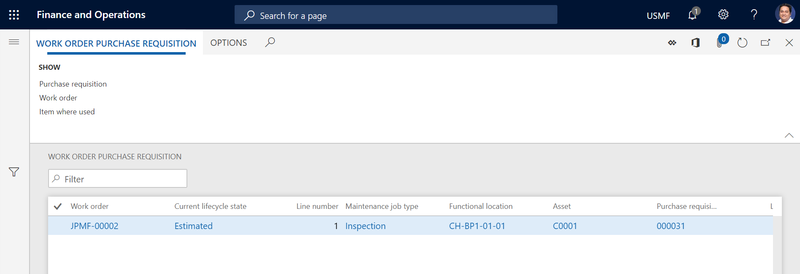
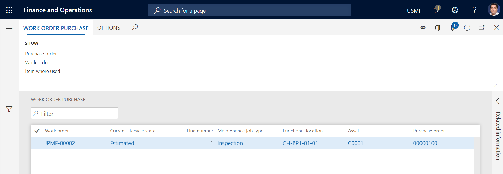
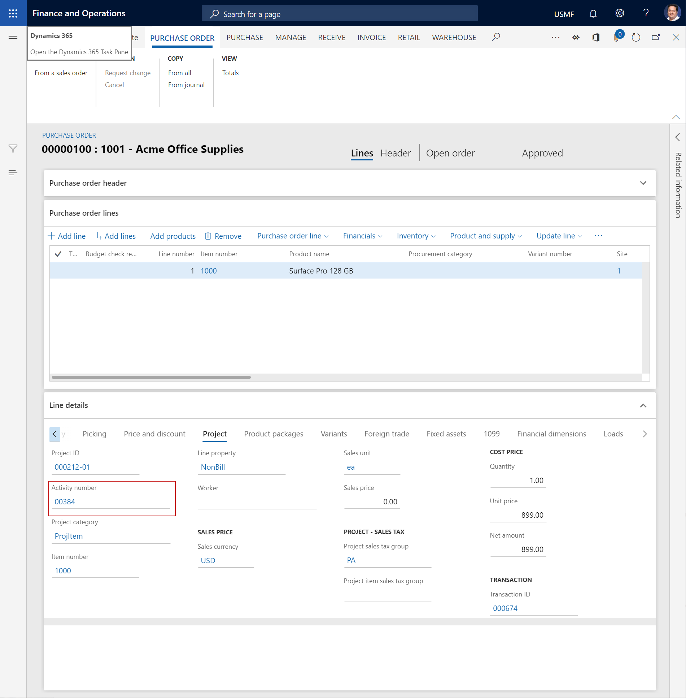

---
# required metadata

title: Procurement
description: This topic explains procurement in Asset Management.
author: josaw1
manager: AnnBe
ms.date: 06/27/2019
ms.topic: article
ms.prod: 
ms.service: dynamics-ax-applications
ms.technology: 

# optional metadata

ms.search.form: CatProcureCatalogEdit, CatProcureCatalogListPage
# ROBOTS: 
audience: Application User
# ms.devlang: 
ms.reviewer: josaw
ms.search.scope: Core, Operations
# ms.tgt_pltfrm: 
ms.custom: 2214
ms.assetid: 2f3e0441-414d-402b-b28b-7ab0d650d658
ms.search.region: Global
# ms.search.industry: 
ms.author: mkirknel
ms.search.validFrom: 2016-02-28
ms.dyn365.ops.version: AX 7.0.0

---

# Procurement

In Asset Management, you can get an overview of purchase requisitions and purchase orders related to work orders. It is also possible to create a purchase order or a purchase requisition from a work order.

In the **Work order purchase requisition** list (**Asset management** > **Common** > **Procurement** > **Work order purchase requisition**), you see a list of purchase requisitions related to work orders.

- Select a work order job in the **Work order purchase requisition** list, and click the **Purchase requisition** button to open the related purchase requisition.  
- Select a work order job in the **Work order purchase requisition** list, and click the **Work order** button to open the related work order.  
- Select a work order job in the **Work order purchase requisition** list, and click the **Item where used** button if you want to get an overview of where the item on the selected line is used in Asset Management in relation to assets, maintenance job type defaults, spare parts, and work orders. 

In the **Work order purchase** list (**Enterprise asset management** > **Common** > **Procurement** > **Work order purchase**), you can see a list of purchase orders related to work orders.

- Select a work order job in the **Work order purchase** list, and click the **Purchase order** button to open the related purchase order.  
- Select a work order job in the **Work order purchase** list, and click the **Work order** button to open the related work order.  
- Select a work order job in the **Work order** purchase list, and click the **Item where used** button if you want to get an overview of where the item on the selected line is used in Asset Management in relation to assets, maintenance job type defaults, spare parts, and work orders. 

In the lists shown above, an icon regarding delivery date control is placed to the right on each line. If the icon shows an exclamation mark in a red circle, it means that delivery on the related purchase requisition or purchase order may be delayed.

On a purchase requisition, the date used to calculate possible delay is found in the **Purchase requisitions** form > **Purchase requisition header** FastTab > **Requested date** field. That date is compared to the available date on the work order or work order job in the same way as the purchase order date.

On a purchase order, the date used to calculate possible delay is the date related to the purchase order line, which shown in the **Purchase order** form > select purchase order line > **Line details** FastTab > **Setup** tab > **Confirmed delivery date** field. If that field is not filled out, the date in the **Delivery date** field on the **Purchase order header** FastTab is used. One of those dates is compared to the available date on the work order or work order job in the following order:

- Actual start date on the work order, or  

- Scheduled start date on the related work order job, or  

- Scheduled start date on the work order, or  

- Expected start date on the work order  

## Create purchase order from a work order

In **All Work orders**, you select a work order job and create a related purchase order or a purchase requisition. This is done to ensure project relations between the purchase order or purchase requisition and the work order.

1. Click **Asset management** > **Common** > **Work orders** > **All work orders** or **Active work orders**.

2. In the **All work orders** or **Active work orders** list, select the work order for which you want to create a purchase order, and click **Edit**.

3. In the **Work order** form > **Work order maintenance jobs** FastTab, select the work order job for which you want to create the purchase order.

4. Click **Item tasks** > **Purchase order from work order job**.

5. In the **Project purchase orders** list page, click **New**.

6. Create the purchase order.

>[!NOTE]
>Creating a purchase requisition is almost identical to creating a purchase order. The only difference is that in the above procedure, you click **Item tasks** > **Purchase requisition from work order job** in step 2.

## Project relation between work order and purchase order or purchase requisition

A purchase order line or purchase requisition line is related to a work order job via the work order project and the related project activity number. When you create a purchase order or purchase requisition from a work order job, the related project activity number is mandatory. The project activity number is automatically inserted on a purchase order or purchase requisition if the related work order contains work order jobs that all use the same maintenance job type. If the work order jobs contain different maintenance job types, the project activity number must be inserted manually.

To see or insert the activity number related to a purchase order line, open **Work order purchase** > select the purchase order record > click on the purchase order in the **Purchase order** column > **Line details** FastTab > **Project** tab > **Activity number** field.

Likewise, to see or insert the activity number related to a work order purchase requisition line, open **Work order purchase requisition** > select the purchase requisition record > click on the purchase requisition in the **Purchase requisition** column > **Line details** FastTab > **Project** tab > **Activity number** field.

