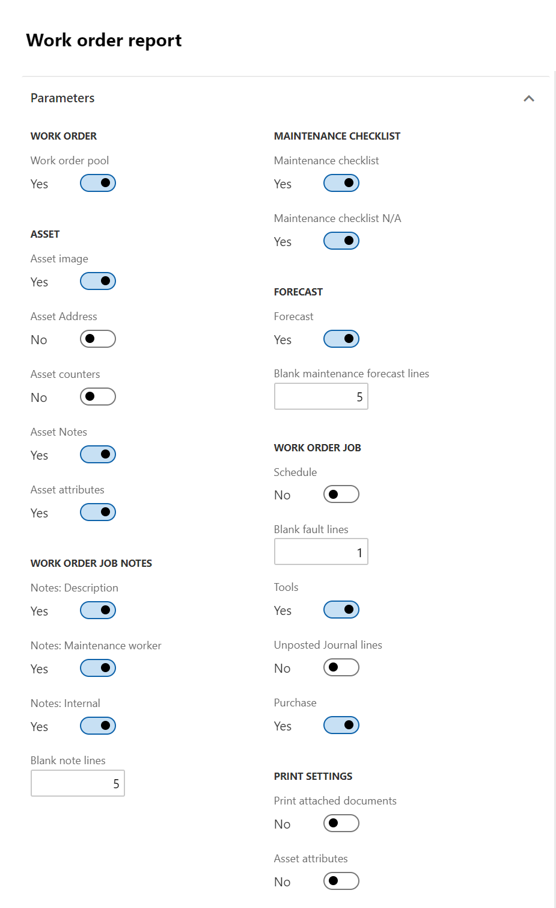

---
# required metadata

title: Work order report
description: This topic describes work order reports in Asset Management.
author: josaw1
manager: AnnBe
ms.date: 06/27/2019
ms.topic: article
ms.prod: 
ms.service: dynamics-ax-applications
ms.technology: 

# optional metadata

ms.search.form: CatProcureCatalogEdit, CatProcureCatalogListPage
# ROBOTS: 
audience: Application User
# ms.devlang: 
ms.reviewer: josaw
ms.search.scope: Core, Operations
# ms.tgt_pltfrm: 
ms.custom: 2214
ms.assetid: 2f3e0441-414d-402b-b28b-7ab0d650d658
ms.search.region: Global
# ms.search.industry: 
ms.author: mkirknel
ms.search.validFrom: 2016-02-28
ms.dyn365.ops.version: AX 7.0.0

---

# Work order report

You can generate a work order report that shows detailed information about a work order. It is possible to select one or several work orders to be displayed in the report.

1. Click **Asset management** > **Reports** > **Work orders** > **Work order report**.

2. Select "Yes"/"No" on the toggle buttons and fill out fields as required, to determine the details to be included in the report.  
  a. In the **Print settings** section, you can select if you want to include attachments from the related maintenance job type setup in the print.

3. On the **Records to include** FastTab, you can filter the contents of the report by **Work order**.

4. If required, you can set up work order report generation as a batch job by filling out the fields on the **Run in the background** FastTab.

5. Click **OK** to generate the report.

Below you see an example of how parameters can be set up, and the related work order report.

