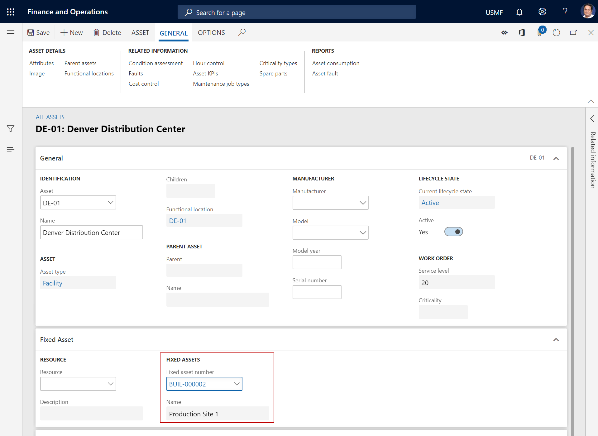
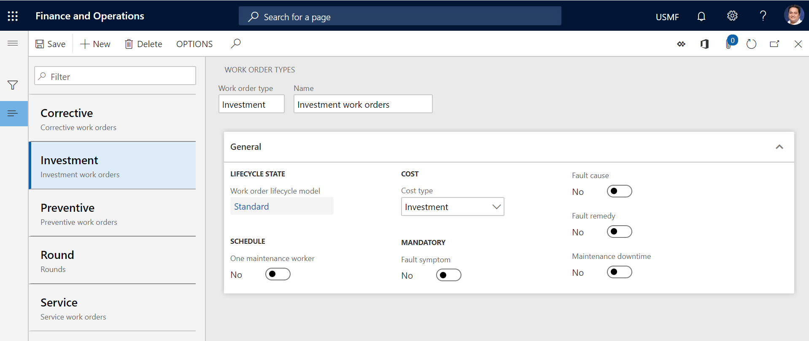
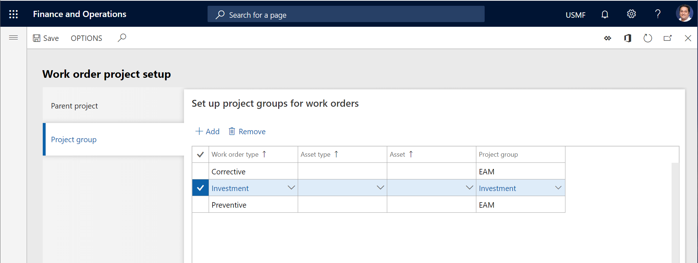
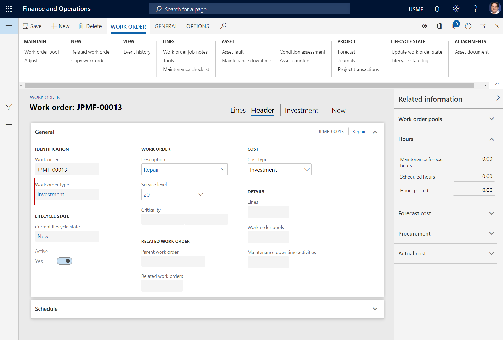

---
# required metadata

title: Work orders and fixed assets
description: This topic explains work orders and fixed assets in Asset Management.
author: josaw1
manager: AnnBe
ms.date: 08/15/2019
ms.topic: article
ms.prod: 
ms.service: dynamics-ax-applications
ms.technology: 

# optional metadata

ms.search.form: 
# ROBOTS: 
audience: Application User
# ms.devlang: 
ms.reviewer: josaw
ms.search.scope: Core, Operations
# ms.tgt_pltfrm: 
ms.custom: 
ms.assetid: 
ms.search.region: Global
# ms.search.industry: 
ms.author: mkirknel
ms.search.validFrom: 2019-08-15
ms.dyn365.ops.version: 10.0.5

---

# Work orders and fixed assets

[!include [banner](../../includes/banner.md)]

 

In Asset Management, assets can be related to fixed assets, and you can create work orders for those assets. If you use this functionality, you can get a complete overview of fixed assets, related investment projects, and the costs registered on the investment projects in the **Project management and accounting** module and the **Fixed assets** module.

>[!NOTE]
>The **Fixed asset number** field is only filled out on the work order job project if type "Investment" is selected as the project type on the work order job project.

The following procedure describes the relation between assets, work orders, work order job projects, and fixed assets.

1. You create an asset that you relate to a fixed asset, as shown in the figure below.

2. When you set up work order types (**Asset management** > **Setup** > **Work orders** > **Work order types**), you create a work order type for handling investments. See also [Work order types](../setup-for-work-orders/work-order-types.md).

3. When you set up work order project groups (**Asset management** > **Setup** > **Work orders** > **Project setup** > **Project group** link), you create a relation between the work order type used for investments and the project group created for investments in the **Project management and accounting** module (**Project management and accounting** > **Setup** > **Posting** > **Project groups**).

4. When you create a work order that relates to a fixed asset object, you select the work order type used for handling investments, for example, "Investment".

5. When the work order is created, the related work order type is shown in **All work orders**.

6. When the work order is created, the project related to the work order is created in **Project management and accounting** > **All projects**. You can see project-related information by clicking the **Project ID** link on the work order (in **Asset management**, open the work order in Details view > **Line details** FastTab > **General** tab > **Project ID** field).

7. In **Fixed assets**, you are able to see an overview of the projects associated with a fixed asset (**Fixed assets** > **Fixed assets** > **Fixed assets** > click on the fixed asset in the **Fixed asset number** field > view the contents in the **Related information** pane > **Associated projects** section).

