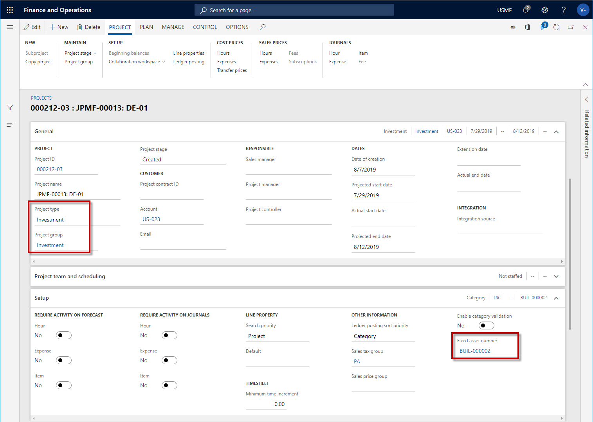

---
# required metadata

title: Work orders and fixed assets
description: This topic explains work orders and fixed assets in Enterprise Asset Management.
author: josaw1
manager: AnnBe
ms.date: 06/27/2019
ms.topic: article
ms.prod: 
ms.service: dynamics-ax-applications
ms.technology: 

# optional metadata

ms.search.form: CatProcureCatalogEdit, CatProcureCatalogListPage
# ROBOTS: 
audience: Application User
# ms.devlang: 
ms.reviewer: josaw
ms.search.scope: Core, Operations
# ms.tgt_pltfrm: 
ms.custom: 2214
ms.assetid: 2f3e0441-414d-402b-b28b-7ab0d650d658
ms.search.region: Global
# ms.search.industry: 
ms.author: mkirknel
ms.search.validFrom: 2016-02-28
ms.dyn365.ops.version: AX 7.0.0

---

# Work orders and fixed assets

This topic explains work orders and fixed assets in Enterprise Asset Management.

In Enterprise Asset Management, objects can be related to fixed assets, and you can create work orders for those objects. If you use this functionality, you can get a complete overview of fixed assets, related investment projects, and the costs registered on the investment projects in the **Project management and accounting** module and the **Fixed assets** module in Dynamics 365 for Finance and Operations.

>[!NOTE]
>The **Fixed asset number** field is only filled out on the work order line project if type "Investment" is selected as the project type on the work order line project.

The following procedure describes the relation between objects, work orders, work order line projects, and fixed assets.

1. You create an object that you relate to a fixed asset, as shown in the figure below.

2. When you set up work order types (**Enterprise asset management** > **Setup** > **Work orders** > **Work order types**), you create a work order type for handling investments. See also [Work order types](../setup-for-work-orders/work-order-types.md).

3. When you set up work order project groups (**Enterprise asset management** > **Setup** > **Work orders** > **Project setup** > **Project group** link), you create a relation between the work order type used for investments and the project group created for investments in the **Project management and accounting** module (**Project management and accounting** > **Setup** > **Posting** > **Project groups**).

The figure below shows a screenshot of the interface.

4. When you create a work order that relates to a fixed asset object, you select the work order type used for handling investments, for example, "Investment".

5. When the work order is created, the related work order type is shown in **All work orders**, as shown in the figure below.

6. When the work order is created, the project related to the work order is shown in the **Project management and accounting** module in the **All projects** list. Click on a project ID in the list and you will see project-related information on the project record as well as a reference to the fixed asset to which the object on the work order is related (**Project management and accounting** > **Projects** > **All projects** > Click on a project ID in the list > **General** FastTab and **Setup** FastTab). The figure below shows a screenshot of the interface.

7. In **Fixed assets**, you are able to see an overview of the projects associated with a fixed asset (**Fixed assets** > **Fixed assets** > **Fixed assets** > click on the fixed asset in the **Fixed asset number** field > view the contents in the **Related information** pane > **Associated projects** section).
