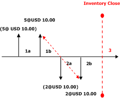
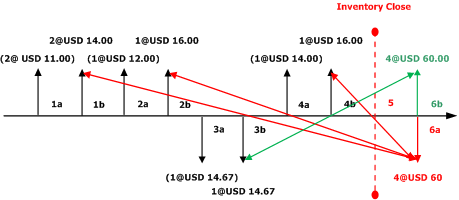
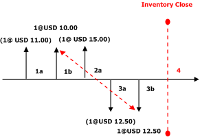
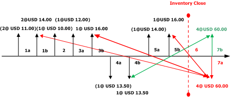
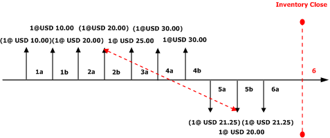

---
# required metadata

title: Weighted average with physical value and marking
description: Weighted average is an inventory model based on the weighted average principle, where issues from inventory are valued at the average value of the items that are received into inventory during the inventory closing period, plus any on-hand inventory from the previous period.
author: AndersGirke
manager: AnnBe
ms.date: 10/25/2017
ms.topic: article
ms.prod: 
ms.service: dynamics-ax-applications
ms.technology: 

# optional metadata

ms.search.form: InventJournalLossProfit, InventMarking, InventModelGroup, SalesTable
# ROBOTS: 
audience: Application User
# ms.devlang: 
ms.reviewer: josaw

ms.search.scope: Core, Operations, Retail

# ms.tgt_pltfrm: 
ms.custom: 65501
ms.assetid: 25041ff0-bafe-484d-a94a-e1772ad43204
ms.search.region: Global
ms.search.industry: Retail
ms.author: shylaw
ms.search.validFrom: 2016-02-28
ms.dyn365.ops.version: AX 7.0.0

---

# Weighted average with physical value and marking

[!include [banner](../includes/banner.md)]

[!include [retail name](../includes/retail-name.md)]

Weighted average is an inventory model based on the weighted average principle, where issues from inventory are valued at the average value of the items that are received into inventory during the inventory closing period, plus any on-hand inventory from the previous period.

When you run an inventory closing, all receipts are settled against a virtual issue, which holds the total received quantity and value. This virtual issue has a corresponding virtual receipt from which the issues are settled. In this manner, all issues get the same average cost. The virtual issue and receipt can be seen as a virtual transfer, which is named the weighted average inventory closing transfer.

If there is only one receipt, all issues can be settled from it and the virtual transfer will not be created. 

When using weighted average, you can mark inventory transactions so that a specific item receipt is settled against a specific issue, instead of using the weighted average rule. 

We recommend a monthly inventory closing when you use the weighted average inventory model. 

The weighted average inventory costing method is calculated by the following formula:
-   Weighted average = (Q1\*P1 + Q2\*P2 + Qn\*Pn) / (Q1 + Q2 + Qn)

Inventory transactions leaving the inventory issues. This includes sales orders, inventory journals, and production orders, occur at an estimated cost price on the posting date. This estimated cost price is also referred to as running average. At the time of inventory close, the system will analyze the inventory transactions for previous and current periods and determine which of the following closing principles should be used.
-   Direct settlement
-   Summarized settlement

Settlements are inventory close postings that adjust the issues to the correct weighted average as of the closing date. The following examples illustrate the effect of using weighted average with five different configurations:
-   Weighted average direct settlement without the Include physical value option
-   Weighted average summarized settlement without the Include physical value option
-   Weighted average direct settlement with the Include physical value option
-   Weighted average summarized settlement with the Include physical value option
-   Weighted average with marking

## Weighted average direct settlement without Include physical value
The direct settlement principle is the same used for weighted average in earlier versions. The system will settle directly between receipts and issues. The system uses this direct settlement principle in certain specific situations:
-   One receipt and one or several issues has been posted in the period
-   Only issues have been posted in the period and the inventory contains on-hand items from a previous closing

In the scenario in the following sections, a financially updated receipt and issue have been posted. During inventory close, the system will settle the receipt directly against the issue, and no adjustment to the cost price is needed on issue. The following transactions are illustrated in the graphic.
-   1a. Inventory physical receipt updated for a quantity of 5 at USD 10.00 each
-   1b. Inventory financial receipt updated for a quantity of 5 at USD 10.00 each
-   2a. Inventory physical issue updated for a quantity of 2 at USD 10.00 each
-   2b. Inventory financial issue updated for a quantity of 2 at USD 10.00 each
-   3. Inventory close is performed using the direct settlement method to settle the inventory financial receipt to the inventory financial issue.

The following diagram illustrates this series of transactions with the effects of choosing the Weighted average inventory model and the direct settlement principle without the Include physical value option. 

 

**Key to diagram**
- Inventory transactions are represented by vertical arrows.
- Receipts into inventory are represented by vertical arrows above the timeline.
- Issues out of inventory are represented by vertical arrows below the timeline.
- Above (or below) each vertical arrow, the value of the inventory transaction is specified in the format Quantity@Unitprice.
- An inventory transaction value enclosed in brackets indicates that the inventory transaction is physically posted into inventory.
- An inventory transaction value without brackets indicates that the inventory transaction is financially posted into inventory.
- Each new receipt or issue transaction is designated with a new label.
- Each vertical arrow is labeled with a sequential identifier, such as *1a*. The identifiers indicate the sequence of inventory transaction postings in the timeline.
- Inventory closings are represented by a red vertical dashed line and the label Inventory Close.
- Settlements that are performed by inventory close are represented by dotted red arrows going diagonally from a receipt to an issue.

## Weighted average summarized settlement without the Include physical value option
Weighted average uses the settlement principle that all receipts within in a closing period are summarized into a transaction called Weighted average inventory closing. All the receipts for the period will be settled against the issue of the newly created inventory transfer transaction. All issues for the period will be settled against the receipt of the new inventory transfer transaction. If the on-hand inventory is positive after the inventory close, that on-hand inventory and value of the inventory are summarized on the new inventory transfer transaction (receipt). If the inventory on-hand is negative after the inventory close, the on-hand inventory and value of the inventory is the sum of individual issues that have not been fully settled. In the scenario below, several financially updated receipts and one issue have been posted. 

During inventory close, the system will generate and post the summarized inventory transfer transaction and settle the receipts for the period against the summarized inventory transfer issue transaction. All the issues posted for the period will be settled against the summarized inventory transfer receipt transaction. The weighted average is calculated to be USD 15.00. The issue was originally posted with an estimated cost price of USD 14.67. Therefore, an adjustment of negative USD 0.33 will be created and posted on the issue. As of the inventory closing date, the on-hand inventory is 3 pieces with a value of USD 45.00. 

The following transactions are illustrated in the graphic below:
-   1a. Inventory physical receipt updated for a quantity of 2 at a cost of USD 11.00 each.
-   1b. Inventory financial receipt updated for a quantity of 2 at a cost of USD 14.00 each.
-   2a. Inventory physical receipt updated for a quantity of 1 at a cost of USD 12.00 each.
-   2b. Inventory financial receipt updated for a quantity of 1 at a cost of USD 16.00 each.
-   3a. Inventory physical issue updated for a quantity of 1 at a cost of USD 14.67 each (running average).
-   3b. Inventory financial issue updated for a quantity of 1 at a cost of USD 14.67 each (running average).
-   4a. Inventory physical receipt updated for a quantity of 1 at a cost of USD 14.00 each.
-   4b. Inventory financial receipt updated for a quantity of 1 at a cost of USD 16.00 each.
-   5. Inventory close is performed.
-   6a. "Weighted average inventory close transaction" financial issue is created to sum the settlements of all the inventory financial receipts.
-   6b. "Weighted average inventory close transaction" financial receipt is created as the offset to 5a.

The following diagram illustrates this series of transactions with the effects of choosing the Weighted average inventory model and the summarized settlement principle without the Include physical value option. 

 

**Key to diagram**
- Inventory transactions are represented by vertical arrows.
- Receipts into inventory are represented by vertical arrows above the timeline.
- Issues out of inventory are represented by vertical arrows below the timeline.
- Above (or below) each vertical arrow, the value of the inventory transaction is specified in the format Quantity@Unitprice.
- An inventory transaction value enclosed in brackets indicates that the inventory transaction is physically posted into inventory.
- An inventory transaction value without brackets indicates that the inventory transaction is financially posted into inventory.
- Each new receipt or issue transaction is designated with a new label.
- Each vertical arrow is labeled with a sequential identifier, such as *1a*. The identifiers indicate the sequence of inventory transaction postings in the timeline.
- Inventory closings are represented by a red vertical dashed line and the label Inventory Close.
- Settlements that are performed by inventory close are represented by dotted red arrows going diagonally from a receipt to an issue.
- Red arrows illustrate the receipt transactions being settled to the issue transaction created by the system.
- The green arrow represents the offsetting system-generated receipt transaction to which the originally posted issue transaction is settled

## Weighted average direct settlement with the Include physical value option
The parameter Include physical value works differently with the weighted average inventory model than in earlier versions of the product. Select the Include physical value box for an item in the Item model group form. Then the system will use physically updated receipts when calculating the estimated cost price, or running average. Issues will be posted based on this estimated cost price during the period. During the inventory close, financially updated receipts only will be considered in the weighted average calculation. We recommend a monthly inventory close when you use the weighted average inventory model. In this weighted average direct settlement example, the item model group is marked to include physical value. 

The following transactions are illustrated in the graphic below:
-   1a. Inventory physical receipt updated for a quantity of 1 at a cost of USD 11.00 each.
-   1b. Inventory financial receipt updated for a quantity of 1 at a cost of USD 10.00 each.
-   2a. Inventory physical receipt updated for a quantity of 1 at a cost of USD 15.00 each.
-   3a. Inventory physical issue updated for a quantity of 1 at a cost of USD 12.50 each (running average cost, since the physical receipt value is taken into consideration).
-   3b. Inventory financial issue updated for a quantity of 1 at a cost of USD 12.50 each (running average cost, since the physical receipt value is taken into consideration).
-   4. Inventory close is performed. During inventory close, the system will disregard all inventory transactions that have been only physically updated. Instead, the direct settlement principle will be used because only one financial receipt exists. An adjustment of USD 2.50 will be posted to the inventory transaction that has been financially issued as of the inventory closing date. After inventory close, the on hand inventory will be a quantity of 1 with a running average cost price of USD 15.00.

The following diagram illustrates this series of transactions with the effects of choosing the Weighted average inventory model and the direct settlement principle with the Include physical value option. 

 

**Key to diagram**
- Inventory transactions are represented by vertical arrows.
- Receipts into inventory are represented by vertical arrows above the timeline.
- Issues out of inventory are represented by vertical arrows below the timeline.
- Above (or below) each vertical arrow, the value of the inventory transaction is specified in the format Quantity@Unitprice.
- An inventory transaction value enclosed in brackets indicates that the inventory transaction is physically posted into inventory.
- An inventory transaction value without brackets indicates that the inventory transaction is financially posted into inventory.
- Each new receipt or issue transaction is designated with a new label.
- Each vertical arrow is labeled with a sequential identifier, such as *1a*. The identifiers indicate the sequence of inventory transaction postings in the timeline.
- Inventory closings are represented by a red vertical dashed line and the label Inventory Close.
- Settlements that are performed by inventory close are represented by dotted red arrows going diagonally from a receipt to an issue.

## Weighted average summarized settlement with the Include physical value option
The Include physical value parameter works differently with weighted average than in earlier versions. Select the Include physical value box for an item in the Item model group page. Then the system will use physically updated receipts in the calculation of estimated cost price, or running average. Issues will be posted based on this estimated cost price during the period. During the inventory close financially updated receipts only will be considered in the weighted average calculation. We recommend a monthly inventory close when you use the weighted average inventory model. In this weighted average summarized settlement example, the inventory model is marked to include physical value. 

The following transactions are illustrated in the graphic below:
-   1a. Inventory physical receipt updated for a quantity of 2 at a cost of USD 11.00 each.
-   1b. Inventory financial receipt updated for a quantity of 2 at a cost of USD 14.00 each.
-   2. Inventory physical receipt updated for a quantity of 1 at a cost of USD 10.00 each.
-   3a. Inventory physical receipt updated for a quantity of 1 at a cost of USD 12.00 each.
-   3b. Inventory financial receipt updated for a quantity of 1 at a cost of USD 16.00 each.
-   4a. Inventory physical issue updated for a quantity of 1 at a cost of USD 13.50 each (running average cost, since the physical receipt value is taken into consideration).
-   4b. Inventory financial issue updated for a quantity of 1 at a cost of USD 13.50 each (running average cost, since the physical receipt value is taken into consideration).
-   5a. Inventory physical receipt updated for a quantity of 1 at a cost of USD 14.00 each.
-   5b. Inventory financial receipt updated for a quantity of 1 at a cost of USD 16.00 each.
-   6. Inventory close is performed. During inventory close, the system will disregard all inventory transactions that are updated only physically. The summarized settlement principle will be used because only one financial receipt exists. An adjustment of USD 1.50 will be posted to the inventory transaction that has been financially issued as of the inventory closing date. After inventory close, the on- hand inventory will be a quantity of 3 with a running average cost price of USD 15.00.
-   7a. "Weighted average inventory close transaction" financial issue is created to sum the settlements of all the inventory financial receipts.
-   7b. "Weighted average inventory close transaction" financial receipt is created as the offset to 5a.

The following diagram illustrates this series of transactions with the effects of choosing the weighted average inventory model and the summarized settlement principle without the Include physical value option. 

 

**Key to diagram**
- Inventory transactions are represented by vertical arrows.
- Receipts into inventory are represented by vertical arrows above the timeline.
- Issues out of inventory are represented by vertical arrows below the timeline.
- Above (or below) each vertical arrow, the value of the inventory transaction is specified in the format Quantity@Unitprice.
- An inventory transaction value enclosed in brackets indicates that the inventory transaction is physically posted into inventory.
- An inventory transaction value without brackets indicates that the inventory transaction is financially posted into inventory.
- Each new receipt or issue transaction is designated with a new label.
- Each vertical arrow is labeled with a sequential identifier, such as 1a. The identifiers indicate the sequence of inventory transaction postings in the timeline.
- Inventory closings are represented by a red vertical dashed line and the label Inventory Close.
- Settlements that are performed by inventory close are represented by dotted red arrows going diagonally from a receipt to an issue.
- Red arrows illustrate the receipt transactions being settled to the issue transaction created by the system.
- The green arrow represents the offsetting system-generated receipt transaction to which the originally posted issue transaction is settled

## Weighted average with marking
Marking is a process that lets you link, or mark, an issue transaction to a receipt transaction. Marking can occur either before or after a transaction is posted. You can use marking when you want to make sure of the exact cost of the inventory when the transaction is posted or when the inventory close is performed. 

For example, your Customer Service department accepted a rush order from an important customer. Because this is a rush order, you will have to pay more for this item to service your customer's request. You must be certain the cost of this inventory item is reflected in the margin, or cost of goods sold (COGS), for this sales order invoice. 

When the purchase order is posted, the inventory is received at a cost of USD 120.00. For example, this sales order document is marked to the purchase order before the packing slip or invoice is posted. Then COGS will be USD 120.00 instead of the current running average cost for the item. If the sales order packing slip or invoice is posted before the marking occurs, the COGS will be posted at the running average cost price. 

Before inventory close is performed, these two transactions can still be marked to each other. 

A receipt transaction is marked to an issue transaction. Then, the valuation method selected for the item's item model group will be disregarded and the system will settle these transactions to each other. 

You can mark an issue transaction to a receipt before the transaction is posted. You can do this from a sales order line in the Sales order details page. The open receipt transactions are viewed in the Marking page. 

You can mark an issue transaction to a receipt after the transaction has been posted. You can match or mark an issue transaction for an open receipt transaction for an inventoried item from a posted inventory adjustment journal. 

The following transactions are illustrated in the graphic below:
-   1a. Inventory physical receipt for a quantity of 1 at a cost of USD 10.00 each.
-   1b. Inventory financial receipt for a quantity of 1 at a cost of USD 10.00 each.
-   2a. Inventory physical receipt for a quantity of 1 at a cost of USD 20.00 each.
-   2b. Inventory financial receipt for a quantity of 1 at a cost of USD 20.00 each.
-   3a. Inventory physical receipt for a quantity of 1 at a cost of USD 25.00 each.
-   4a. Inventory physical receipt for a quantity of 1 at a cost of USD 30.00 each.
-   4b. Inventory financial receipt for a quantity of 1 at a cost of USD 30.00 each.
-   5a. Inventory physical issue for a quantity of 1 at a cost price USD 21.25 (running average of financial and physical updated transactions).
-   5b. Inventory financial issue for a quantity of 1 is marked to the inventory receipt 2b before the transaction is posted. This transaction is posted with a cost price of USD 20.00.
-   6a. Inventory physical issue for a quantity of 1 at a cost price of USD 21.25 each.
-   7 Inventory close is performed. Since the financially updated transaction is marked to an existing receipt these transactions are settled to each other and no adjustment is made.

The new running average cost price reflects the average of the financially and physically updated transactions at USD 27.50. 

The following diagram illustrates this series of transactions with the effects of choosing the Weighted average inventory model with marking. 

 

**Key to diagram**
- Inventory transactions are represented by vertical arrows.
- Receipts into inventory are represented by vertical arrows above the timeline.
- Issues out of inventory are represented by vertical arrows below the timeline.
- Above (or below) each vertical arrow, the value of the inventory transaction is specified in the format Quantity@"Unitprice".
- An inventory transaction value enclosed in brackets indicates that the inventory transaction is physically posted into inventory.
- An inventory transaction value without brackets indicates that the inventory transaction is financially posted into inventory.
- Each new receipt or issue transaction is designated with a new label.
- Each vertical arrow is labeled with a sequential identifier, such as *1a*. The identifiers indicate the sequence of inventory transaction postings in the timeline.
- Inventory closings are represented by a red vertical dashed line and the label Inventory Close.
- Settlements that are performed by inventory close are represented by dotted red arrows going diagonally from a receipt to an issue.

