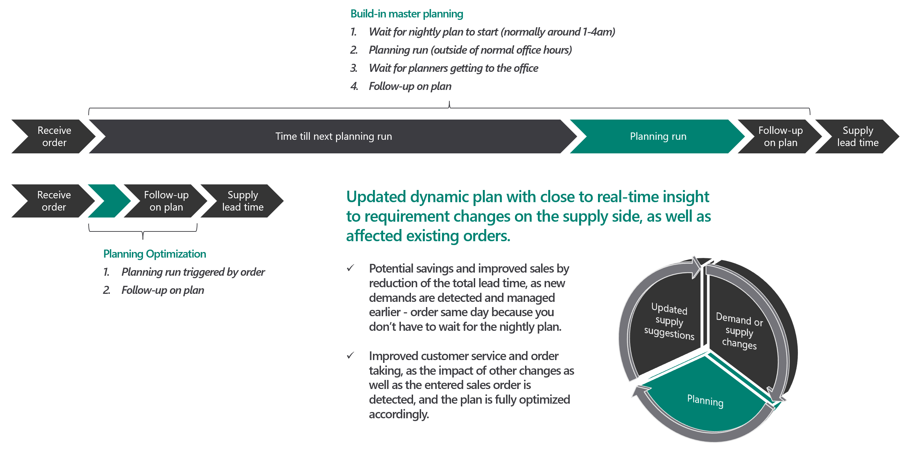

---
# required metadata

title: Master planning home page
description: Master planning allows companies to determine and balance the future need for raw materials and capacity to meet company goals. 
author: ShylaThompson
manager: AnnBe
ms.date: 12/03/2018
ms.topic: article
ms.prod: 
ms.service: dynamics-ax-applications
ms.technology: 

# optional metadata

ms.search.form: ReqCreatePlanWorkspace
# ROBOTS: 
audience: Application User
# ms.devlang: 
ms.reviewer: josaw
ms.search.scope: Core, Operations
# ms.tgt_pltfrm: 
ms.custom: 
ms.assetid: 
ms.search.region: Global
ms.search.industry: Manufacturing
ms.author: roxanad
ms.search.validFrom: 2016-02-28
ms.dyn365.ops.version: AX 7.0.0

---

[!include [banner](../includes/preview-banner.md)]

# Planning Optimization overview

The Planning Optimization Add-in for Dynamics 365 for Finance and Operations enables master planning calculation to happen outside of Finance and Operations and the related SQL database. The benefits include improved performance and minimal impact on SQL during master planning runs. Quick planning runs, even during office hours, allows planners to react immediately on demand or parameter changes.

In order to use Planning Optimization you have to install the Planning Optimization Add-in for Finance and Operations from your LCS project and enable the use of Planning Optimization from the Finance and Operations UI. Read more in Get started [Link].

### Possibility to run master planning in minutes during office hours

### Improved performance

Can Planning Optimization be used in situations with long running master plans in Dynamics 365 Finance and Operations? 
Yes, the Planning Optimization is specifically designed for very fast calculations with massive data volume. It’s built as a hyper-scalable multitenant service, meaning that multiple instances can cooperate simultaneously to calculate the plan. Also the planning service will remove the load of master planning from your ERP system and work with a data stream that minimizes the server load. 
Enabling customers to achieve:
- Greatly improved planning performance with shorter run time.
- Reduced impact on other processes during master planning run. 
- More frequent planning runs – not just daily.
- Comfort that future business growth will not overload the planning system.

### Architecture and data flow
When the Planning Optimization add-in is installed, for a project via LCS, a secure connection is created to the Planning Optimization service. The service is located in the same data center geo as the related Finance and Operations. During master planning with Planning Optimization relevant setup, master and transactional data will be sent from Finance and Operations to the Planning Optimization service. If the Planning Optimization add-in is uninstalled from LCS, then all related data in the Planning Optimization service will be removed.

#### High level data flow for regeneration run
1. The Finance and Operations client sends a signal to request a planning run from Planning Optimization
2. Planning Optimization requests needed data via the connector for Finance and Operations that is integrated in Planning Optimization.
3. Database (SQL) supplies Planning Optimization with the requested information about setup, master and transactional data. The information is sent via the connector that translates information between Finance and Operations and the Planning Optimization service.
4. The Planning Optimization service holds planning related data in memory and performs the needed calculations.
5. Planning result is sent to the Finance and Operations data base via the connector. This includes information like Planned orders and pegging information. Planning Optimization sends a signal to Finance and Operations that the planning run is completed along with relevant messages and warnings from Planning Optimization.

