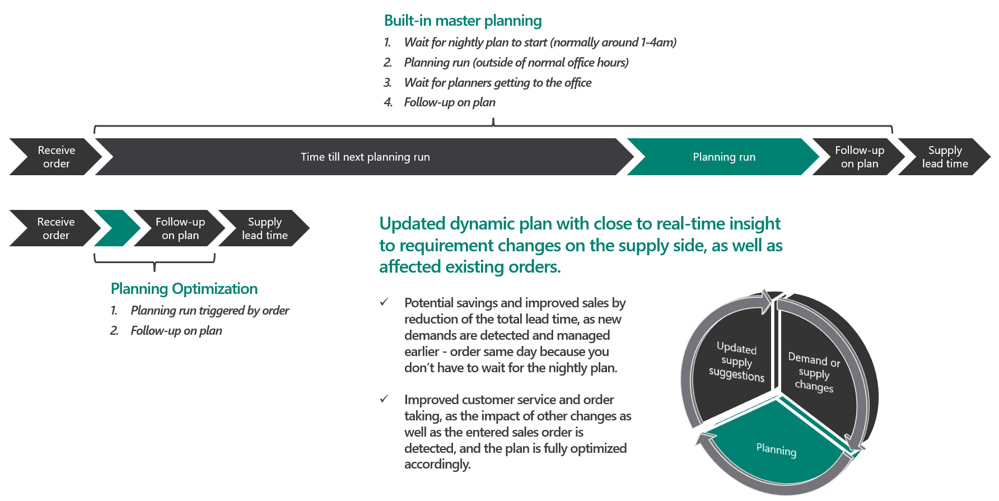
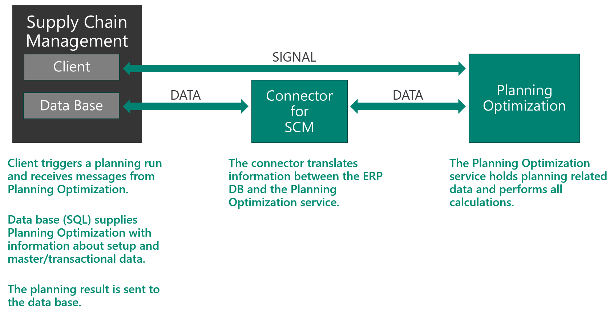

---
# required metadata

title: Planning Optimization overview
description: This topic provides an overview of the Planning Optimization functionality.
author: ChristianRytt
manager: AnnBe
ms.date: 10/31/2019
ms.topic: article
ms.prod: 
ms.service: dynamics-ax-applications
ms.technology: 

# optional metadata

ms.search.form: ReqCreatePlanWorkspace
# ROBOTS: 
audience: Application User
# ms.devlang: 
ms.reviewer: josaw
ms.search.scope: Core, Operations
# ms.tgt_pltfrm: 
ms.custom: 
ms.assetid: 
ms.search.region: Global
ms.search.industry: Manufacturing
ms.author: crytt
ms.search.validFrom: 2019-10-31
ms.dyn365.ops.version: AX 10.0.5

---

[!include [banner](../../includes/banner.md)]
[!include [banner](../../includes/preview-banner.md)]

# Planning Optimization overview

The Planning Optimization Add-in for Dynamics 365 for Finance and Operations enables master planning calculation to happen outside of Dynamics 365 Supply Chain Management and the related SQL database. The benefits associated with using Planning Optimization include improved performance and minimal impact on SQL during master planning runs. Quick planning runs, even during office hours, allows planners to react immediately on demand or parameter changes.

To use Planning Optimization, you have to install the Planning Optimization Add-in for Finance and Operations from your Lifecycle Services (LCS) project and enable the use of Planning Optimization from Supply Chain Management. For more information, read the (Get started with Planning Optimization)[get-started.md] topic.

The image below demonstrates the advantage of running Planning Optimization during office hours. 

## Improved performance

Planning Optimization can be used in scenarios involving long-running master plans. Planning Optimization is specifically designed for very fast calculations with massive data volume. It’s built as a hyper-scalable multitenant service, so multiple instances can cooperate simultaneously to calculate the plan. The planning service will also remove the load of master planning from your system and work with a data stream that minimizes the server load. 

With Planning Optimization, you can achieve:
- Improved planning performance with a shorter run time.
- Reduced impact on other processes during the master planning run. 
- More frequent planning runs (not limited to daily runs).
- Knowledge that future business growth will not overload the planning system.

## Architecture and data flow
When the Planning Optimization add-in is installed via LCS, a secure connection is created to the Planning Optimization service. The service is located in the same data center geo as the related Supply Chain Management instance. During master planning with the Planning Optimization set up, master and transactional data will be sent from Supply Chain Management to the Planning Optimization service. If the Planning Optimization add-in is uninstalled, all related data in the Planning Optimization service will be removed.

### High level data flow for regeneration run
1. The Supply Chain Management client sends a signal to request a planning run from Planning Optimization.
2. Planning Optimization requests needed data via the connector that is integrated in Planning Optimization.
3. The SQL database supplies Planning Optimization with the requested information about setup, master, and transactional data. The information is sent via the connector that translates information between Supply Chain Management and the Planning Optimization service.
4. The Planning Optimization service holds planning related data in memory and performs the needed calculations.
5. The planning result is sent to the Supply Chain Management database via the connector. The results include information like planned orders and pegging information. Planning Optimization sends a signal to Supply Chain Management that the planning run is completed along with relevant messages and warnings.

