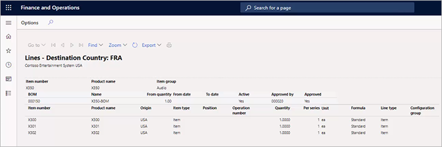

---
# required metadata

title: Country of origin
description: Many organizations issue certificates for their vendors to ensure that a product will meet a certain certification standard. These certificates are often dependent on the country of origin. Supply Chain Management country of origin features let you link a product to its country of origin and keep track of its product certifications.
author: dasani-madipalli
manager: tfehr
ms.date: 07/01/2020
ms.topic: article
ms.prod: 
ms.service: dynamics-ax-applications
ms.technology: 

# optional metadata

# ms.search.form:  [Operations AOT form name to tie this topic to]
audience: Application User
# ms.devlang: 
ms.reviewer: kamaybac
ms.search.scope:  Core, Operations
# ms.tgt_pltfrm: 
# ms.custom: [used by loc for topics migrated from the wiki]
ms.search.region: Global
# ms.search.industry: [leave blank for most, retail, public sector]
ms.author: damadipa
ms.search.validFrom: 2020-07-01
ms.dyn365.ops.version: Release 10.0.13
---

# Country of origin

Many organizations issue certificates for their vendors to ensure that a product will meet a certain certification standard. These certificates are often dependent on the country of origin. Supply Chain Management country of origin features let you link a product to its country of origin and keep track of its product certifications.

## Configuring the country of origin

Before issuing a certificate for a product you first need to link the product to its destination country and country of origin. To do this, navigate to **Product information management \> Setup \> Country of origin \> Country of origin rules**.

To create a new configuration, select **New** and fill out the following information:

| **Setting** | **Description** |
| --- | --- |
| **Item number** | The item number of the product you want to configure |
| **Destination country** | The country you are sending the product to |
| **Origin country** | The country you are shipping the product from |

## Keeping track of vendor certificates

Now that you have your country of origin information configured you may want to keep track of the certificates you are issuing to vendors.

Companies will need to figure out which certificate documents they are issuing and how they will send it to the customer. This configuration provides a mechanism to keep track of it and display the certificate number on invoices, packing slips and order confirmations.

To set this information, you need to navigate to **Product information management \> Setup \> Country of origin \> Country of origin vendor certificates**.

Then you need to fill out the following information:

| **Setting** | **Description** |
| --- | --- |
| **Vendor account** | The vendor you are sending the certificate to |
| **Item number** | The item you issued the certificate for |
| **Certificate number** | The number of the certificate you issued |
| **Effective** | The date of effectiveness for the certificate |
| **Expiration** | The expiry date of the certificate |
| **Print on invoice** | A checkbox to indicate whether you want the certificate number to be displayed on the invoice |
| **Print on packing slip** | A checkbox to indicate whether you want the certificate number to be displayed on the packing slip |
| **Print on sales confirmation** | A checkbox to indicate whether you want the certificate number to be displayed on the sales confirmation |

## Print bill of material lines

The country of origin configuration is also helpful for reporting purposes. Suppose you have a product with a bill of materials, and you want to see what the country of origin is for each of those parts. If you have the country of origin specified for each of your parts you'll easily be able to print a report that shows you all that information.

Here's how you can do that:

1. Navigate to the released product details of a product that multiple
2. On the top ribbon select **Engineer** tab
3. Under BOM select **Designer**
4. In the form that opens up, select BOM in the top ribbon and select the print option
5. In the Bill of materials lines form select the destination country if you want it to show up in your report
6. Select **OK**

A report with the information detailing the country of origin of each of the parts should be generated. Here's an example of a generated report:

