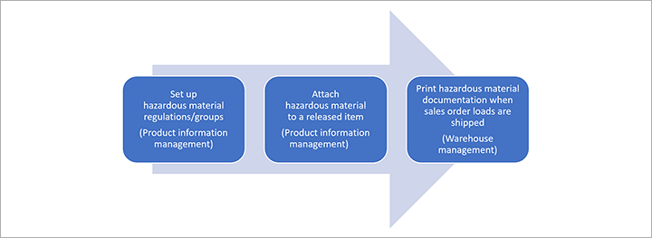

---
# required metadata

title: Hazardous materials overview
description: This topic provides an overview of features related to handling and documenting hazardous materials during product-information management and warehouse management
author: dasani-madipalli
manager: tfehr
ms.date: 06/10/2020
ms.topic: article
ms.prod: 
ms.service: dynamics-ax-applications
ms.technology: 

# optional metadata

# ms.search.form:  [Operations AOT form name to tie this topic to]
audience: Application User
# ms.devlang: 
ms.reviewer: kamaybac
ms.search.scope:  Core, Operations
# ms.tgt_pltfrm: 
# ms.custom: [used by loc for topics migrated from the wiki]
ms.search.region: Global
# ms.search.industry: [leave blank for most, retail, public sector]
ms.author: damadipa
ms.search.validFrom: 2020-06-10
ms.dyn365.ops.version: Release 10.0.11
---

# Hazardous materials overview

[!include [banner](../includes/banner.md)]

To remain compliant with shipping and transport regulations, organizations that ship materials classified as dangerous goods must include additional paperwork with their shipments. The hazardous materials feature lets customers store information related to released items. This information can then be used to help prepare shipping documentation. The sending organization must have their own processes and procedures for managing the dangerous goods shipping process. Dynamics 365 Supply Chain Management is just a tool that can help in generating the required documents.

The hazardous materials feature is set up within product information management and provides documents that can be printed through warehouse management.

Broadly, there are two main areas where you will review, set up, and use this functionality:

- Product-information management, where you set up the codes to be applied to a released product.
- Warehouse management, where you will work with additional shipping documents to print for shipments.

> [!IMPORTANT]
> The hazardous materials features in Microsoft Dynamics 365 Supply Chain Management provide a collection of useful product information fields and related functionality that can help you record and reference information related to your hazardous products. These features can also help you design and print shipment documents that include some of this same information about any hazardous materials you are shipping. However, the system won't automatically make you compliant with all applicable regulations in your country or region. These tools are intended to help you comply with common regulations, but are neither sufficient in themselves, nor guaranteed to do so. It is your organization's responsibility to be aware of all applicable regulations and to take all necessary steps to comply with them.

## Product information management

Product information management provides a range of setup tables where you can enter reference information for the various dangerous goods lists for road, air, and sea freight.

 The common regulations that were referenced when developing this functionality were:

- **ADR** - Regulations concerning the international carriage of dangerous goods by road
- **CFR 49** - Regulations in the United Sates for carriage of dangerous goods
- **IMDG** - International Marine Dangerous Goods code
- **IATA** - International Air Transport System

Each of these regulations has a list of dangerous goods list with reference codes. The lists for each type of transport are unified on common international classifications, so Dynamics 365 Supply Chain Management therefore provides a reference table for the common codes found on those lists. Each list also has some unique codes that you can define.

For more information about how to set up hazard material regulations and values, and assign these values to relevant products, see the following topics:

- [Set up hazardous materials](hazmat-setup.md)
- [Hazardous materials in products, orders, shipments, and loads](hazmat-items.md)

## Warehouse management

When you prepare a shipment in warehouse management, you'll be able to print any of several new reports that utilize the information set up in product information management. For more information about the available reports and how to use them, see [Hazardous materials inquiries and reports](hazmat-reports.md).