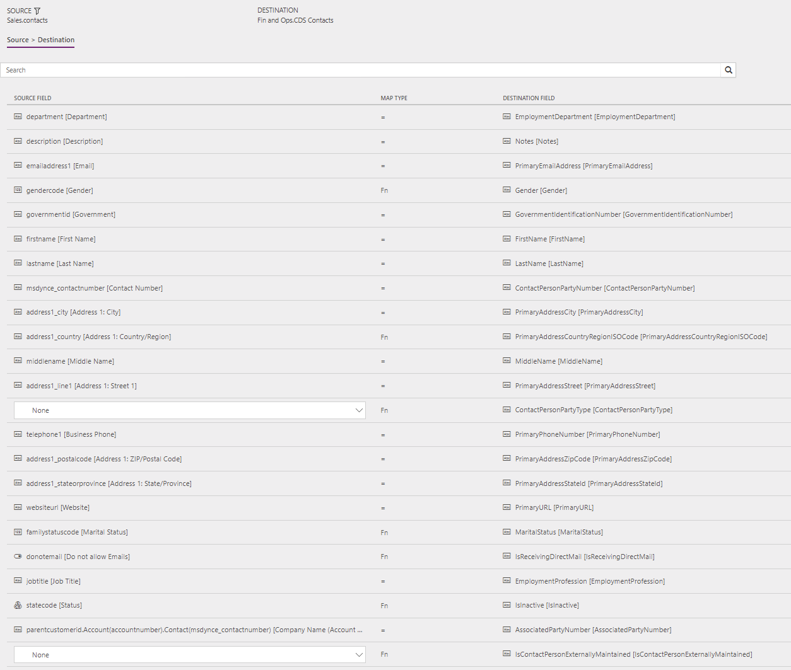
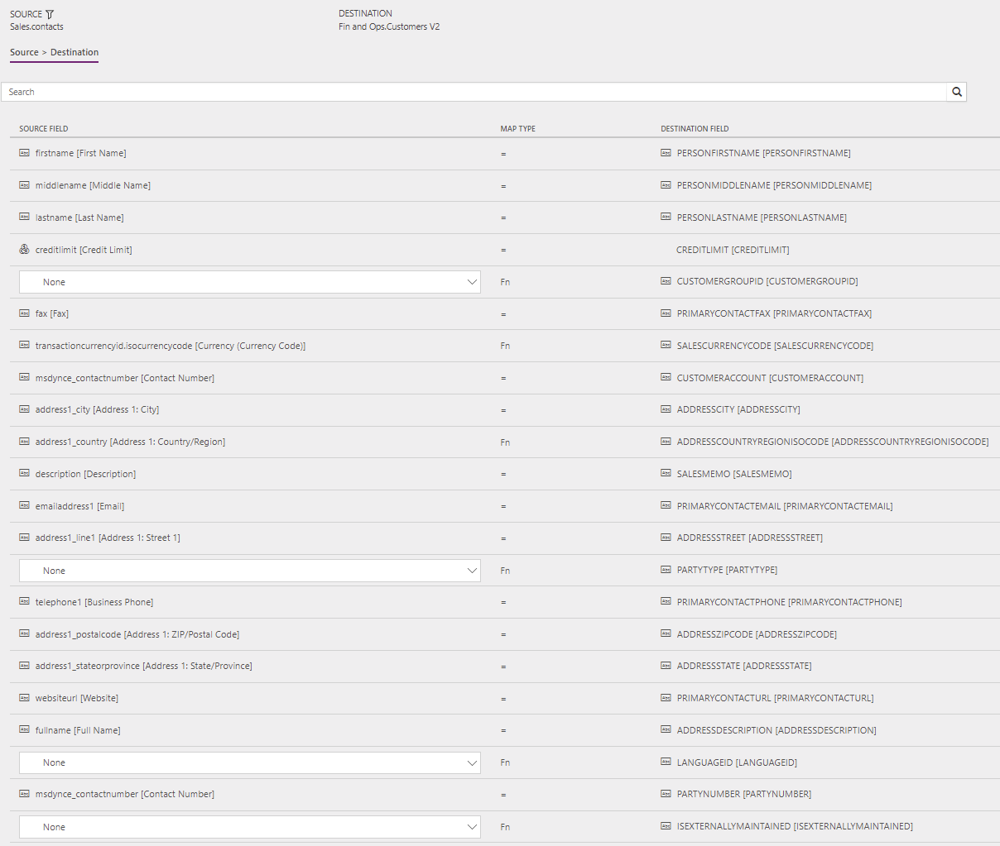

---
# required metadata

title: Synchronize contacts directly from Sales to contacts or customers in Supply Chain Management
description: This topic discusses the templates and underlying tasks that are used to synchronize Contact (Contacts) and Contact (Customers) entities from Dynamics 365 Sales to Dynamics 365 Supply Chain Managements.
author: ChristianRytt
manager: AnnBe
ms.date: 10/25/2018
ms.topic: article
ms.prod: 
ms.service: dynamics-ax-applications
ms.technology: 

# optional metadata

ms.search.form: 
# ROBOTS: 
audience: Application User, IT Pro
# ms.devlang: 
ms.reviewer: josaw
ms.search.scope: Core, Operations
# ms.tgt_pltfrm: 
ms.custom: 
ms.assetid: 
ms.search.region: global
ms.search.industry: 
ms.author: crytt
ms.dyn365.ops.version: July 2017 update 
ms.search.validFrom: 2017-07-8

---

# Synchronize contacts directly from Sales to contacts or customers in Supply Chain Management

[!include [banner](../includes/banner.md)]

> [!NOTE]
> Before you can use the Prospect to cash solution, you should be familiar with [Integrate data into Common Data Service for Apps](https://docs.microsoft.com/powerapps/administrator/data-integrator).

This topic discusses the templates and underlying tasks that are used to synchronize Contact (Contacts) and Contact (Customers) entities directly from Dynamics 365 Sales to Dynamics 365 Supply Chain Management.

## Data flow in Prospect to cash

The Prospect to cash solution uses the Data integration feature to synchronize data across instances of Supply Chain Management and Sales. The Prospect to cash templates that are available with the Data integration feature enable the flow of data about accounts, contacts, products, sales quotations, sales orders, and sales invoices between Supply Chain Management and Sales. The following illustration shows how the data is synchronized between Supply Chain Management and Sales.

## Templates and tasks

To access the available templates, open [PowerApps Admin Center](https://preview.admin.powerapps.com/dataintegration). Select **Projects**, and then, in the upper-right corner, select **New project** to select public templates.

The following templates and underlying tasks are used to synchronize Contact (Contacts) entities in Sales to Contact (Customers) entities in Supply Chain Management.

- **Names of the templates in Data integration**

    - Contacts (Sales to Supply Chain Management) - Direct
    - Contacts to Customer (Sales to Supply Chain Management) - Direct

- **Names of the tasks in the Data integration project**

    - Contacts
    - ContactToCustomer

The following synchronization task is required before contact synchronization can occur: Accounts (Sales to Supply Chain Management)

## Entity sets

| Sales    | Supply Chain Management |
|----------|------------------------|
| Contacts | CDS Contacts           |
| Contacts | Customers V2           |

## Entity flow

Contacts are managed in Sales and synchronized to Supply Chain Management.

A contact in Sales can become either a contact or a customer in Supply Chain Management. To determine whether a contact in Sales should be synchronized to Supply Chain Management as a contact or a customer, the system looks at the following properties on the contact in Sales:

- **Synchronization to a customer in Supply Chain Management:** Contacts where **Is Active Customer** is set to **Yes**
- **Synchronization to a contact in Supply Chain Management:** Contacts where **Is Active Customer** is set to **No** and **Company** (parent account/contact) points to an account (not a contact)

## Prospect to cash solution for Sales

A new **Is Active Customer** field has been added to the contact. This field is used to differentiate contacts that have sales activity and contacts that don't have sales activity. **Is Active Customer** is set to **Yes** only for contacts that have related quotations, orders, or invoices. Only those contacts are synchronized to Supply Chain Management as customers.

A new **IsCompanyAnAccount** field has been added to the contact. This field indicates whether a contact is linked to a company (parent account/contact) of the **Account** type. This information is used to identify contacts that should be synchronized to Supply Chain Management as contacts.

A new **Contact Number** field has been added to the contact to help guarantee a natural and unique key for the integration. When a new contact is created, a **Contact Number** value is automatically generated by using a number sequence. The value consists of **CON**, followed by an increasing number sequence and then a suffix of six characters. Here is an example: **CON-01000-BVRCPS**

When the integration solution for Sales is applied, an upgrade script sets the **Contact Number** field for existing contacts by using the number sequence that was mentioned earlier. The upgrade script also sets the **Is Active Customer** field to **Yes** for any contacts that have sales activity.

## In Supply Chain Management

Contacts are tagged by using the **IsContactPersonExternallyMaintained** property. This property indicates that a given contact is maintained externally. In this case, externally maintained contacts are maintained in Sales.

## Preconditions and mapping setup

### Contact to customer

- **CustomerGroup** is required in Supply Chain Management. To help prevent synchronization errors, you can specify a default value in the mapping. That default value is then used if the field is left blank in Sales.

    The default template value is **10**.

- By adding the following mappings, you can help reduce the number of manual updates that are required in Supply Chain Management. You can use a default value or a value map from, for example, **Country/Region** or **City**.

    - **SiteId** – A default site can also be defined on products in Supply Chain Management. A site is required in order to generate quotations and sales orders in Supply Chain Management.

        A template value for **SiteId** isn't defined.

    - **WarehouseId** – A default warehouse can also be defined on products in Supply Chain Management. A warehouse is required in order to generate quotations and sales orders in Supply Chain Management.

        A template value for **WarehouseId** isn't defined.

    - **LanguageId** – A language is required in order to generate quotations and sales orders in Supply Chain Management.
    
        The default template value for is **en-us**.

## Template mapping in Data integration

The following illustrations show an example of a template mapping in Data integration. 

> [!NOTE]
> The mapping shows which field information will be synchronized from Sales to Supply Chain Management.

### Contact to contact

### Contact to customer

## Related topics

[Prospect to cash](prospect-to-cash.md)

[Synchronize accounts directly from Sales to customers in Supply Chain Management](accounts-template-mapping-direct.md)

[Synchronize products directly from Supply Chain Management to products in Sales](products-template-mapping-direct.md)

[Synchronization of sales orders directly between Sales and Supply Chain Management](sales-order-template-mapping-direct-two-ways.md)

[Synchronize sales invoice headers and lines directly from Supply Chain Management to Sales](sales-invoice-template-mapping-direct.md)

