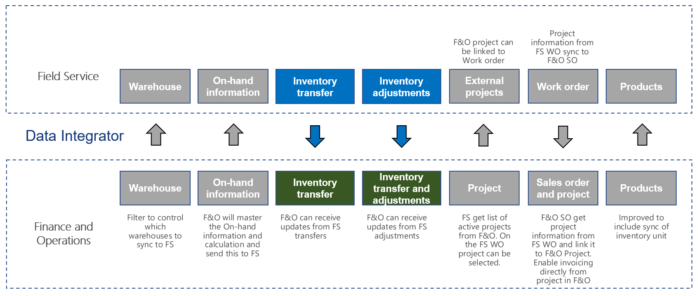
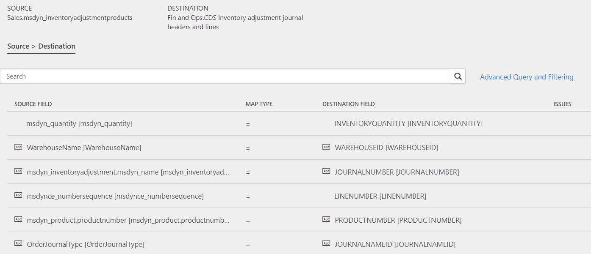

---
# required metadata

title: Synchronize inventory transfers and adjustments from Field Service to Finance and Operations
description: This topic discusses the templates and underlying tasks that are used to synchronize inventory adjustments and transfers from Microsoft Dynamics 365 for Finance and Operations to Microsoft Dynamics 365 for Field Service.
author: ChristianRytt
manager: AnnBe
ms.date: 01/14/2019
ms.topic: article
ms.prod: 
ms.service: dynamics-ax-applications
ms.technology: 

# optional metadata

ms.search.form: 
# ROBOTS: 
audience: Application User, IT Pro
# ms.devlang: 
ms.reviewer: shylaw
ms.search.scope: Core, Operations
# ms.tgt_pltfrm: 
ms.custom: 
ms.assetid: 
ms.search.region: global
ms.search.industry: 
ms.author: crytt
ms.dyn365.ops.version: 8.1.3 
ms.search.validFrom: 2018-12-01

---

# Synchronize inventory adjustments from Field Service to Finance and Operations

[!include[banner](../includes/banner.md)]

This topic discusses the templates and underlying tasks that are used to synchronize inventory adjustments and transfers from Microsoft Dynamics 365 for Finance and Operations to Microsoft Dynamics 365 for Field Service.

## Templates and tasks
The following template and underlying tasks are used to synchronize inventory adjustments and transfers from Microsoft Dynamics 365 for Field Service to Microsoft Dynamics 365 for Finance and Operations.

**Templates in Data integration**
- Inventory Adjustment (Field Service to Fin and Ops)
- Inventory Transfers (Field Service to Fin and Ops)

**Tasks in the Data integration projects**
- Inventory Adjustments
- Inventory Transfers

## Entity set
| Field Service	                    | Finance and Operations                             |
|-----------------------------------|----------------------------------------------------|
| msdyn_inventoryadjustmentproducts |	CDS Inventory adjustment journal headers and lines |
| msdyn_inventoryadjustmentproducts	| CDS inventory transfer journal headers and lines   |

## Entity flow
Inventory adjustments and transfers made in Field Service will synchronize to Finance and Operations after the **Post status** changes from **Created** to **Posted**. When this occurs, the adjustment or the transfer order will be locked and become read only. This means that adjustments and transfers can be posted in Finance and Operations, but cannot be modified. In Finance and Operations, you can set up a batch job to automatically post the adjustments and transfer inventory journals that have been generated during the integration. See the following prerequisites for details on how to enable the batch job.

## Field Service CRM solution 
The **Inventory unit** field has been added to the **Product** entity. This field is needed because the Sales and Inventory unit is not always the same in Finance and Operations, and the Inventory Unit is needed for the Warehouse Inventory in Finance and Operations.
When you set the product on an Inventory adjustment product for both Inventory adjustments and Inventory transfers, the unit will be fetched from the inventory product value. If a value is found, the **Unit** field will be locked on the Inventory adjustment product.

The **Post status** field has been added to both the **Inventory adjustment** entity and the **Inventory transfer** entity. This field is used as a filter when an adjustment or transfer is sent to Finance and Operations. The default for this field is Created (1), however it is not sent to Finance and Operations. When you update the value to Posted (2), it is sent to Finance and Operations, but after that you will no longer be able to change the adjustment or transfer or add new lines.

The **Number sequence** field has been added to the **Inventory adjustment product** entity. This field ensures that the integration has a unique number, so the integration can create and update the adjustment. When you create your first inventory adjustment product, it will create a new record in the **P2C AutoNumber** entity to maintain the number series and the prefix that is used.

## Prerequisites and mapping setup

### Finance and Operations
The integration inventory journals generated by the integration can automatically be posted using a batch job. This is enabled from **Inventory management > Periodic tasks > CDS integration > Post integration inventory journals**.

## Template mapping in Data integration

The following illustrations show the template mapping in Data integration.

### Inventory adjustment (Field Service to Fin and Ops): Inventory adjustment

### Inventory transfer (Field Service to Fin and Ops): Inventory transfer

