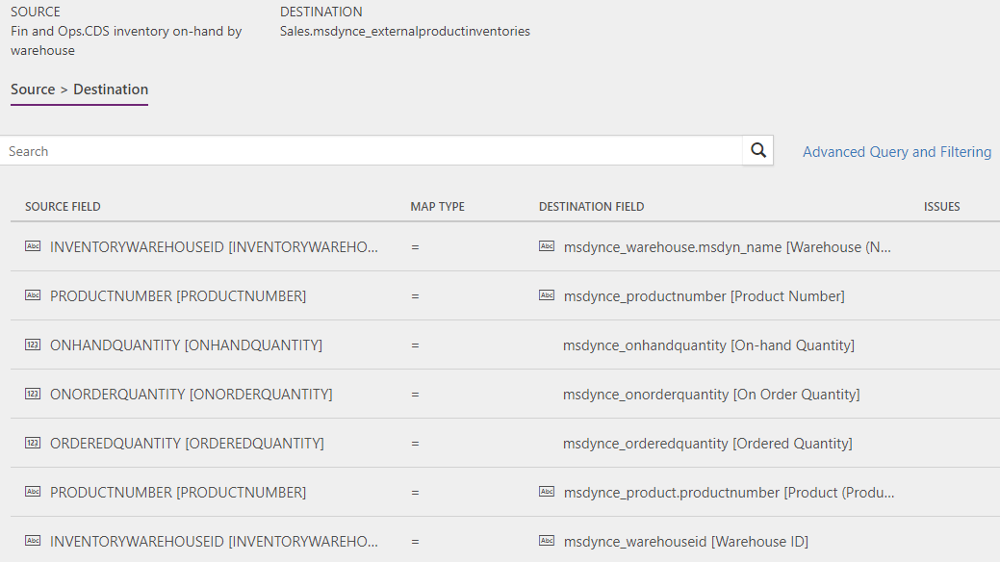

---
# required metadata

title: Synchronize inventory level information from Finance and Operations to Field Service 
description: 
author: ChristianRytt
manager: AnnBe
ms.date: 10/10/2018
ms.topic: article
ms.prod: 
ms.service: dynamics-ax-applications
ms.technology: 

# optional metadata

ms.search.form: 
# ROBOTS: 
audience: Application User, IT Pro
# ms.devlang: 
ms.reviewer: shylaw
ms.search.scope: Core, Operations
# ms.tgt_pltfrm: 
ms.custom: 
ms.assetid: 
ms.search.region: global
ms.search.industry: 
ms.author: crytt
ms.dyn365.ops.version: 8.1.3 
ms.search.validFrom: 2018-12-01

---

# Synchronize inventory level information from Finance and Operations to Field Service 

[!include[banner](../includes/banner.md)]

This topic discusses the templates and underlying tasks that are used to synchronize inventory level information from Microsoft Dynamics 365 for Finance and Operations to Microsoft Dynamics 365 for Field Service.

## Templates and tasks
The following template and underlying tasks are used to run synchronization of inventory on-hand levels from Microsoft Dynamics 365 for Finance and Operations to Microsoft Dynamics 365 for Field Service.

**Name of the template in Data integration:**
- Product Inventory (Fin and Ops to Field Service)
  
**Names of the tasks in the Data integration project:**
- Product inventory

The following synchronization tasks are required before synchronization of inventory levels can occur:
- Warehouses (Fin and Ops to Field Service) 
- Field Service Products with Inventory unit (Fin and Ops to Sales) 

## Entity set

| Field Service                      | Finance and Operations                 |
|------------------------------------|----------------------------------------|
| msdynce_externalproductinventories | CDS inventory on-hand by warehouse     |

## Entity flow
Inventory level information from Finance and Operation is send to Field Service for selected products. The inventory level information include: 
- On hand quantity (current recorded physically quantity located in the warehouse)
- On order quantity (total recorded quantity on order - i.e. sales orders)
- Ordered quantity (total recorded ordered quantity - i.e. purchase orders)

This information is captured per released product for each warehouse and synchronized based on change tracking, when the inventory level changes.

In Field Service the integration solution create inventory journals for the delta, to get the levels in Field Service to match the levels in Finance and Operations.

Finance and Operations will act as the master for inventory levels. So it is important to setup integration for workorders, transfers and adjustments from Field Service to Finance and Operations if the this functionality is used in Field Service, together with synchronization of inventory levels from Finance and Operations.

The products and warehouses where inventory levels are mastered from Finance and Operations can be controlled with the Advanced Query and Filtering (Power Query).

Note: It is possible to create multiple warehouses in Field Services (with Is Externally Maintained = No) and then map them to a single warehouse in Finance and Operations, with the Advanced query and filtering functionality. This is used in situations where you want Field service to master the detailed inventory level and just send updates to Finance and Operations. In this case Field service will not receive inventory level updates from Finance and Operations. See additional information in Synchronize inventory adjustments from Field Service to Finance and Operations and Synchronize work orders in Field Service to sales orders linked to project in Finance and Operations.

## Field Service CRM solution
The External Product Inventory entity is a new entity that’s only used for backend in the integration. It receives the inventory level values from Finance and Operations in the integration and then transforms those values to Manuel Inventory journals, that then changes the Inventory Products on the Warehouse. 

## Prerequisites and mapping setup

### In the Data Integration project
Apply filters with the Advanced  Query and Filtering to control that only desired products and warehouses send inventory level information from Finance and Operations to Field Service.

## Template mapping in Data integration

### Product Inventory (Fin and Ops to Field Service): Product inventory

