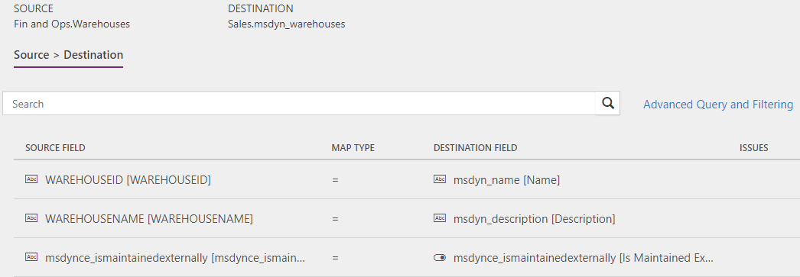

---
# required metadata

title: Synchronize warehouses from Finance and Operations to Field Service
description: 
author: ChristianRytt
manager: AnnBe
ms.date: 10/10/2018
ms.topic: article
ms.prod: 
ms.service: dynamics-ax-applications
ms.technology: 

# optional metadata

ms.search.form: 
# ROBOTS: 
audience: Application User, IT Pro
# ms.devlang: 
ms.reviewer: shylaw
ms.search.scope: Core, Operations
# ms.tgt_pltfrm: 
ms.custom: 
ms.assetid: 
ms.search.region: global
ms.search.industry: 
ms.author: crytt
ms.dyn365.ops.version: 8.1.3 
ms.search.validFrom: 2018-12-01

---

# Synchronize warehouses from Finance and Operations to Field Service

[!include[banner](../includes/banner.md)]

This topic discusses the templates and underlying tasks that are used to synchronize warehouses from Microsoft Dynamics 365 for Finance and Operations to Microsoft Dynamics 365 for Field Service.

## Templates and tasks
The following template and underlying tasks are used to run synchronization of warehouses from Microsoft Dynamics 365 for Finance and Operations to Microsoft Dynamics 365 for Field Service.

**Name of the template in Data integration:**
- Warehouses (Fin and Ops to Field Service)

**Names of the tasks in the Data integration project:**
- Warehouse

## Entity set
| Field Service    | Finance and Operations                 |
|------------------|----------------------------------------|
| msdyn_warehouses | Warehouses                             |

## Entity flow
Warehouses that are created and maintained in Finance and Operations can be synchronized to Field Service via a Common Data Service (CDS) Data integration project. The desired warehouses that synchronize to Field Service can be controlled with the Advanced query and filtering on the project. Warehouses that synchronize from Finance and Operations are created in Field Service with the field Is maintained externally set to Yes and the record is made read only.
Field Service CRM solution
To support the integration between Field Service and Finance and Operations, additional functionality from the Field Service CRM solution is required. The solution includes the following changes.
The field **Is Maintained Externally** has been added to the **Warehouse (msdyn_warehouses)** entity. This field helps to identify If the Warehouse is handled from Operations or if It only exists in Field Service.
- Yes – The warehouse originated from Finance and Operations and won't be editable in Sales.
- No – The warehouse was entered directly in Field Service and is maintained here.

The **Is Externally Maintained** field helps control the synchronization of inventory levels, adjustments, transfers and usage on work orders. Only warehouses with **Is Externally Maintained** = Yes can be used to synchronize directly to the same warehouse in the other system. 

Note: It is possible to create multiple warehouses in Field Services (with **Is Externally Maintained** = No) and then map them to a single warehouse in Finance and Operations, with the Advanced query and filtering functionality. This is used in situations where you want Field service to master the detailed inventory level and just send updates to Finance and Operations. In this case Field service will not receive inventory level updates from Finance and Operations. See additional information in Synchronize inventory adjustments from Field Service to Finance and Operations and Synchronize work orders in Field Service to sales orders linked to project in Finance and Operations.

## Prerequisites and mapping setup
### In the Data Integration project
Before synchronization of the warehouses make sure to update the Advanced query and filtering on the project to only include the warehouses that you want to bring from Finance and Operations to Field Service. Note that you will need the warehouse in Field Service to apply it on work orders, adjustments and transfers.  

## Template mapping in Data integration

The following illustrations show the template mapping in Data integration.

### Warehouses (Fin and Ops to Field Service): Warehouse

