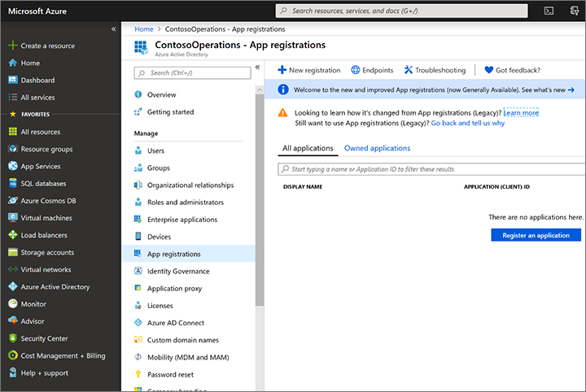
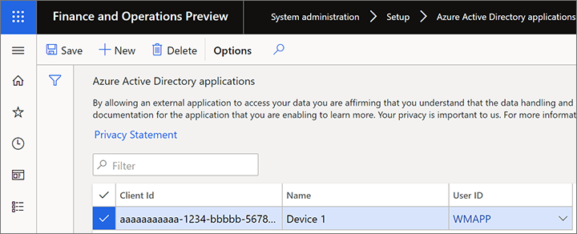
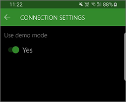
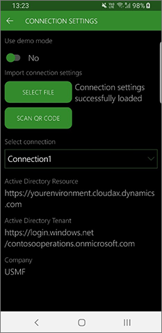
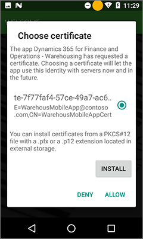
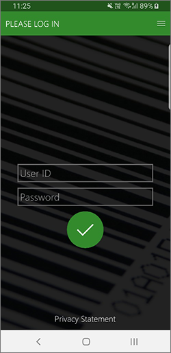

---
# required metadata

title: Install and connect the warehousing app
description: This topic describes how to install the warehousing app on each of your mobile devices and configure it to connect to your Supply Chain Management environment. You can configure each device manually, or import connection settings through a file or by scanning a QR code.
author: MarkusFogelberg
manager: tfehr
ms.date: 05/25/2020
ms.topic: article
ms.prod: 
ms.service: dynamics-ax-applications
ms.technology: 

# optional metadata

ms.search.form: SysAADClientTable, WHSMobileAppField, WHSMobileAppFieldPriority, WHSRFMenu, WHSRFMenuItem, WHSWorker
# ROBOTS: 
audience: Application User, IT Pro
# ms.devlang: 
ms.reviewer: kamaybac
ms.search.scope: Core, Operations
# ms.tgt_pltfrm: 
ms.custom: 267694
ms.assetid: d95d43b2-13ff-4189-a71a-3a1fb57d55ed
ms.search.region: global
ms.search.industry: Manufacturing
ms.author: mafoge
ms.search.validFrom: 2016-11-30
ms.dyn365.ops.version: Version 1611

---

# Install and connect the warehousing app

[!include [banner](../includes/banner.md)]

> [!NOTE]
> 
> This topic describes how to configure warehousing for cloud deployments. If you are looking for how to configure warehousing for on-premises deployments, please see [Warehousing for on-premises deployments](../../dev-itpro/deployment/warehousing-for-on-premise-deployments.md).

The warehousing app is available on the Google Play and Windows app stores. The app is provided as a standalone component, which means that you must download it on each device and then configure it to connect to your Supply Chain Management environment.

This topic describes how to install the warehousing app on each of your mobile devices and configure it to connect to your Supply Chain Management environment. You can configure each device manually, or import connection settings through a file or by scanning a QR code.

## Prerequisites

The app is available on Android and Windows operating systems. To use this app, you must have one of the following supported operating systems installed on your mobile devices.

| Platform | Version |
| --- | --- |
| **Android** | 4.4 and above |
| **Windows (UWP)** | **1.7.0.0 and above:** Windows 10 Fall creators update 1709 (10.0.16299) and above<br>**1.6.3.0 and below:** Windows 10 November Update 1511 (10.0.10586) |

<!-- KFM: I don't understand these Windows specifications, please clarify -->

## Get the warehousing app

Use one of the following links to download the app:

- Windows (Universal Windows Platform (UWP)):<br>
[Finance and Operations - Warehousing on the Windows Store](https://www.microsoft.com/store/apps/9p1bffd5tstm)
- Android:<br>
[Finance and Operations - Warehousing on the Google Play Store](https://play.google.com/store/apps/details?id=com.Microsoft.Dynamics365forOperationsWarehousing)

For modest deployments, you might choose to install the application from the store on each device and then manually configure the connection to the environments you are using. However, starting with version 1.7.0.0 of the warehousing app, you can also choose to automate app deployment and/or configuration. This is convenient if you are managing many devices and are using a mobile device management and mobile application management solution such as [Microsoft Intune](https://docs.microsoft.com/mem/intune/fundamentals/what-is-intune). For details about how to use Intune to add applications, see [Add apps to Microsoft Intune](https://docs.microsoft.com/mem/intune/apps/apps-add).

<a name="create-service"></a>

## Create a web service application in Azure Active Directory

To enable the warehousing app to interact with a specific Supply Chain Management server, you must register a web service application in Azure Active Directory (Azure AD) for the Supply Chain Management tenant. The following procedure illustrates one way to do this, including relevant notes. See the links after the procedure for more detailed information and alternatives.

1. In a web browser, go to [https://portal.azure.com](https://portal.azure.com/).

1. Enter the name and password for the user who has access to the Azure subscription.

1. In Azure Portal, in the left navigation pane, select  **Azure Active Directory**.

    

1. Make sure you are working with the Active Directory instance used by Supply Chain Management.

1. In the **Manage** list, select  **App registrations**.

    

1. Select  **New registration** on the tool bar. The  **Register an application wizard** starts.

1. Enter a name for the application and select **Accounts in this organizational directory only** and then select  **Register**.

    

1. Your new app registration opens. Take note of the **Application (client) ID**, you will need it later. The **Application (client) ID** will later be referred to as the  **Client ID**

     ID")

1. Select  **Certificate & secrets**  in the  **Manage**  pane. Select one of the following, depending on how you want to configure the app for authentication (see also [Authenticate using a certificate or client secret](#authenticate)):

    - **Upload certificate** - Upload a certificate to be used as a secret. We recommend this approach because it is more secure and can also be automated more completely. If you are running the warehousing app on Windows devices, then take a copy of the **Thumbprint** shown here after you upload the certificate because you will use it to configure the certificate on Windows devices.
    - **New client secret** - Create a key by entering a key description and a duration in the  **Passwords**  section and then select  **Add**. Copy the key and store it securely.

    

For more information about setting up web service applications in Azure AD, see the following resources:

- For instructions on how to use PowerShell to setup web service applications in Azure AD, see [How to: Use Azure PowerShell to create a service principal with a certificate](https://docs.microsoft.com/azure/active-directory/develop/howto-authenticate-service-principal-powershell).
- For complete details about how to manually create a web service application in Azure AD, see the following topics:
  - [Quickstart: Register an application with the Microsoft identity platform](https://docs.microsoft.com/azure/active-directory/develop/quickstart-register-app)
  - [How to: Use the portal to create an Azure AD application and service principal that can access resources](https://docs.microsoft.com/azure/active-directory/develop/howto-create-service-principal-portal)

## Create and configure a user account in Supply Chain Management

To enable Supply Chain Management to use your Azure AD application, do the following:

1. Create a user that corresponds to the warehousing app user credentials.
    1. In Supply Chain Management, go to **System administration \> Users \> Users**.
    1. Create a new user.
    1. Assign the warehousing mobile device user, as shown in the following screenshot.

    

1. Associate your Azure Active Directory application with the warehousing app user.
    1. Go to **System administration \> Setup \> Azure Active Directory applications**.
    1. Create a new line.
    1. Enter the **Client ID** (obtained in the last section), give it a name, and select the previously created user. We recommend that you tag all your devices so that you can easily remove their access to Supply Chain Management from this page in case they are lost.

    

<a name="authenticate"></a>

## Authenticate using a certificate or client secret

Authentication with Azure Active Directory provides a secure way of connecting a mobile device to Dynamics 365 Supply Chain Management. You can choose to authenticate using either a client secret or a certificate. If you are going to import connection settings, we recommend that you use a certificate instead of a client secret. This is because the client secret must always be stored securely, so you can't import it in the connections settings file or QR code, as described later in this topic.

Certificates can be used as secrets to prove the application's identity when requesting a token. The public part of the certificate is uploaded to the app registration in Azure Portal, while the full certificate must be deployed on each device where the warehouse mobile app is installed. Your organization is responsible for managing the certificate in terms of rotation and so on. You can use self-signed certificates, but always use non-exportable certificates.

You must make the certificate available locally on each device where you run the warehousing app. If you are using Microsoft Intune, see the following topic for information about managing certificates for your Intune-controlled devices: [Use certificates for authentication in Microsoft Intune](https://docs.microsoft.com/mem/intune/protect/certificates-configure)

## Configure the application by importing connection settings

To make it easier to maintain and deploy the application on many mobile devices, you can import the connection settings rather then enter them manually on each individual device. This section describes how to create and import the settings.

### Create a connection settings file or QR code

You can import connection settings from a file or a QR code. Either way, you must start by creating a settings file using the JSON format and syntax. The file must include a connection list that contains the individual connections to be added. The following table summarizes the options that you must specify in the connection file:

| Parameter | Description |
| --- | --- |
| **ConnectionName** | Specify the name of the connection setting (max. 20 characters). This is the unique identifier for a connection setting, so ensure that it is unique in the list. If a connection with the same name already exists on the device, it will be overridden with the settings from the imported file. |
| **ActiveDirectoryClientAppId** | Specify the **Application (client) ID** that you found when setting up Azure Active Directory, as described in [Create a web service application in Azure Active Directory](#create-service). |
| **ActiveDirectoryResource** | Specify the Supply Chain Management root URL |
| **ActiveDirectoryTenant** | Specify the Azure Active Directory tenant you are using with the Supply Chain Management Server. It takes the following form:<br>`https://login.windows.net/<your-AD-tenant-ID>`<br>For example:<br>`https://login.windows.net/contosooperations.onmicrosoft.com` |
| **Company** | Enter the legal entity in Supply Chain Management to which you want the application to connect. |
| **ConnectionType** | (Optional) Defines whether the connection setting should use a certificate or a client secret when connecting to an environment.
Valid options are "certificate" or "clientsecret". The default value is "certificate".
Note: It isn't possible to import a client secret. |
| **IsEditable** | (Optional) Defines whether or not the connection setting should be editable by the app user.
Valid options are "true" or "false". Default value is "true". |
| **IsDefault** | (Optional) If a connection is set to be default, it will automatically be preselected when the app starts. Only one connection can be set as default.
Valid options are "true" or "false". The default value is "false". |
| **CertificateThumbprint** | (Optional) For Windows devices, you can specify the certificate thumbprint for the connection.
For Android, the app user must select the certificate the first time a connection is used. |

The following example shows a valid connection settings file that contains two connections. As you can see, the connection list (called "ConnectionList" in the file) is an object with an array that stores each connection as an object. Each object must be enclosed inside curly braces and the array must be enclosed inside square brackets separated by commas.

```json
{
  "ConnectionList": [
    {
      "ActiveDirectoryClientAppId":"aaaaaaaa-bbbb-ccccc-dddd-eeeeeeeeeeee",
      "ConnectionName": "Connection1",
      "ActiveDirectoryResource": "https://yourenvironment.cloudax.dynamics.com",
      "ActiveDirectoryTenant": "https://login.windows.net/contosooperations.onmicrosoft.com",
      "Company": "USMF",
      "IsEditable": false,
      "IsDefaultConnection": true,
      "CertificateThumbprint": "aaaabbbbcccccdddddeeeeefffffggggghhhhiiiii",
      "ConnectionType": "certificate"
    },
    {
      "ActiveDirectoryClientAppId":"aaaaaaaa-bbbb-ccccc-dddd-eeeeeeeeeeee",
      "ConnectionName": "Connection2",
      "ActiveDirectoryResource": "https://yourenvironment2.cloudax.dynamics.com",
      "ActiveDirectoryTenant": "https://login.windows.net/contosooperations.onmicrosoft.com",
      "Company": "USMF",
      "IsEditable": true,
      "IsDefaultConnection": false,
      "ConnectionType": "clientsecret"
    }
  ]
}
```

You can either save the information as a JSON file or generate a QR code with the same content. If you are saving it as a file, we recommend you save it using the default name ("connections.json"), especially if you will also be storing it at the default location on each mobile device.

### Save the connection-settings file on each device

You'll typically use a device-management tool or script to distribute the connection-settings files to each of the devices you are managing. If you save the connection-settings file on each device using the default name and location, the warehousing app will import it automatically, even on the first run after installing it. If you are using a custom name or location for the file, then the app user must specify these on the first run, but the app will continue to use the specified name and location thereafter. Each time the app starts, it will reimport the connection settings from their previous location to check if there have been any changes. The app will only update connections that have the same names as those in the connection-settings file; user-created connections that use other names won't be updated. It isn't possible to remove a connection using of the connection-settings file.

As mentioned, the default file name is "connections.json". The default file location depends on whether you are using Windows or Android. The paths are normally created automatically after the first run of the app, but you can also create them manually if you need to transfer the connection-settings file to the device before installation.

- Windows:<br>
 `C:\Users\<User>\AppData\Local\Packages\Microsoft.Dynamics365forOperations-Warehousing_8wekyb3d8bbwe\LocalState`
- Android:<br>
 `Android\data\com.Microsoft.Dynamics365forOperationsWarehousing\files`

> [!NOTE]
> When the app is uninstalled, the default path and its contents will also be removed.

### Import the connection settings

To import connection settings from a file QR code:

1. Launch the warehousing app on your mobile device.
1. Go to  **Connection settings**.
1. Set  **Use demo mode** to _No_.

    

1. Tap on the **Select File** or **Scan QR Code**, depending on how you will import the settings.

    

    - If you are importing from a file, then the app may already have found the file, provided it was stored with its default name and location. Otherwise, tap **Select file** and then navigate to and select the file on your local device. If you choose a custom location, then the app will remember it for next time.
    - If you are importing the connection-settings file by scanning QR code, select the **Scan QR code** option. The app will ask for permission to use the device camera, and then the camera will start so you can use it for scanning. Depending on the quality of the device camera and the complexity of the QR code, it might be difficult to correctly get it to scan. If that is the case, try reducing the complexity of the QR code by only generating one connection per QR code. (Currently, you can only use the device camera to scan the QR code.)

1. Tap the  **Back**  button in the top-left corner of the page.

    

1. If you are using an Android device and are authenticating with a certificate, then the device now prompts you to select the certificate.

    

1. The app now connects to your Supply Chain Management server and shows the sign-in screen.

    

## Configure the application manually

You can manually configure the app on the device to connect to the Supply Chain Management server through the Azure AD application. To do this, complete the following steps.

1. Launch the warehousing app on your mobile device.
1. Go to  **Connection settings**.
1. Set  **Use demo mode** to _No_.

    

1. Tap on the **Select connection** drop-down list to expand the settings needed to manually enter the connection details.

    

1. Enter the following information:
    - **Use client secret** - Set to _Yes_ to authenticate with Supply Chain Management using a client secret. Set to _No_ to authenticate using a certificate. (See also [Create a web service application in Azure Active Directory](#create-service).)
    - **Connection name** - Enter a name for the new connection. This name will appear in the **Select connection** drop-down list the next time you open the connection settings. The name you choose must be unique (different from all other connection names stored on your device, if any).
    - **Active directory client ID**  - Enter the **Application (client) ID** that you found when setting up Azure Active Directory, as described in [Create a web service application in Azure Active Directory](#create-service).
    - **Active directory client secret**  - This field is only provided when **Use client secret** is set to _Yes_. Enter the **Client secret**  that you found when setting up Azure Active Directory, as described in [Create a web service application in Azure Active Directory](#create-service).
    - **Active directory certificate thumbprint** - This field is only provided for Windows devices when **Use client secret** is set to _No_. Enter thumbprint for the certificate that you found when setting up Azure Active Directory, as described in [Create a web service application in Azure Active Directory](#create-service).
    - **Active directory resource**  - Enter your Supply Chain Management root URL.
    **Note:** Do not end this field with a forward slash character (/).
    - **Active directory tenant**  - Enter the Azure Active Directory tenant you are using with the Supply Chain Management Server. It takes the following form:<br>`https://login.windows.net/<your-AD-tenant-ID>`<br>For example:<br>`https://login.windows.net/contosooperations.onmicrosoft.com`
        > [!NOTE]
        > Do not end this field with a forward slash character (/).
    - **Company**  - Enter the legal entity in Supply Chain Management to which you want the application to connect.
1. Tap the  **Save** button in the top-right corner of the page.
1. If you are using an Android device and are authenticating with a certificate, then the device now prompts you to select the certificate.
1. The app connects to your Supply Chain Management server and shows the sign-in screen.

## Remove access for a device

In case of a lost or compromised device, you must remove access to Supply Chain Management for the device. The following steps describe the recommended process to remove access.

1. Go to  **System administration \> Setup \> Azure Active Directory applications**.
1. Delete the line that corresponds to the device to which you want to remove access. Remember the  **Client ID**  used for the removed device, you will need it later. If you have only registered one **Client ID** , remember that if there are multiple devices using the same **Client ID** , you will need to push out new connection settings to these device for them to retain access.
1. Sign in to the Azure portal at [https://portal.azure.com](https://portal.azure.com/).
1. Select the  **Active Directory**  icon on the left menu, and ensure that you are in the correct directory.
1. In the list, select **App registrations**, and then select the application that you want to configure. The  **Settings** page will appear with configuration information.
1. Ensure that the **Client ID** of the application is the same as in step 2 in this section.
1. Select the **Delete**  button in the top pane.
1. Select **Yes**  in the confirmation message.
