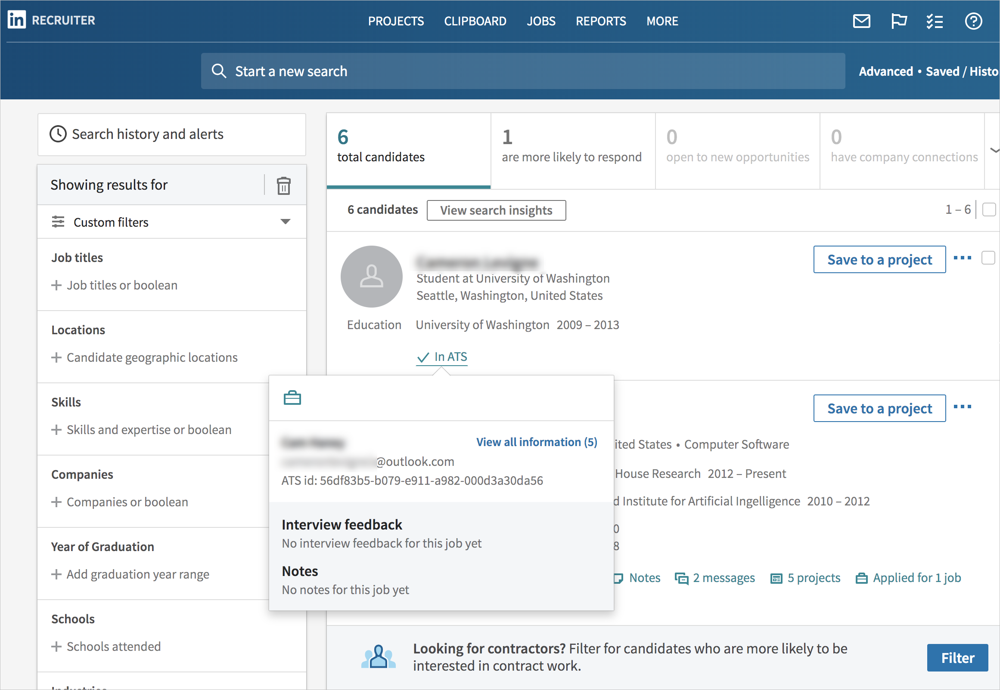

---
# required metadata

title: Source candidates with LinkedIn Recruiter
description: Use the LinkedIn integration provided by Microsoft Dynamics 365 for Talent - Attract to source job candidates through LinkedIn Recruiter.
author: andreabichsel
manager: AnnBe
ms.date: 05/20/2019
ms.topic: article
ms.prod: 
ms.service: dynamics-365-talent
ms.technology: 

# optional metadata

ms.search.form: 
# ROBOTS: 
audience: Application User
# ms.devlang: 
ms.reviewer: anbichse
ms.search.scope: Talent, Core
# ms.tgt_pltfrm: 
ms.custom: 7521
ms.assetid: 3b953d5f-6325-4c9e-8b9b-6ab0458a73f8
ms.search.region: Global
ms.search.industry: 
ms.author: anbichse
ms.search.validFrom: 2018-10-15
ms.dyn365.ops.version: Talent October 2018 update

---

# Source candidates with LinkedIn Recruiter
[!include[banner](../includes/banner.md)]

LinkedIn is the world's largest online professional network, giving you access to the world's top talent. With Microsoft Dynamics 365 for Talent: Attract, you can source candidates directly from LinkedIn, which makes it easier than ever to find the talent you need to fill your open positions. After you set up your connection with LinkedIn through Attract, you can view potential LinkedIn candidates for your position and export them into Attract with just one click.

If it appears you don't have this capability, contact your admin. Before you can take advantage of LinkedIn Recruiter from within Attract, your admin needs to [set up integration with LinkedIn](./attract-admin-linkedin.md). Once this is complete, you can set up your connection with LinkedIn Recruiter and start finding candidates.

## Set up your connection with LinkedIn Recruiter

Before you can start working with LinkedIn Recruiter through Attract, you need to set up your connection with LinkedIn Recruiter. You'll need your LinkedIn Recruiter credentials for this step.

1. Select the **Settings** button (gear icon) in the upper-right corner of the screen.

2. Select **User settings**.

3. On the **Connections** tab, select **Connect** next to LinkedIn. Follow the instructions provided by LinkedIn.

   ](./media/attract-set-up-linkedin-recruiter-connection.png)

## View LinkedIn candidates in Attract

Once you're connected to LinkedIn Recruiter, you can view candidates' LinkedIn profiles in Attract.

1. In Attract, select **Jobs** or **Talent pools** on the left and select an applicant.

   ](./media/attract-view-linkedin-candidates.png)

2. In the candidate's profile, select the **LinkedIn** tab. You can view the candidate's profile, along with InMail history and LinkedIn notes history.

From here, you can save the candidate to a LinkedIn Recruiter project, send inMail, or set an alert in LinkedIn Recruiter with Update Me.

> [!NOTE]
> A candidate's LinkedIn profile will display in Attract when the candidate's Attract information matches the LinkedIn information as follows:
> 

> 1. If the email address and LinkedIn member ID match in Attract and LinkedIn, the candidate's profile will display. Candidates still have the option to link or unlink their LinkedIn profile from Attract.
> 

> 2. If the email address or LinkedIn member ID don't match, you will see a list of possible candidates to choose from and link the profile.
> 

> 3. If there aren't any good matches, you'll see a notice that no match was found.

## Export LinkedIn candidates to Attract with one click

While reviewing candidates in LinkedIn Recruiter, you can export the candidate to jobs you currently have open in Attract. You'll need Recruiter or Hiring Manager permissions in Attract. For more information about roles in Attract, see [Security and role management in Attract](https://docs.microsoft.com/en-us/dynamics365/unified-operations/talent/security-attract).

Also make sure that the job has a Prospect stage. For more information, see [Prospect activity](./activities-attract.md#prospect-activity).

1. In Attract, create a job, assign the appropriate roles, and activate the job.

2. In LinkedIn Recruiter, find a good candidate for the job and go to their profile.

3. In the job search box in the contact card, find the job using the title or the Job ID that was activated in Attract. If you don’t find the job, click **Change ATS** to find the correct Attract instance.

4. Select the job and then select **Export**.

5. In Attract, open the job. The exported candidate will appear in the **Prospect** tab of the job.

## View Attract information from within LinkedIn Recruiter

You can track whether a candidate applied to other jobs in your organization, see where they are in different stages of job applications, and view feedback and comments from Attract in LinkedIn Recruiter.

1.  Open LinkedIn Recruiter and select a candidate profile.

2.  Hover over **In ATS**.

3.  Select any of the following to view the candidate's information that's stored in Attract:

    - **Jobs & Statuses** - see jobs they're part of, latest status, and how they've been progressing with each job

    - **Interview Feedback** - see feedback that interviewers have submitted in Attract

    - **Notes** - see any notes for this applicant in Attract

   ](./media/attract-view-information-from-linkedin-recruiter.png)

> [!NOTE]
> Candidate and application data won't sync with LinkedIn Recruiter if the candidate hasn't moved past the prospect stage.

## View LinkedIn talent pools

If candidates agree to share their LinkedIn profiles with any user in your organization, a new candidate record will be created in Attract. These candidates will appear in a system-created LinkedIn talent pool. 

1. In Attract, select **Talent pools** on the left.

2. Select the LinkedIn talent pool. You can see a list of candidates their stub profiles from LinkedIn. The stub profiles contain the candidate's first and last name, plus their email address if the candidate chose to share it.

## See also

[LinkedIn FAQ](./attract-linkedin-faq.md)

[Set up integration with LinkedIn](./attract-admin-linkedin.md)

[Create jobs](./creating-jobs-attract.md)

[Post jobs to LinkedIn from Attract](./attract-post-jobs-to-linkedin.md)

[Troubleshoot integration with LinkedIn](./attract-troubleshoot-linkedin.md)