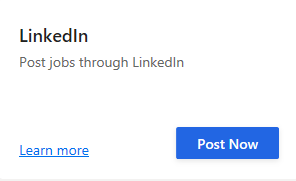

---
# required metadata

title: Post jobs to LinkedIn from Attract
description: This topic explains how to use Dynamics 365 for Talent - Attract to post jobs to LinkedIn.
author: andreabichsel
manager: AnnBe
ms.date: 05/28/2019
ms.topic: article
ms.prod: 
ms.service: dynamics-365-talent
ms.technology: 

# optional metadata

# ms.search.form: 
audience: Application User
# ms.devlang: 
ms.reviewer: anbichse
ms.search.scope: Core, Talent
# ms.tgt_pltfrm: 
ms.custom: 
ms.assetid: 
ms.search.region: Global
# ms.search.industry: 
ms.author: anbichse
ms.search.validFrom: 2019-05-28
ms.dyn365.ops.version: Platform update 24
---

# Post jobs to LinkedIn from Attract

[!include [banner](../includes/banner.md)]

LinkedIn is the largest online professional network, giving you access to the world's top talent. Microsoft Dynamics 365 for Talent: Attract helps you get the talent you need by letting you post your jobs to LinkedIn directly from Attract. Attract provides the option to post a Limited Listing with LinkedIn at no extra cost. These listings are only available through LinkedIn software partners like Attract. They don't appear on the Careers panel on your company's LinkedIn page, because that requires a paid listing, but they display when potential candidates view all available jobs. Limited Listings also display in LinkedIn job searches.

After you [create a job](./creating-jobs-attract.md) in Attract, all you have to do is push a button to put your job in front of thousands of potential candidates on LinkedIn.

The following table shows the actions you can perform on LinkedIn, depending on your user role.

| Your role | Actions you can take |
| --- | --- |
| Admin | post, re-post, unpost |
| Hiring manager | read only |
| Recruiter | post, re-post, unpost |
| Interviewer | no access |
| Read-only | read only |

For more information about user roles in Attract, see [Security and role management in Attract](./security-attract.md).

If you're an admin who needs more information about configuring LinkedIn integration with Attract, see [Set up integration with LinkedIn](./attract-admin-linkedin.md).

## Post jobs to LinkedIn

1. In Attract, open the job that you want to post to LinkedIn.
2. On the **Postings** tab, select the **Post Now** button that corresponds to LinkedIn.

3. In the **Create an "Apply now" web address** window, select an option under **Candidates can apply using a**. We recommend you select **Link in Attract**.
4. Select **Done**.
5. In the **Submit for posting** window, select **Confirm**.

After LinkedIn successfully completes the posting, the **Postings** section of the job in Attract shows the LinkedIn status as **Posted**.

When interested candidates select **View** next to your listing, they'll see the full job details, along with your information about how to apply.

It can take up to 24 hours for your job to appear in LinkedIn. All job postings done with attract are Limited Listings. For more information about Limited Listings in LinkedIn, see [Limited Listings vs Premium Job Slots for Job Wrapping](https://www.linkedin.com/help/recruiter/answer/79049).

If you're having trouble with posting jobs to LinkedIn, see [Troubleshoot posting jobs to LinkedIn](./attract-troubleshoot-linkedin.md).

## See also

[LinkedIn FAQ](./attract-linkedin-faq.md)

[Set up integration with LinkedIn](./attract-admin-linkedin.md)

[Create jobs](./creating-jobs-attract.md)

[Source candidates with LinkedIn Recruiter](./attract-linkedin-recruiter.md)

[Troubleshoot posting jobs to LinkedIn](./attract-troubleshoot-linkedin.md)
