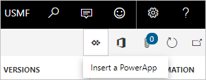
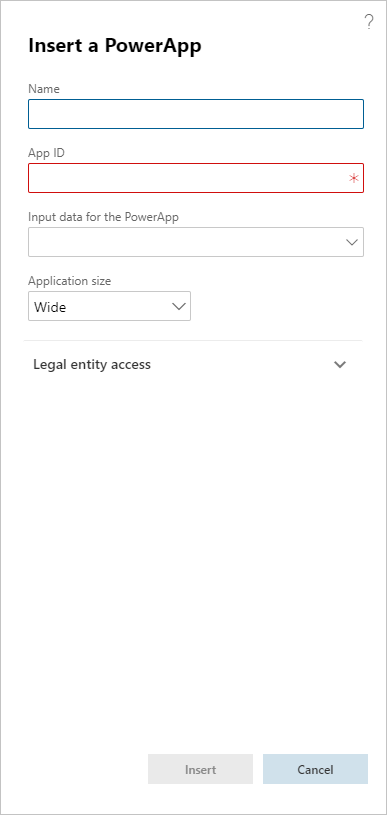

---
# required metadata

title: Embed PowerApps apps in Core HR
description: This topic explains how to resolve the issue where the PowerApps menu item has disappeared from the System administration module.
author: andreabichsel
manager: AnnBe
ms.date: 11/02/2018
ms.topic: article
ms.prod: 
ms.service: dynamics-365-talent
ms.technology: 

# optional metadata

# ms.search.form: 
# ROBOTS: 
audience: Application User
# ms.devlang: 
ms.reviewer: anbichse
ms.search.scope: Talent
# ms.tgt_pltfrm: 
ms.custom: 
ms.assetid: 
ms.search.region: Global
# ms.search.industry: 
ms.author: anbichse
ms.search.validFrom: 2018-11-02
ms.dyn365.ops.version: Talent

---

# Embed PowerApps apps in Core HR

[!include [banner](includes/banner.md)]

**Issue**

The **PowerApps** menu item has disappeared from the **System administration** module.

**Cause**

The user interface (UI) design has been changed, and Microsoft PowerApps is now included in the standard personalization model.

**Resolution**

The way that PowerApps apps are embedded has been changed. PowerApps apps are now added through the personalization model. You can add PowerApps apps to almost all pages in Microsoft Dynamics 365 for Talent.

For information about how to embed PowerApps apps in Talent, see [Embed PowerApps apps](https://docs.microsoft.com/en-us/dynamics365/unified-operations/fin-and-ops/get-started/embed-power-apps).

Any PowerApps customer who embedded apps before the change should have been upgraded to the new model.

The **PowerApps** button is in the upper-right corner of almost every page in Talent. You can use this button to insert a PowerApps app.

Here is an example.

1. Go to **Personnel management \> Links \> Workers \> Employees**.
2. Select the **PowerApps** button, and then select **Insert a PowerApp**.

    

3. Complete the fields in the **Insert a PowerApp** dialog box.

    

Alternatively, follow these steps.

1. On the page's Action Pane, on the **Options** tab, in the **Personalize** group, select **Personalize this form**.

    

    The personalization toolbar appears.

2. On the toolbar, select **Insert \> PowerApp**.

    
