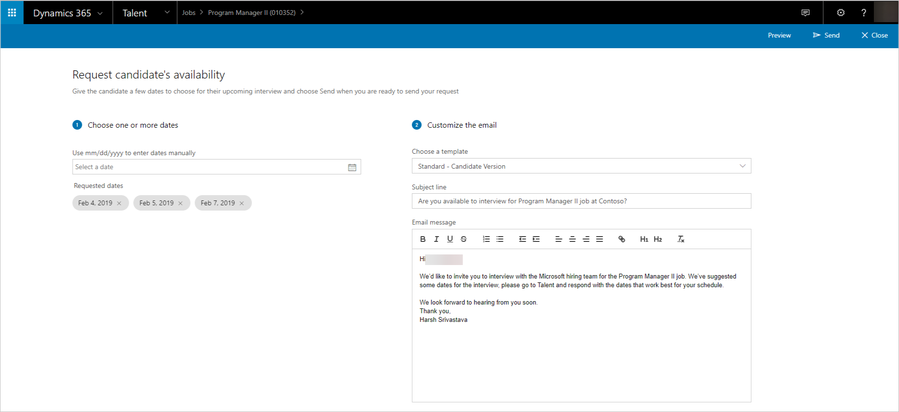
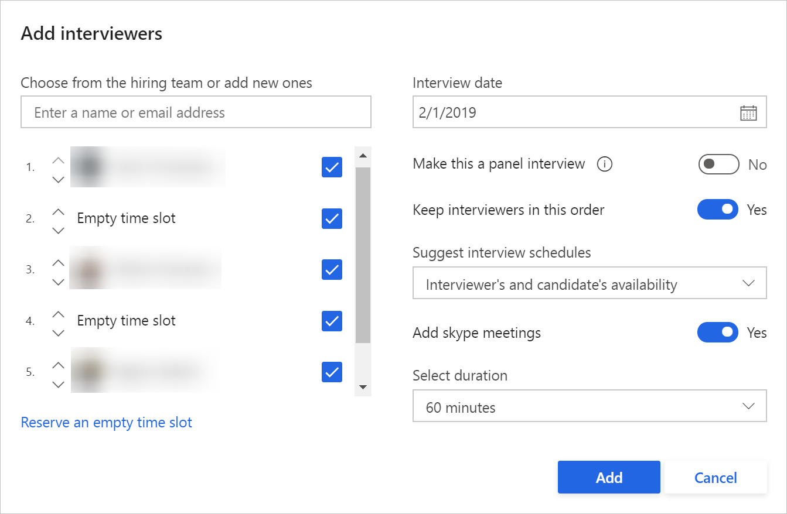
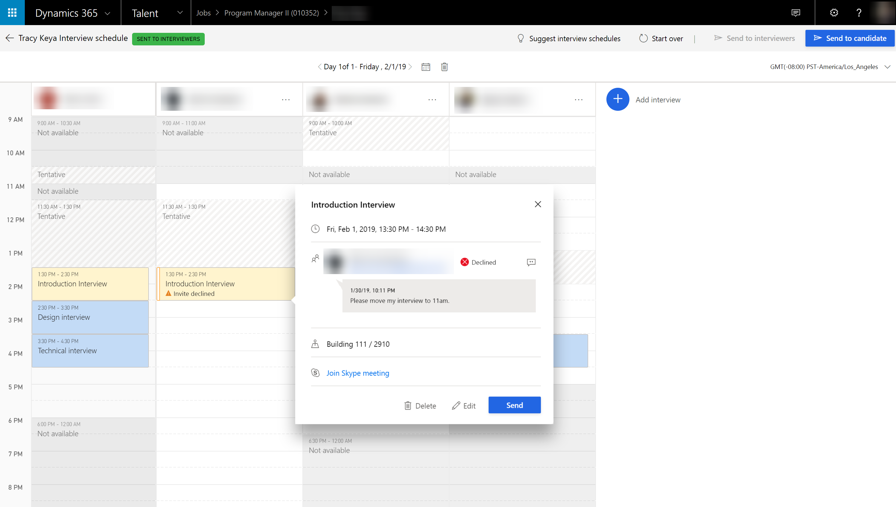

---
# required metadata

title: Interview scheduling and feedback
description: This topic provides information about interview scheduling and feedback activities in Attract.
author: 
manager: AnnBe
ms.date: 12/07/2018
ms.topic: article
ms.prod: 
ms.service: dynamics-365-talent
ms.technology: 

# optional metadata

ms.search.form: 
# ROBOTS: 
audience: Application User
# ms.devlang: 
ms.reviewer: josaw
ms.search.scope: Talent, Core
ms.search.region: Global
# ms.search.industry: HR, Human Resources
ms.author: hasrivas

---

Interview scheduling and feedback
=================================
[!include[banner](../includes/banner.md)]

Scheduler activity
------------------

The Scheduler activity is optional. This activity has two components: Candidate
availability request and Schedule. The Candidate availability component lets you
use email to request a candidate's availability. The Schedule component provides
the ability to schedule interviews with the candidate and the hiring team.

### Candidate availability request

- To be able to send an email to candidates to request their availability, set
the **Request candidate availability** option to **On**. If you set the
option to **Off**, this step won't be shown in the hiring process on the
job.

- To send the availability request, click **Send request**, choose the
available dates and the right email template and send the mail to the candidate.

- The candidate receives an email to respond to the request. They can then log
on to their candidate portal, choose the dates which match their availability
and hit **Submit**.

### Schedule

This step is used to create the interview loop for the activity. There are
multiple configurations available for the interview scheduler to use and quickly
create and send the interview loop to the interviewers and the candidate.

1.  Click **Create schedule** to start creating the schedule.

2.  On the **Add interviewers** box, list all the interviewers that are going to
    be part of the interview loop.

3.  If the candidate had responded to the interview request availability, the
    interview date field will be pre-populated with their selection. You can
    choose to pick a new date as well.

4.  If you select **Make this a panel interview** option to On, the group of
    interviewers on the left are put into a single panel loop to create the
    interview.

5.  You can choose to define a specific sequence of the interviews if need be.

6.  We also recommend interview schedules that will best match the participants’
    availability. If it’s an internal candidate, you can include their
    availability as part of the schedule recommendation.

7.  To have an online meeting option, you can turn on **Add Skype meetings**
    option and each of the interview events will have a Skype for Business link
    available for them.

8.  Lastly, select the interview duration for each interview event.

9.  Click Ok to start creating the schedule.

10.  If the recommendations were turned to On, suggestions will be shown to you
    and the interview grid will be pre-populated. You will be able to see the
    current calendar availability of all the interviewers selected. You will be
    able to view the candidate’s calendar view as well if it was an internal
    candidate.

11.  If there are no suggestions available, you can manually click into a time
    slot in the interviewer’s grid column, provide the interview title, details
    and populate the location details, as necessary. You can choose to include
    the Skype for Business link for the interview if need be.

12. If you want to include more interviewers, click **+ Add interview** grid
    column to select one or more interviewers. You can use the “…” option to
    remove an interview from the loop as well.

13. Click **Send to interviewers** to send the meeting invites to the interviewers
    involved.

14. Once the interview requests have been sent to the interviewers, they can
    respond to it directly from the e-mail invite they receive.

>[!NOTE]

> - For all 1:1 interviews, reminders are sent to the interviewers every 24
hours if the interviewer has not responded (accepted or declined) to the
interview request.

> - For all panel interviews, there are no automated reminders to respond to
interview request. To trigger a reminder manually, edit the interview and use
the **Update & Send** option to send the request back to the interviewers.

15.  The interviewer responses are captured and shown back in Attract. If an
    interviewer declined the invite, you will be notified to make a change. You
    can also view their response in the scheduler grid view by clicking the
    bubble icon.

16.  Once the interview schedule is ready to be shared with the candidate, click
    “Send to candidate”. You can choose to hide/show the interviewer names and
    slots with the candidate.

17.  Select an e-mail template and share the interview summary with the
    candidate. The candidate can view this information in their email as well as
    on their candidate portal.
    
>[!NOTE]

> We display the calendar availability of a candidate only if the candidate is internal. Similarly, only in internal candidate's cases can their calendar be used to enhance interview schedule recommendations. Currently, candidates (external or internal) do not receive an email meeting invite but only a summary of the interviews.

Feedback activity
-----------------

The Feedback activity is optional in a job template. This activity lets
interview participants enter recommendations for an applicant. They can also
enter any feedback comments that they have. If you turn on the **Inherit
feedback participants from Hiring Team** option, the recruiter, hiring
manager, and interviewers are automatically entered in the Feedback activity.
Organizations can allow interviewers to view the feedback of other people before
they submit their own feedback. Organizations can also allow interviewers to
edit their feedback after they submit it. Interviewers are also reminded to
submit feedback for the interviews they have recently conducted based on the
preset configuration as part of the job template. The hiring manager or a
recruiter on the job can also choose to manually remind an interviewer for the
feedback to be submitted.

Interview activity
------------------

The Interview activity is optional. This activity has three components:
Candidate availability request, Schedule, and Feedback. It is recommended to use
the interview activity in the job template if you want all of candidate’s
availability request, schedule and feedback as part of the process vs using them
individually as part of the hiring process.
