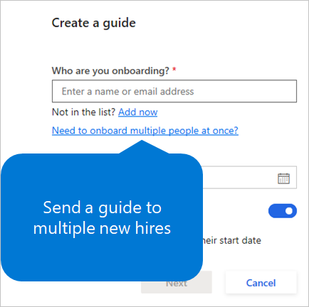
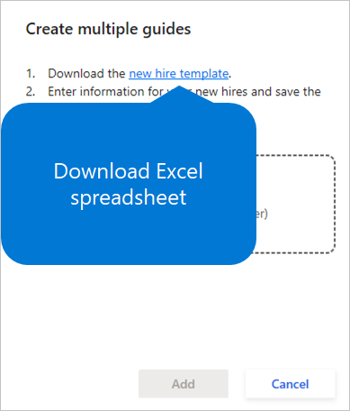
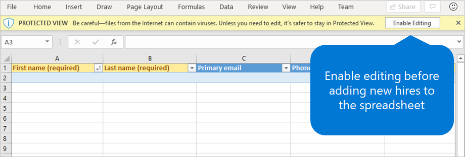
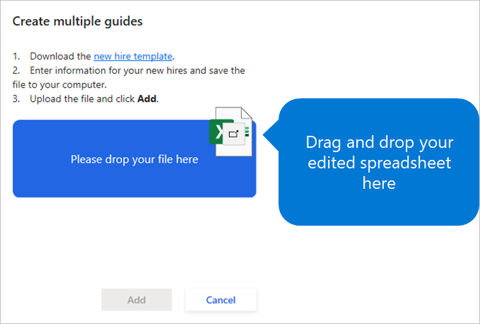
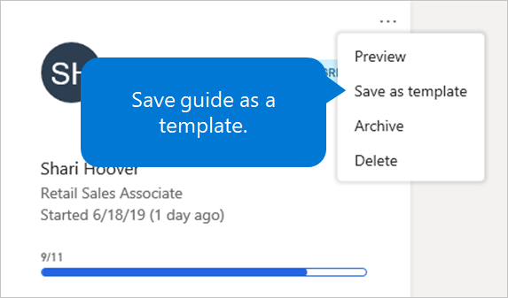

---
# required metadata

title: Create an onboarding guide with Dynamics 365 for Talent - Onboard
description: Use the Dynamics 365 for Talent - Onboard app to create an onboarding guide for your new hires. This is an essential first step in your human capital management hire-to-retire strategy.
author: andreabichsel
manager:
ms.date: 05/02/2019
ms.topic: article
ms.prod:
ms.service: dynamics-365-talent
ms.technology:

# optional metadata

ms.search.form: HcmCourseType, HcmCourseTypeGroup, HRMCourseTable
# ROBOTS:
audience: Application User
# ms.devlang:
ms.reviewer: anbichse
ms.search.scope: Core, Operations, Talent
# ms.tgt_pltfrm:
# ms.custom:
# ms.assetid:
ms.search.region: Global
# ms.search.industry:
ms.author: anbichse
ms.search.validFrom: 2019-05-06
ms.dyn365.ops.version: Talent
---

# Create and send an onboarding guide

[!include [banner](includes/banner.md)]

With Microsoft Dynamics 365 for Talent: Onboard, you can create onboarding guides from templates you created on your own or from those available in the gallery. After you've created at least one onboarding template, you can create a guide for your new hire.

## Create and send an onboarding guide to a single new hire from a template

1. On the left-hand menu, select **Templates**.

2. Under **My templates**, select the template you'd like to set up as an onboarding guide for your new hire.

3. Edit the template as desired, being sure to save your work as you go.

4. When you're done editing, select **Create guide**.

   

5. In the **Create a guide** window, enter your new hire's name or email address under **Who are you onboarding**. If your new hire isn't in the system yet, select **Add now** and enter the employee's information.

   ](./media/onboard-create-a-guide-window.png)

6. Select a start date under **When do they start**. 

7. If desired, select an automatic send date. If you want to send the guide immediately, turn the **Schedule an automatic send date** toggle button off. Select **Done**.

8. Select **Send** in the upper-right corner of the screen. Then do one of the following:
    - If you want to send your new hire a link to the onboarding guide on your own, select **copy a link** and then select **Copy**.
    - If you want to customize the email for the onboarding guide, select **Customize the email before sending** and then select **Next**, customize the email as desired, and select **Send**.
    - If you don't want to customize the email, select **Next** and then select **Send**.

9. If you want to send your customized guide to another new hire, select **Save as template**, enter a new template name, select **Save**, and start the process over again.

## Create and send on onboarding guide to multiple new hires from a template

Onboard lets you send an onboarding guide to multiple new hires at the same time.

1. On the left-hand menu, select **Templates**.

2. Under **My templates**, select the template you'd like to set up as an onboarding guide for your new hire.

3. Edit the template as desired, being sure to save your work as you go.

4. When you're done editing, select **Create guide**.

5. In the **Create a guide** window, select **Need to onboard multiple people at once**. 

   

6. Select **new hire template**, click **Open** when the .xlsx file finishes downloading, enter your employees' information in the Excel spreadsheet, and save the spreadsheet.

   

    > [!NOTE]
    > You'll need to click **Enable editing** in Excel before you can edit the spreadsheet.

   

7. Drag and drop the Excel spreadsheet to the designated area in the **Create multiple guides** window, or click the area to browse for the file on your computer.

   

8. Select **Send** in the upper-right corner of the screen. Then do one of the following:
    - If you want to send your new hire a link to the onboarding guide on your own, select **copy a link** and then select **Copy**.
    - If you want to customize the email for the onboarding guide, select **Customize the email before sending** and then select **Next**, customize the email as desired, and select **Send**.
    - If you don't want to customize the email, select **Next** and then select **Send**.

9. If you want to send your customized guide to other new hires, select **Save as template**, enter a new template name, select **Save**, and start the process over again.

## Create a guide without a template

You don't always have to create a guide from a template. If your guide is meant for only one new hire, you can create a guide from scratch instead.

1. On the left-hand menu, select **Guides** and then select **Add** (plus sign).

2. In the **Create a guide** window, enter your new hire's name or email address under **Who are you onboarding**. If your new hire isn't in the system yet, select **Add now** and enter the employee's information.

   ](./media/onboard-create-a-guide-window.png)

3. Select a start date under **When do they start**. 

4. If desired, select an automatic send date. If you want to send the guide immediately, turn the **Schedule an automatic send date** toggle button off. Select **Done**.

5. Select **Send** in the upper-right corner of the screen. Then do one of the following:
    - If you want to send your new hire a link to the onboarding guide on your own, select **copy a link** and then select **Copy**.
    - If you want to customize the email for the onboarding guide, select **Customize the email before sending** and then select **Next**, customize the email as desired, and select **Send**.
    - If you don't want to customize the email, select **Next** and then select **Send**.

6. If you want to send your customized guide to another new hire, select **Save as template**, enter a new template name, select **Save**, and start the process over again. 

## Save a guide as a template

You can save an onboarding guide as a template to save you time while creating guides in the future.

1. On the left-hand menu, select **Guides**.

2. Select **More** (ellipsis) on the guide you want to create a template from and then select **Save as template**.

   ](./media/onboard-save-guide-as-template.png)

3. In the **Save as a new template** window, enter a name for your new template, and then select **Save**. 

## Next steps

- [Edit onboarding guides and templates](./onboard-edit-guides-templates.md)
- [Share content with other contributors](./onboard-share-template.md)
- [View the status of tasks and onboarding employees](./onboard-view-status.md)
- [Create hiring teams in Onboard](./onboard-create-team.md)

### See also

- [Try or buy the Onboard app](https://dynamics.microsoft.com/en-us/talent/onboard/)
- [What's new](./whats-new.md)
- [Release notes](https://docs.microsoft.com/en-us/business-applications-release-notes/index)
- [Get support](./talent-support.md)
