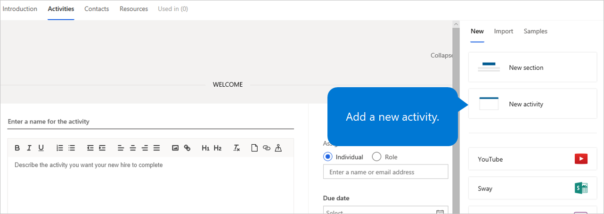
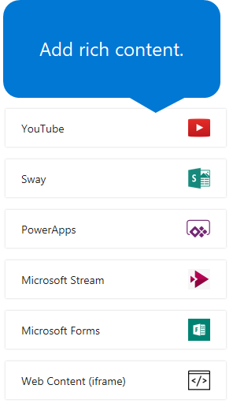
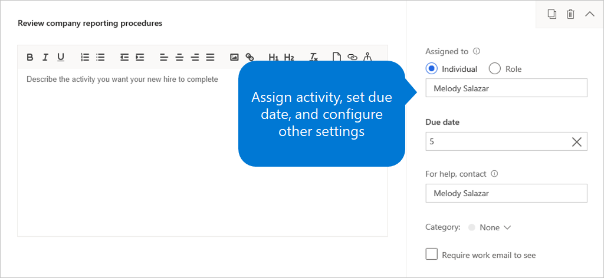

---
# required metadata

title: Edit onboarding guides and templates in Microsoft Dynamics 365 for Talent - Onboard
description: Add activities and other information to your onboarding guides and templates in Microsoft Dynamics 365 for Talent - Onboard
author: andreabichsel
manager:
ms.date: 06/19/2019
ms.topic: article
ms.prod:
ms.service: dynamics-365-talent
ms.technology:

# optional metadata

ms.search.form: HcmCourseType, HcmCourseTypeGroup, HRMCourseTable
# ROBOTS:
audience: Application User
# ms.devlang:
ms.reviewer: anbichse
ms.search.scope: Core, Operations, Talent
# ms.tgt_pltfrm:
# ms.custom:
# ms.assetid:
ms.search.region: Global
# ms.search.industry:
ms.author: anbichse
ms.search.validFrom: 2019-06-19
ms.dyn365.ops.version: Talent
---

# Edit guides and templates

[!include [banner](includes/banner.md)]

Once you create an onboarding guide or template in Microsoft Dynamics 365 for Talent: Onboard, you need to add an introduction, activities, contacts, and resources. Onboard lets you include rich content in your onboarding guides, including:

- YouTube videos
- Sway presentations
- PowerApps apps
- Microsoft Stream videos
- Microsoft forms forms
- Iframes with web content

## Add or edit an introduction

1. On the **Introduction** tab, enter a title for your guide and enter an opening message. To use the sample text, select **Use this message**. 

   

2. Use the formatting buttons to call out text as necessary, or to add images or links.

3. Select **Save** to save your work.

## Add or edit activities

1. On the **Activities** tab, drag and drop items from the right to the editing area.

2. To organize your guide into sections, drag and drop **New section** to the editing area and enter a name and optional description for the section.

   ](./media/onboard-edit-add-section.png)

3. To add activities for your new hire to complete, drag and drop **New activity** to the editing area and enter a name and description for the activity. 

   ](./media/onboard-edit-add-activity.png)

4. Add rich content to your onboarding guide.

   ](./media/onboard-edit-add-rich-content.png)

    - To add a YouTube video, drag and drop **YouTube** to the editing area, enter a name and description for the activity, and then enter a YouTube video URL.

    - To add a Sway presentation or newsletter, drag and drop **Sway** to the editing area, enter a name and description for the activity, and then enter a Sway embedded URL.

    - To add a PowerApps app, drag and drop **PowerApps** to the editing area, enter a name and description for the activity, and then choose a PowerApps app or enter a PowerApps app ID.

    - To add a Microsoft Stream video, drag and drop **Microsoft Stream** to the editing area, enter a name and description for the activity, and then enter a Microsoft Stream video URL. 

    - To add a Microsoft Forms form, drag and drop **Microsoft Forms** to the editing area, enter a name and description for the activity, and then enter a Microsoft Forms URL and specify the size for the screen area. 

    - To add an iframe with web content, drag and drop **Web Content (iframe)** to the editing area, enter a name and description for the activity, and then enter a web content URL and specify the size for the screen area. 

2. If desired, in the right-hand area of each activity, assign activities to a person or role, add a due date and contact person, and assign a category color. When you assign an activity to a person or a role, this creates a task for each individual, which appears in the **Tasks** menu in Onboard.

   

3. Select **Save** to save your work. 

If you need to delete an activity or section, select the **Delete** (trash can) button on the upper right-hand corner of the activity or section.

If you want to rearrange activities and sections, drag and drop them to the new desired location.

## Add or edit contacts

Add people who can help your new hire succeed from day one. These can be recruiters, teammates, onboarding buddies, mentors, admins, and IT support staff.

1. On the **Contacts** tab, select **New contact**.

2. On the **Add team member** pane, enter the contact person's name or email address, enter a short description of how the contact person can help your new hire, and then select **Add**. 

   ](./media/onboard-edit-add-contact.png)

3. Select **Save** to save your work. 

Alternately, you can select one or more contacts under **Suggestions**.

If you need to delete a contact, select the **Delete** (trash can) button to the right of the contact.

If you need to edit a contact, select the **Edit** (pencil) button to the right of the contact.

## Add or edit resources

You can add useful files, maps, and links to the **Resources** section of your guide.

1. On the **Resources** tab, select **New resource**.

2. Do one of the following:

    - To add a file, select **File**, drag and drop a file (or click the drag-and-drop area to browse your computer, or select **Browse OneDrive**), enter a name for the file, and then select **Add**.

    - To add a link, select **Link**, enter a name and address for the link, and then select **Add**.

    - To add a map, select **Map**, enter a name and address for the map, and then select **Add**. Onboard will include a map of the address you specified.

    ](./media/onboard-edit-add-resource.png)

3. Select **Save** to save your work. 

If you need to delete a resource, select the **Delete** (trash can) button to the right of the resource.

If you need to edit a contact, select the **Edit** (pencil) button to the right of the resource.
