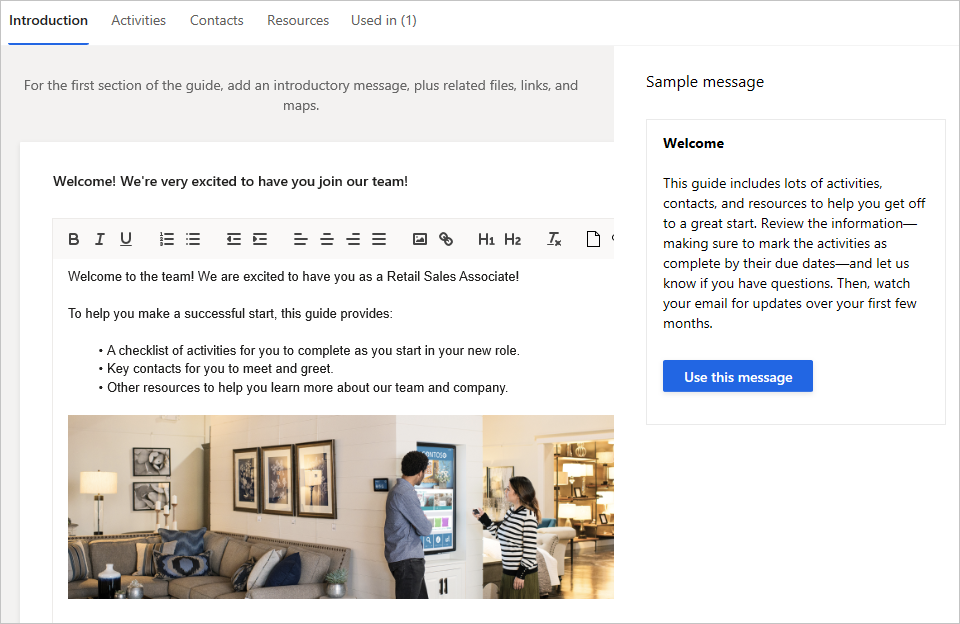
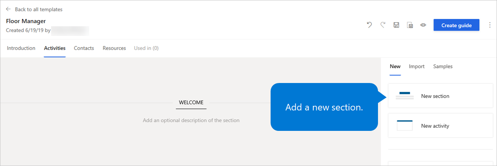
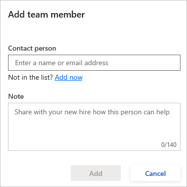
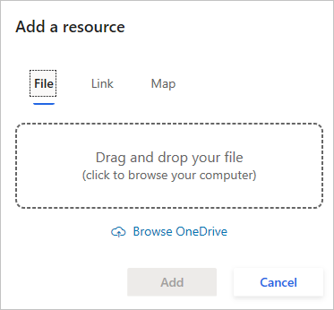

---
# required metadata

title: Edit onboarding guides and templates in Dynamics 365 for Talent - Onboard
description: This topic explains how to add activities and other information to onboarding guides and templates in Microsoft Dynamics 365 for Talent - Onboard.
author: andreabichsel
manager:
ms.date: 06/19/2019
ms.topic: article
ms.prod:
ms.service: dynamics-365-talent
ms.technology:

# optional metadata

ms.search.form: HcmCourseType, HcmCourseTypeGroup, HRMCourseTable
# ROBOTS:
audience: Application User
# ms.devlang:
ms.reviewer: anbichse
ms.search.scope: Core, Operations, Talent
# ms.tgt_pltfrm:
# ms.custom:
# ms.assetid:
ms.search.region: Global
# ms.search.industry:
ms.author: anbichse
ms.search.validFrom: 2019-06-19
ms.dyn365.ops.version: Talent
---

# Edit onboarding guides and templates in Dynamics 365 for Talent: Onboard

[!include [banner](includes/banner.md)]

After you create an onboarding guide or template in Microsoft Dynamics 365 for Talent: Onboard, you must add an introduction, activities, contacts, and resources. Onboard lets you include rich content in your onboarding guides. Here are some examples of rich content:

- YouTube videos
- Microsoft Sway presentations
- Microsoft PowerApps apps
- Microsoft Stream videos
- Microsoft Forms forms
- Iframes that contains web content

## Add or edit an introduction

1. On the **Introduction** tab, enter a title for your guide and an opening message. To use the sample text, select **Use this message**.

    

2. Use the formatting buttons to call out text as you require, or to add images or links.
3. Select **Save** to save your work.

## Add or edit activities

1. On the **Activities** tab, drag items from the right to the editing area.
2. To organize your guide into sections, drag the **New section** item to the editing area, and enter a name and an optional description for the section.

    ](./media/onboard-edit-add-section.png)

3. To add activities for your new hire to complete, drag the **New activity** item to the editing area, and enter a name and description for the activity.

    ](./media/onboard-edit-add-activity.png)

4. Add rich content to your onboarding guide:

    - To add a YouTube video, drag the **YouTube** item to the editing area, enter a name and description for the activity, and enter the URL for the YouTube video.
    - To add a Sway presentation or newsletter, drag the **Sway** item to the editing area, enter a name and description for the activity, and enter the embedded URL for the Sway presentation or newsletter.
    - To add a PowerApps app, drag the **PowerApps** item to the editing area, enter a name and description for the activity, and either select the PowerApps app or enter the PowerApps app ID.
    - To add a Microsoft Stream video, drag the **Microsoft Stream** item to the editing area, enter a name and description for the activity, and enter the URL for the Microsoft Stream video.
    - To add a Microsoft Forms form, drag the **Microsoft Forms** item to the editing area, enter a name and description for the activity, enter the URL for the Microsoft Forms form, and specify the size of the screen area.
    - To add an iframe that contains web content, drag the **Web Content (iframe)** item to the editing area, enter a name and description for the activity, enter the URL for the web content, and specify the size of the screen area.

    ](./media/onboard-edit-add-rich-content.png)

2. Optional: In the area on the right of each activity, assign the activity to a specific person or role, add a due date and contact person, and assign a category color. When you assign an activity to a person or role, a task is created for each individual. This task appears on the **Tasks** menu in Onboard.

    

3. Select **Save** to save your work.

To delete an activity or section, select the **Delete** button (the trash can symbol) in the upper-right corner of the activity or section.

To rearrange activities and sections, drag them to a new location.

## Add or edit contacts

You can add contact people who can help your new hire succeed from day one. These contacts can be recruiters, teammates, onboarding buddies, mentors, admins, and IT support staff.

1. On the **Contacts** tab, select **New contact**.
2. In the **Add team member** pane, enter the contact person's name or email address, enter a short description that explains how the contact person can help the new hire, and then select **Add**. 

    ](./media/onboard-edit-add-contact.png)

    Alternately, you can select one or more contacts under **Suggestions**.

3. Select **Save** to save your work.

To delete a contact, select the **Delete** button (the trash can symbol) to the right of the contact.

To edit a contact, select the **Edit** button (the pencil symbol) to the right of the contact.

## Add or edit resources

You can add useful files, maps, and links to the **Resources** section of your onboarding guide.

1. On the **Resources** tab, select **New resource**.
2. Follow one of these steps:

    - To add a file, select the **File** tab, and drag the file into the designated area. (Alternatively, click anywhere in that area to browse for the file on your computer, or select **Browse OneDrive**.) Enter a name for the file, and then select **Add**.
    - To add a link, select the **Link** tab, enter a name and address for the link, and then select **Add**.
    - To add a map, select the **Map** tab, enter a name and address for the map, and then select **Add**. Onboard will include a map of the address that you specify.

    ](./media/onboard-edit-add-resource.png)

3. Select **Save** to save your work.

To delete a resource, select the **Delete** button (the trash can symbol) to the right of the resource.

To edit a contact, select the **Edit** button (the pencil symbol) to the right of the resource.

## Next steps

- [Share content with other contributors](./onboard-share-template.md)
- [View the status of tasks and onboarding employees](./onboard-view-status.md)
- [Create hiring teams in Onboard](./onboard-create-team.md)

### See also

- [Try or buy the Onboard app](https://dynamics.microsoft.com/talent/onboard/)
- [What's new](./whats-new.md)
- [Release notes](https://docs.microsoft.com/business-applications-release-notes/index)
- [Get support](./talent-support.md)
