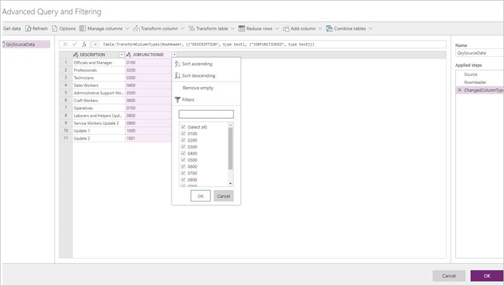
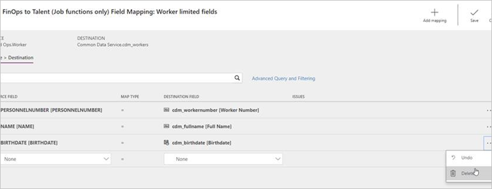
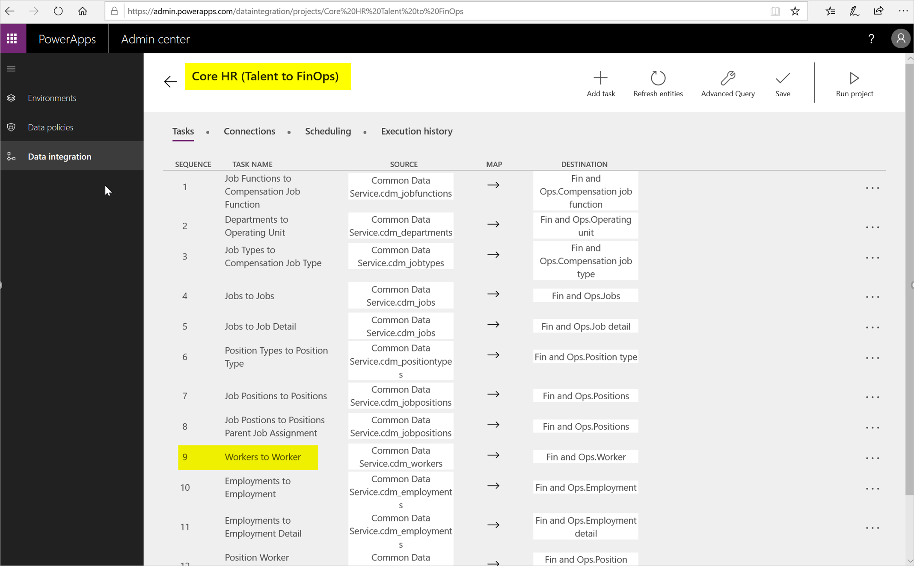
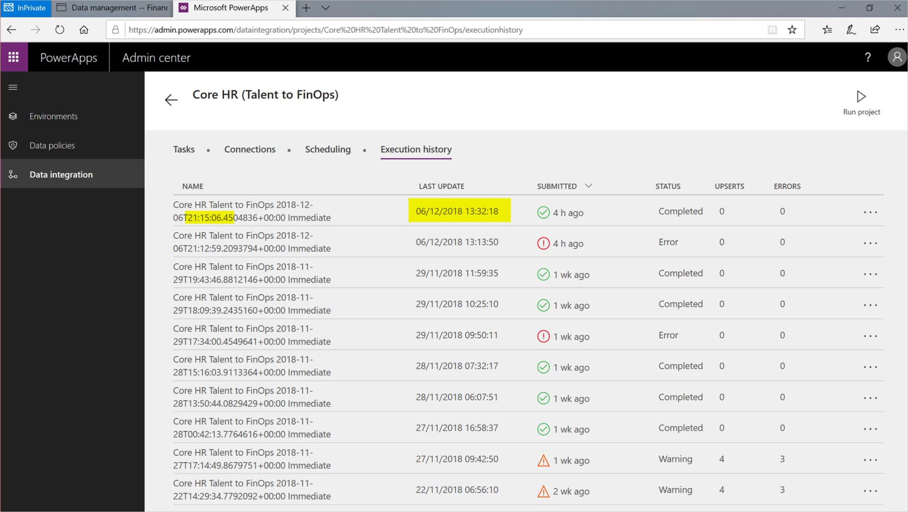
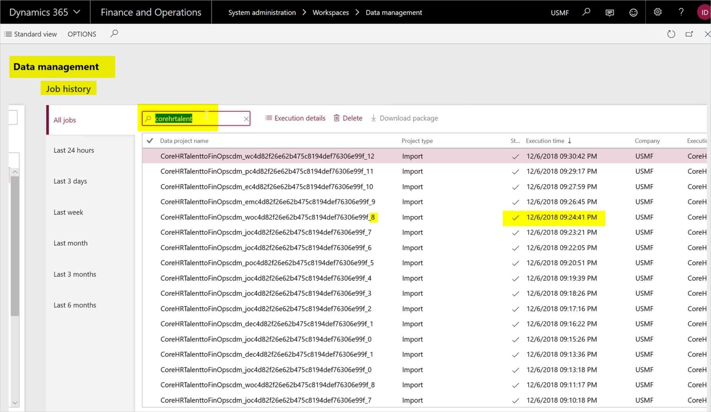
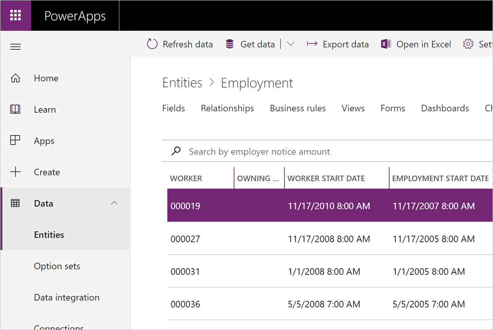

---
# required metadata

title: Dynamics 365 Talent to Dynamics 365 Finance integration FAQ
description: This topic explains what data is synchronized in a Talent and Finance integration.
author: andreabichsel
manager: AnnBe
ms.date: 10/14/2019
ms.topic: article
ms.prod: 
ms.service: dynamics-365-talent
ms.technology: 

# optional metadata

# ms.search.form: 
# ROBOTS: 
audience: Application User
# ms.devlang: 
ms.reviewer: anbichse
ms.search.scope: Talent
# ms.tgt_pltfrm: 
ms.custom: 
ms.assetid: 
ms.search.region: Global
# ms.search.industry: 
ms.author: anbichse
ms.search.validFrom: 2018-12-31
ms.dyn365.ops.version: Talent

---

# Dynamics 365 Talent to Dynamics 365 Finance integration FAQ

[!include [banner](includes/banner.md)]

This topic answers common questions associated about what data is synchronized when Dynamics 365 Talent is integrated with Dynamics 365 Finance.

## Is all data synchronized or just some data entities?

For Core HR, a subset of the data is synchronized. For a list of all
the entities, see [Integration from Dynamics 365 Talent to Dynamics 365 Finance](talent-financeandoperations-integration.md).

For Attract and Onboard, all data is native to Common Data Service.

## Why don't I see any data synced to Common Data Service?

By default, the Common Data Service integration is turned off in new environments that don't include the provided demo data. By default, it's turned on in new environments that include demo data, and data synchronization begins when the environment is provisioned. After your environment is ready to sync data, you can turn on the integration. For more information, see [Configure Common Data Service integration](hr-common-data-service-integration.md).

## Can I create a new mapping without using the templates?

Templates are the starting point. You can create your own template, but a
template is always needed when creating an integration project. For
more information about data integrator (DI), templates, and projects, see [Integrate data into Common Data Service](https://docs.microsoft.com/powerapps/administrator/data-integrator).

## Can I map financial dimensions to transfer between Talent and Finance?

Financial dimensions aren’t currently in Common Data Service and as a result aren’t
part of the default template. This entity is planned, but currently no release timeline is available.

For data that resides in Finance but does not exist in Talent,
link the two systems together by using **Configure Links** in Talent. For more
information about how to configure links between Talent and Finance, see [What's new or changed in Dynamics 365 Talent: Core HR (October 31, 2018)](whats-new-talent-october-31.md).

## Sometimes when I import employees, they go into inactive workers in Finance. Why?

You may get this error if employees don’t have an active employment detail
record in Talent. To resolve this, go to **Personnel Management \> Employees \> Employment History \> Date Manager**, and verify that there is an active employment detail record.

## If I select to map only a subset of fields, will changes made to non-mapped fields trigger a sync?

Data sync follows the execution schedule. The integration will pick up a record
if any field in the record changes regardless if the field is part of
integration mapping.

## How can I send only active worker changes and not the terminated records?

With the use of "Advanced query", you can filter and reshape source data before
passing it into the destination.

## Can I specify which fields to send to Finance for a specific entity?

Fields can be added or removed from the integration task. Not all data fields
that exist on the Common Data Service entity will be populated from Core HR.
Additional data can be populated via Power Apps.

## I set up integration as a batch job, but Talent lost connection to the destination system. How can I send the same set of changes to the destination system?

No special setup is required for exception handling. The Data Integrator will automatically catch and report errors which occur at the source and destination and will allow manual retries. However, it doesn’t allow manual data correction. If data updates are needed, that should happen either at the source or the destination.

## Can I set up bi-directional integration?

No, integration is currently one-way (Talent to Finance and
Operations). However, there is a default template available to send data from Talent to
Finance.

## Can I allow record deletion as part of my integration?

No, Data Integrator will not capture deleted records for data transfer. Only
data creation and updates (UPSERT) are currently included.

## Can I rerun the errored execution? If so, will it send a full file or only the changes?

The first run of Data Integrator is always a full run. Subsequent runs are
based on change tracking. When an error run is executed, it extracts the records
in scope of the run and sends out the most recent changes from Common Data Service.

## When I save the project, I get the error: “Project has mapping errors." What do I do?

Check the setup of your integration keys, make any required changes to the setup, then refresh the entities in the project.

When the default template is used, the integration keys will be
automatically imported. This issue may occur when new tasks are added to
the existing template.

## If I have N number of legal entities where workers have employments, do I need to create a mapping for each of them?

Yes, for each legal entity in Finance, you'll need a separate 
integration project in the data integration.

## I need to transfer data that is not part of the default template provided by Microsoft. Can I do this?

Yes, fields can be added to or removed from the existing template. The template can be modified to include additional data from other Common Data Service entities. The entity must be in Common Data Service for it to be included in the template. 

## I just created new Finance and Talent environments, and I'm getting the error "The data value violates integrity constraints." Why?

Reasons for this error can include:

- The data transfer resulted in duplicate records extraction at the source (Common Data Service).

- The data transfer has null values for fields that are required in Finance and
Operations. Verify the data that is in Common Data Service and meets the requirements of Finance and
Operations.

## If there are execution errors and the Employee ID didn't sync, how do I find the history job which has the failed employee record?

Data Integrator will create multiple projects in Finance. The
relationship between the Data Integrator task and the Finance project
is one to one.

Trace the time from the Data Integrator execution history and look for the index -1
project in Finance. If the task number is 9 in Data Integrator, the index in Finance is 8.

1. Capture the task index from Data Integrator (in this example it is "9").

2. Track the execution time of the project.

3. In Finance, identify index - 1. In this example, the
project with suffix "8" and execution time of index "0" project matches with
the execution time in Step 2.

## After integrating Talent and Finance, I don’t see my Talent data in Finance. What do I do?

The integration to Finance is a two-step process. First, verify
that the Talent data is updated and available in Common Data Service. This is a near real-time
sync and can be verified in Power Apps by looking at the data within the data
entities.

If the data is not appearing as expected in Common Data Service, verify that the entity is
supported in the integration. To include additional data in Common Data Service, a change will be required on the Microsoft side.

If the entity is supported and the data is available in Common Data Service, verify the mapping
is correct in Data Integrator. If the integrator mapping looks okay, then
verify the data management jobs have successfully run. Errors may occur during
the execution of the batch jobs. For more information about Data Management, see [Data management](https://docs.microsoft.com/dynamics365/unified-operations/dev-itpro/data-entities/data-entities-data-packages?toc=/fin-and-ops/toc.json).

## The addresses for my employees are incorrect after I import them into Finance. What should I do?

The number sequence for **Location ID** uses the same pattern in both Talent and
Finance. The number sequence needs to be unique on both sides so
there are no address collisions when integrating data from Common Data Service to Finance and
Operations.

During implementation of Talent, verify that the number sequences are not the same in
Talent and Finance. Validate that all number sequences are not
identical where data may be maintained in both systems.

## When creating my connection set, I am unable to see the connection in the Connection drop-down list. What do I do?

Make sure when creating your connections, you choose Dynamics 365 Finance and Common Data Service.

## When syncing employments, I get the errors “CompanyInfo_FK doesn’t exist" or “The value '12/31/2154 11:59:59 pm' in field 'Employment end date' is not found in the related table 'Employment'.” What should I do?

Ensure that you are mapping to the correct legal entities. Legal entity syncing
is not part of the default template, so it is expected that each legal
entity that is present in Talent and Common Data Service is also present in Finance.
Also, make sure that you are selecting the correct legal entities for the
associated Connection Set.

## After setting up my project, the field mapping for Finance appears to be empty. What should I do?

Refresh the data entities in Finance by going to **Data management \> Framework
Parameters \> Entity settings \> Refresh entity list.** This should take a couple
of minutes to complete, then you should see those mappings. This issue occurs when new projects are created.

## Additional resources

- Data Integrator (DI): 

  - [Integrate data into Common Data Service](https://docs.microsoft.com/powerapps/administrator/data-integrator)

  - [Data Integrator error management and troubleshooting](https://docs.microsoft.com/powerapps/administrator/data-integrator-error-management)

  - [Responding to DSR requests for system-generated logs in Power Apps, Microsoft Power Automate, and Common Data Service](https://docs.microsoft.com/powerapps/administrator/powerapps-gdpr-dsr-guide-systemlogs)

- Data Management:

  - [Data management](https://docs.microsoft.com/dynamics365/unified-operations/dev-itpro/data-entities/data-entities-data-packages?toc=/fin-and-ops/toc.json)
