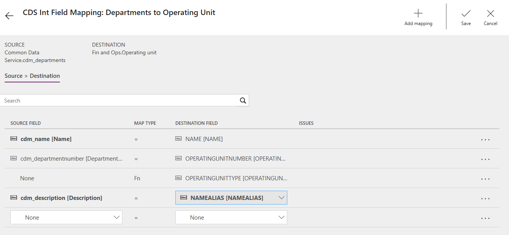
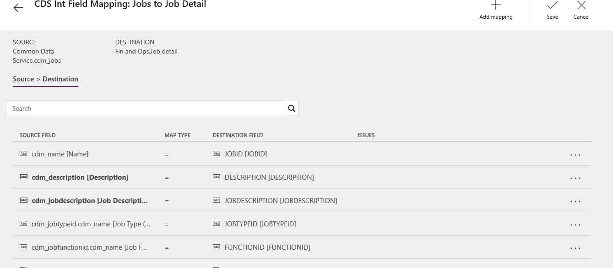

---
# required metadata

title: What's new or changed in Dynamics 365 for Talent Core HR (December 6, 2018)
description: This topic describes features that are either new or changed in Microsoft Dynamics 365 for Talent Core HR.
author: Darinkramer
manager: AnnBe
ms.date: 12/07/2018
ms.topic: article
ms.prod: 
ms.service: dynamics-365-talent
ms.technology: 

# optional metadata

ms.search.form: 
# ROBOTS: 
audience: Application User
# ms.devlang: 
ms.reviewer: anbichse
ms.search.scope: Talent
# ms.tgt_pltfrm: 
ms.custom: 
ms.assetid: 
ms.search.region: Global
# ms.search.industry: 
ms.author: dkrame
ms.search.validFrom: 2018-12-06
ms.dyn365.ops.version: Talent

---
# What's new or changed in Dynamics 365 for Talent Core HR (December 6, 2018)

[!include [banner](includes/banner.md)]

**Build 8.1.2071**

This topic describes features that are either new or changed in Core HR.

## Platform update 22

### Export up to 1 million rows to Excel

The Export to Excel feature can now be configured to allow users to export up to 1 million rows from a grid in Talent, a substantial increase from the previous 10,000-row limit. 

### Restyled personalization toolbar

The personalization toolbar has been restyled in Platform update 22 to help users more easily tailor their own experiences in Talent. The following changes were made: 

-  The name of each personalization tool is now shown along with an icon, which helps users quickly recognize the tool they are interested in using.
-  The description for how to use the current tool is also now shown, which helps users understand how to make the needed personalizations.  
-  The entire personalization toolbar can be moved across the screen by dragging and dropping on a specific region at the far left of the toolbar. This allows users to personalize elements that were previously obscured by the toolbar.   

### Optimized "is one of" filtering experience

The "is one of" filtering operator is available for most fields when using the Filter Pane and grid header drop-down lists. This operator allows a user to filter a field based on multiple values. A new and improved experience for the "is one of" operator is available in Platform update 22. To learn more, see [Optimized "is one of" filtering experience](https://docs.microsoft.com/business-applications-release-notes/October18/dynamics365-finance-operations/improved-isoneof-filtering).

### Paste lists from Excel into filter fields with the "is one of" operator

For some tasks, users might have a list of values in Excel that they'd like to use to filter data in Talent. For example, a Human Resource user might have identified a set of employees from a report that need additional research in the system, and it would be ideal for this user to be able to copy the list directly from Excel into a filter field in Talent.

Starting in Platform update 22, the "is one of" operator in the Filter Pane and grid column filtering now recognizes lists copied from Excel so that they can be pasted directly into a filter field. This includes a collection of values copied from different rows and columns in Excel. To learn more about this feature, see [Paste lists from Excel into filter fields with the "is one of" operator](https://docs.microsoft.com/business-applications-release-notes/October18/dynamics365-finance-operations/paste-filter-lists-from-excel).

## In preview

### Configure UK payroll integration between Talent and Dayforce

The integration between Microsoft Dynamics 365 for Talent and Ceridian Dayforce is available in preview for the UK. Refer to the following topic for more information, [Configure the payroll integration between Talent and Dayforce](https://docs.microsoft.com/en-us/dynamics365/unified-operations/talent/configure-payroll-integration).

## Coming soon

### Leave and absence: Future leave and forecasting leave balances

With the changes being made to allow for employees to forecast time off and request future time off requests without impacting their current time off balances, the way time off balances are displayed is also changing. 

The available balance currently displayed is the amount of time off available for requests including accruals through today and all approved leave requests to the end of time. 

When the ability to forecast is released, the balance displayed changes to  be the current balance of time off including accruals through today and requests through today. Employees and managers will see these updated balances in employee and manager self service on the **Time off** card and in the **Time off balances** window. HR managers will see these updated balances in the **People** workspace and in the employee’s **Assigned leave plans** window.

## Other changes 

### Termination code is not populated to the worker position assignment record

A change has been implemented that populates the reason code on the position assignment record during the termination process.

### Validation for personnel number being in-use needs additional details

Additional information is displayed when number sequences are in use, to better understand issues when a new number cannot be generated.
 
### Attachments buttons not available for workers

Changes have been made to correct attachments. When adding a new attachment to a worker, the **New** and **Edit** buttons are now available when FactBoxes are open on the worker window. 

## Known issues

### Mapping errors in the integration with Finance and Operations

The following issues have been identified in the current template for integrating Talent with Finance and Operations. A new template will be published soon and will be applied to all new integration projects that are created. For existing integration projects, the task mappings can be updated. Refer to the following table for updated mappings. 

>[!NOTE]
> The Job Positions to Positions Parent Job Assignment task does not integrate data. This is an issue that is currently being researched. There is no workaround in the current mapping. 

The Departments to Operating unit task needs the following mappings updated.

| Existing source field          | New source field |
| -------------------------------|------------------|
| cdm_description (Description)  | cdm_name (Name)  |

An additional mapping also needs to be added. Select the last **None** field to add the following mapping.

| Source field                   | Destination field    |
| -------------------------------|----------------------|
| cdm_description (Description)  | NAMEALIAS (NAMEALIAS)|

The updated mappings should look like this.

The Jobs to Job Detail task needs the following mappings updated.

| Existing source field          | New source field                   |
| -------------------------------|------------------------------------|
| cdm_name (Name)                | cdm_description (Description)      |
| cdm_name (Description)         | cdm_jobdescription(Job Description)|

The updated mappings should look like this.

The Workers to Work task needs the following mappings updated.

| Existing source field                 | New source field                               |
| --------------------------------------|------------------------------------------------|
| cdm_emailaddress1 (Email Address 1)   | cdm_primaryemailaddress (Primary Email Address |
| cdm_telephone1 (Telephone 1)          | cdm_primarytelephone (Primary Telephone)       |

The Gender field transform also needs to be updated. Select the **fn** (function) map type for Gender and update the following value mappings.

| CDS Value   | Finance and Operations value |
| ------------|------------------ -----------|
| 75440000    | Male                         |
| 75440001    | Female                       |
| 75440002    | None                         | 
| 75440003    | NonSpecific                  |

The updated mappings should look like this.

